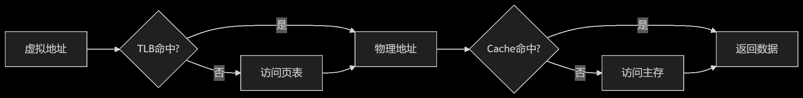

# TLB

## 1. 完整定义

TLB（Translation Lookaside Buffer）是计算机操作系统中的一种高速缓存，用于存储最近使用的虚拟地址到物理地址的映射关系。它的作用是加速虚拟地址到物理地址的转换过程，减少访问主存中页表的次数，从而提高系统性能。

## 2. 通俗的语言描述

TLB 就像是操作系统的“快速查找表”。当计算机需要把虚拟地址转换成物理地址时，首先会去 TLB 里找，如果找到了就直接用，这样速度很快；如果没找到，再去主存里的页表里找，这个过程就比较慢。所以 TLB 的存在就是为了让地址转换更快。

## 3. 通俗的比喻解释

想象一下你在图书馆找书。图书馆的书架就像是主存，而 TLB 就像是你的个人笔记，记录了最近借过的书的位置。当你需要找一本书时，首先会看看笔记里有没有记录，如果有，直接去拿就行，很快；如果没有，再去书架上慢慢找。TLB 就是计算机的“个人笔记”，帮助它快速找到需要的信息。

## 4. 定义分成主体与其它部分，分别解释

- **主体**: TLB 是用于存储虚拟地址到物理地址映射的高速缓存。
- **其它部分**: 它通过减少访问主存中页表的次数来加速地址转换过程，从而提高系统性能。

## 常见的误解

1. **误解 TLB 是主存的一部分**: 实际上，TLB 是 CPU 内部的高速缓存，不是主存的一部分。
2. **误解 TLB 存储的是数据**: TLB 存储的是地址映射关系，而不是具体的数据。
3. **误解 TLB 的大小对性能没有影响**: TLB 的大小直接影响到地址转换的效率，过小的 TLB 会导致频繁的“未命中”，从而降低性能。
4. **误解 TLB 对所有应用程序的影响相同**: 实际上，不同的应用程序对 TLB 的依赖程度不同，某些应用程序可能会更频繁地使用 TLB。

## 公式和依赖关系

虽然没有直接的公式，但 TLB 的命中率（Hit Rate）和未命中率（Miss Rate）可以用以下公式表示：
将公式转换为使用 `$$` 版本的 Markdown LaTeX 格式如下：

$$
\text{Hit Rate} = \frac{\text{Number of TLB Hits}}{\text{Total Number of TLB Access}}
$$

$$
\text{Miss Rate} = 1 - \text{Hit Rate}
$$

## 对照表

| **特性** | **TLB**                  | **页表**                 |
| -------- | ------------------------ | ------------------------ |
| 位置     | CPU 内部                 | 主存                     |
| 速度     | 非常快                   | 较慢                     |
| 容量     | 较小                     | 较大                     |
| 存储内容 | 虚拟地址到物理地址的映射 | 虚拟地址到物理地址的映射 |
| 访问频率 | 高频                     | 低频                     |

## 是否可以认为 TLB 就是 Cache？

不完全是，虽然 TLB 和 Cache 都是高速缓存，但它们的**用途**和**存储的内容**不同。

## TLB 和 Cache 的区别

| **特性**     | **TLB**                            | **Cache**                       |
| ------------ | ---------------------------------- | ------------------------------- |
| **用途**     | 加速**虚拟地址到物理地址的转换**   | 加速**数据或指令的访问**        |
| **存储内容** | 虚拟地址到物理地址的映射           | 实际的数据或指令                |
| **位置**     | CPU 内部，靠近 MMU（内存管理单元） | CPU 内部，靠近核心              |
| **访问频率** | 每次内存访问时都需要使用           | 只有访问数据或指令时才使用      |
| **命中影响** | 未命中会导致访问主存中的页表，较慢 | 未命中会导致访问主存，较慢      |
| **层次结构** | 通常只有一级（L1 TLB）             | 有多级（L1 Cache、L2 Cache 等） |

## 通俗比喻区别

- **TLB**：就像是一个“地址查找助手”，专门帮你快速找到书的位置（虚拟地址到物理地址的映射）。
- **Cache**：就像是一个“书架上的常用书区”，里面放的是你最近读过的书（数据或指令），方便你快速拿到。

## 依赖关系

TLB 和 Cache 在系统中是**协作关系**：

1. **TLB**先完成虚拟地址到物理地址的转换。
2. **Cache**根据转换后的物理地址，查找是否有缓存的数据或指令。

## 常见误解

1. **误解 TLB 和 Cache 是同一东西**：TLB 和 Cache 虽然都是高速缓存，但功能不同，TLB 负责地址转换，Cache 负责数据存储。
2. **误解 TLB 存储数据**：TLB 只存储地址映射关系，不存储实际数据。
3. **误解 Cache 能替代 TLB**：Cache 无法替代 TLB，因为 Cache 需要物理地址才能工作，而物理地址是通过 TLB 转换得到的。

## 总结

TLB 和 Cache 都是为了提高系统性能而设计的高速缓存，但它们的作用不同：

- **TLB**：专注于加速虚拟地址到物理地址的转换。
- **Cache**：专注于加速数据或指令的访问。
  两者是**互补关系**，而不是替代关系。

## **TLB 是否存在专用电路？是否不可扩容？**

### **1. TLB 是否存在专用电路？**

**是的，TLB 是专用的硬件电路。**
TLB（Translation Lookaside Buffer）是 CPU 内部的**专用硬件模块**，通常集成在**MMU（内存管理单元）**中。它是专门为加速虚拟地址到物理地址的转换而设计的，因此是**定制化**的硬件电路。

### **2. TLB 是否不可扩容？**

**TLB 的容量通常是固定的，但可以通过设计优化间接“扩容”。**
TLB 的容量由硬件设计决定，一般不会像内存那样直接扩容。不过，可以通过以下方式间接优化 TLB 的利用率：

- **多级 TLB**：现代 CPU 通常采用多级 TLB（如 L1 TLB 和 L2 TLB），L1 TLB 容量较小但速度极快，L2 TLB 容量较大但速度稍慢。
- **页大小优化**：使用更大的页（如 2MB 或 1GB 的大页）可以减少 TLB 条目数量，从而间接提高 TLB 的利用率。
- **TLB 替换策略**：采用更高效的替换算法（如 LRU，Least Recently Used）可以提高 TLB 的命中率。
- **软件优化**：操作系统可以通过优化内存管理策略（如页表映射）来减少 TLB 未命中的情况。

### **为什么 TLB 容量通常固定？**

1. **硬件限制**：TLB 是高速缓存，需要极高的访问速度，增加容量会带来更大的延迟和功耗。
2. **成本问题**：TLB 是专用硬件，增加容量会增加芯片面积和制造成本。
3. **设计复杂度**：TLB 需要与 CPU 的其他部分（如 MMU、Cache）紧密协作，增加容量会提高设计复杂度。

### **通俗比喻**

- **TLB 是专用电路**：就像一个“专用的快速查询员”，他的任务是专门帮你查地址，但他只能记住有限的信息（TLB 容量有限）。
- **不可直接扩容**：就像你不能直接给这个查询员增加记忆能力（硬件限制），但你可以通过让他查更大的范围（大页）或者优化他的查询方法（替换策略）来提高效率。

### **TLB 的层级结构**

现代 CPU 通常采用多级 TLB，类似于多级 Cache：

### **总结**

- **专用电路**：TLB 是专用的硬件模块，集成在 CPU 的 MMU 中。
- **不可直接扩容**：TLB 容量由硬件设计决定，通常固定，但可以通过多级 TLB、大页、替换策略等方式优化利用率。
- **设计权衡**：TLB 的容量、速度和功耗之间存在权衡，硬件设计需要在三者之间找到平衡。
