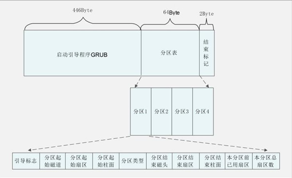
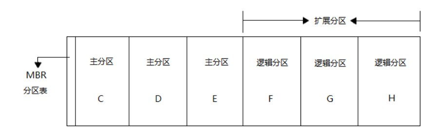

# 操作系统引导过程

## 摘要

**目的**：解析操作系统从硬件启动到内核初始化的完整流程  
**方法**：通过分析磁盘数据结构（MBR/PBR）与引导步骤，揭示操作系统启动机制  
**结果**：明确引导过程的四个关键阶段及其依赖关系  
**结论**：引导过程是操作系统与硬件交互的起点，理解其机制对系统调试与优化至关重要

---

## 主题

操作系统引导过程的核心机制，重点分析 MBR、分区表、活动分区与 PBR 的作用及其协作关系

> 重点难点
>
> - **MBR 与分区表的解析**：磁盘引导程序与分区元数据的协同工作
> - **活动分区定位**：如何通过分区表确定引导目标
> - **PBR 执行流程**：从引导记录到启动管理器的跳转逻辑

---

## 线索区

### [磁盘结构] 引导相关数据结构

> **主引导记录（MBR）**

- **位置**：磁盘的第一个扇区（512 字节）
- **结构**：

  ```plaintext
  +-------------------+-------------------+
  | 引导代码 (446字节) | 分区表 (64字节)    |
  +-------------------+-------------------+
  | 结束标志 (0x55AA)  |                   |
  +-------------------+-------------------+
  ```

- **作用**：加载活动分区的引导记录（PBR）

- **MBR**

MBR (主引导记录)： 一个磁盘 `通常` 只有一个 MBR。 MBR 位于磁盘的 `第一个扇区`，它是整个磁盘的引导入口。

对于传统的 MBR 分区方案，一个物理磁盘只有一个 MBR 是标准的。 (虽然技术上在某些特殊情况下，例如磁盘阵列，可能会有更复杂的引导设置，但对于个人电脑和考研复试的范围，我们可以认为一个磁盘通常只有一个 MBR)。

- **PBR**

  PBR (分区引导记录)： `每个` `分区` 可以 `有一个 PBR`。 PBR 位于 每个分区的 第一个扇区 (相对于分区而言)。

PBR 包含引导这个 `特定分区` 的代码。 如果一个磁盘被划分为多个分区，那么每个可引导的分区都可能拥有自己的 PBR。

- > tip
  > MBR 是磁盘的引导入口，PBR 是分区的引导入口。 MBR 负责找到 活动分区，然后将控制权交给 活动分区的 PBR。

一个磁盘只有一个 MBR (通常)，一个磁盘可以有多个 PBR (如果它有多个分区)。

MBR 承上启下，连接了 BIOS 和 PBR

> **分区表**

- **条目结构**：



  ```c
  struct partition_entry {
      uint8_t  boot_flag;      // 0x80表示活动分区
      uint8_t  start_head;     // 分区起始磁头
      uint16_t start_sector;   // 分区起始扇区
      uint8_t  system_id;      // 分区类型标识
      uint8_t  end_head;       // 分区结束磁头
      uint16_t end_sector;     // 分区结束扇区
      uint32_t start_lba;      // 分区起始LBA地址
      uint32_t sector_count;   // 分区扇区总数
  };
  ```

- **限制**：最多支持 4 个主分区（扩展分区可突破限制）

  

---

### [引导流程] 操作系统启动四阶段

1. **硬件自检（POST）**

   - **BIOS/UEFI**：初始化硬件并加载 MBR
   - **关键寄存器**：CS:IP 指向 0xFFFF0（BIOS 入口地址）

2. **MBR 加载与执行**

   - **读取 MBR**：BIOS 将磁盘第一个扇区加载到 0x7C00
   - **引导代码**：查找活动分区并加载其 PBR

3. **PBR 执行与启动管理器**

   ```plaintext
   +-------------------+-------------------+
   | 跳转指令 (3字节)   | OEM标识 (8字节)    |
   +-------------------+-------------------+
   | BPB (BIOS参数块)  | 引导代码 (剩余部分) |
   +-------------------+-------------------+
   ```

   - **启动管理器**：如 Windows 的`bootmgr`或 Linux 的`GRUB`

4. **操作系统初始化**
   - **内核加载**：解压并加载内核映像
   - **初始化任务**：建立内存映射、初始化设备驱动、启动 init 进程

---

### [Windows 引导] 关键文件与路径

- **引导文件位置**：

  ```plaintext
  C:\
  ├── bootmgr          # 启动管理器
  ├── Boot\BCD         # 启动配置数据
  └── Windows\         # 系统文件
      ├── system32\    # 核心系统组件
      └── winload.exe  # 内核加载器
  ```

- **引导配置数据（BCD）**：存储启动选项与参数

---

## 总结区

### 考点聚焦

1. **数据结构题**

   - MBR 与 PBR 的二进制结构解析
   - 分区表条目的字段含义与计算

2. **流程分析题**

   - 从 BIOS 到内核加载的完整流程
   - 活动分区定位与 PBR 加载的逻辑

3. **故障排查题**
   - MBR 损坏的修复方法（`bootrec /fixmbr`）
   - BCD 配置错误的修复步骤（`bcdedit`工具）

### 实验建议

```bash
# 查看磁盘MBR（Linux环境）
sudo dd if=/dev/sda bs=512 count=1 | hexdump -C
# 修复Windows引导（WinPE环境）
bootrec /scanos
bootrec /rebuildbcd
```
