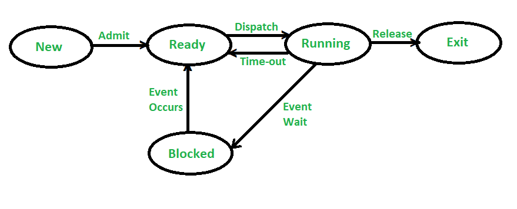
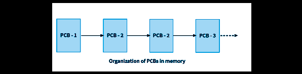
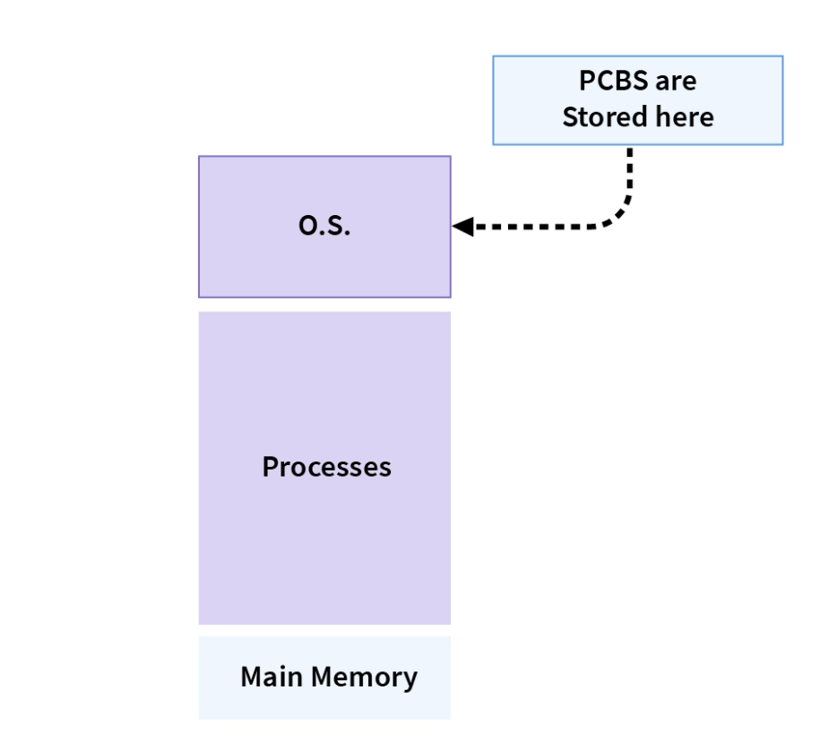
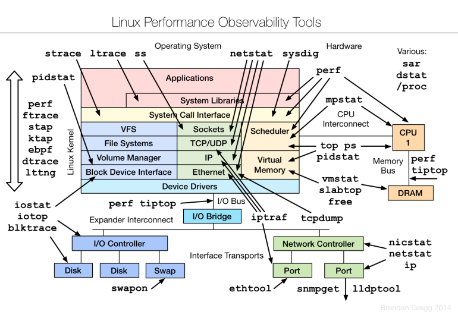

# 进程状态与状态转换

## 摘要

本专题系统解析进程状态模型及其转换机制，通过五状态模型可视化、系统调用接口分析和 Linux 环境验证，建立操作系统进程管理的三维认知框架。重点攻克状态转换限制条件与 PCB 组织策略，提供可执行的进程监控脚本及多核扩展思考。

## 主题

操作系统通过状态机模型管理进程生命周期，核心掌握：

1. 五状态模型转换条件与约束
2. PCB 链式/索引组织策略对比
3. 状态监控工具与内核机制映射

> 重点难点
>
> - **状态转换的约束关系**：就绪态 → 阻塞态的直接转换违反状态机原理
> - **多核环境的状态同步**：SMP 架构下运行态进程的负载均衡问题
> - **实时系统特殊状态**：挂起态与延迟敏感型状态转换

## 线索区

### [进程管理] 五状态模型（Five-State Model）

**工作机制**：

**1. 什么是寄存器上下文 (Register Context)?**

- **寄存器上下文是指某一时刻 CPU 中所有寄存器的内容集合**。 当一个进程正在 CPU 上运行时，CPU 的各种寄存器会保存该进程的**当前运行状态**，包括程序执行到哪里 (程序计数器的值)，正在处理什么数据 (通用寄存器的值)，以及当前处理器的状态 (状态寄存器的值) 等等。 **这些寄存器的值合起来，就构成了该进程的寄存器上下文。**
- **每个进程都有自己独立的寄存器上下文**。 虽然 CPU 只有一套物理寄存器，但是操作系统通过进程切换技术，使得每个进程在“看起来”都像独占 CPU 一样。 为了实现进程切换，操作系统必须能够保存和恢复不同进程的寄存器上下文。
- **寄存器上下文是进程能够被暂停和恢复执行的关键**。 当进程 A 需要暂停执行，让出 CPU 给进程 B 执行时，操作系统必须先将进程 A 的**当前寄存器上下文保存起来** (通常保存在进程 A 的 PCB 中)。 当之后操作系统又调度回进程 A 执行时，再从进程 A 的 PCB 中**恢复之前保存的寄存器上下文**，将 CPU 的寄存器设置为进程 A 之前暂停时的状态，这样进程 A 就可以从上次中断的地方**无缝衔接，继续执行**，就好像从未被中断过一样。

**2. PCB 如何存储寄存器上下文？**

- **PCB 是一个数据结构，用来管理进程的各种信息，包括寄存器上下文**。 在 PCB 的数据结构中，会专门开辟一块空间，用于**保存进程的寄存器上下文**。
- **寄存器上下文通常以 “快照 (Snapshot)” 的形式保存在 PCB 中**。 当进程切换发生时，操作系统会将 CPU 中所有寄存器的值，**逐个复制**到当前进程 PCB 中预留的寄存器上下文存储区，就像给 CPU 寄存器 “拍了一张照片” 一样，记录下进程暂停时的 “工作现场”。
- **当进程被重新调度执行时，操作系统再将 PCB 中保存的寄存器上下文 “恢复” 到 CPU 的物理寄存器中**， 就像把之前拍的照片 “放回去” 一样，让 CPU “回忆起” 进程之前的工作状态，继续执行。
  
  _（这张图可以展示 PCB 的内部结构，突出显示寄存器上下文存储区，并示意寄存器上下文的保存和恢复过程）_

**3. 没有寄存器上下文会怎样？**

- **进程切换将无法正常工作**。 如果没有寄存器上下文的保存和恢复机制，当进程切换发生时，CPU 的寄存器内容会被新的进程覆盖， 之前进程的运行状态就会丢失。 当再次切换回之前的进程执行时，由于寄存器状态已经改变，进程将**无法从上次中断的地方继续执行，程序就会出错甚至崩溃**。
- **多道程序并发执行将无法实现**。 寄存器上下文的保存和恢复是实现进程切换和多道程序并发执行的基础。 没有寄存器上下文，操作系统就只能顺序执行程序，无法实现多个程序 “同时” 运行的效果。

---

#### 1. 五状态模型转换条件与约束

**五状态模型** 是对进程生命周期中不同状态的更精细划分，相较于更简单的三状态模型（运行、就绪、阻塞），它更完整地描述了进程从创建到消亡的整个过程。 经典的五状态模型通常包括：

- **新建态 (New):** 进程刚刚被创建，但还未被操作系统接纳为可运行的进程。
- **就绪态 (Ready):** 进程已具备运行条件，已获得除 CPU 外的所有必要资源，等待操作系统调度分配 CPU 时间片。
- **运行态 (Running):** 进程正在 CPU 上执行指令。
- **阻塞态 (Blocked/Waiting):** 进程由于等待某种事件（例如 I/O 完成、资源请求、信号量等）发生而暂停运行。
- **终止态 (Terminated):** 进程执行完毕或因某种原因异常终止，进程的生命周期结束。


_(这张图可以展示五状态模型的状态转换图，清晰标示各个状态以及状态之间的转换箭头和触发条件)_

**状态转换条件与约束：**

五状态模型中，进程在不同状态之间转换，是由特定的事件或条件触发的，并且状态转换也遵循一定的约束和规则。 我将从状态转换方向和触发条件两个方面进行解释：

**（1）状态转换方向：**

- **新建态 → 就绪态 (Admission):**

  - **触发条件：** 操作系统完成进程创建所需的必要操作，例如 **PCB 创建、资源分配 (内存、部分 I/O 资源等)**。 当操作系统决定**接纳**新进程进入系统参与调度时，进程由新建态转换为就绪态。
  - **约束：** 操作系统对系统中并发运行的进程数量可能有限制 (例如，基于系统负载、资源限制等)， 只有当系统允许接纳新进程时，才会发生从新建态到就绪态的转换。

- **就绪态 → 运行态 (Dispatch):**

  - **触发条件：** **进程调度器** 按照某种调度算法 (例如，优先级调度、轮转调度等) **选中** 一个就绪态进程，为其**分配 CPU 时间片**，进程获得 CPU 执行权，由就绪态转换为运行态。
  - **约束：** 只有处于就绪队列中的进程才有可能被调度器选中进入运行态。 调度算法和系统负载会影响哪个就绪态进程被优先调度。

- **运行态 → 就绪态 (Time slice timeout / Preemption):**

  - **触发条件 (两种情况):**
    - **时间片用完 (Time slice timeout):** 在**时间片轮转调度算法**中，运行态进程的**时间片耗尽**，操作系统**强制剥夺** CPU，将进程转换为就绪态，重新放回就绪队列末尾等待下次调度。
    - **更高优先级进程抢占 (Preemption):** 在**抢占式优先级调度算法**中，当有**更高优先级**的就绪态进程进入就绪队列时，**操作系统可以剥夺**当前运行态进程的 CPU，将其转换为就绪态，并将 CPU 分配给更高优先级的进程。
  - **约束：** 时间片轮转调度中，每个进程运行一个时间片后**必然**会回到就绪态。 抢占式优先级调度中，是否发生抢占取决于**调度策略和进程优先级**。

- **运行态 → 阻塞态 (Block / Wait):**

  - **触发条件：** 运行态进程**主动请求等待** 某个事件发生 (例如，请求 I/O 操作、等待信号量、等待用户输入等)， 进程自身调用**阻塞型系统调用**，例如 `sleep()`, `wait()`, `read()`, `sem_wait()` 等。 进程**主动放弃** CPU，进入阻塞态，等待事件发生。
  - **约束：** 进程只有在执行到可能导致阻塞的系统调用或操作时，才会进入阻塞态。 阻塞的原因和等待的事件类型决定了进程进入哪种具体的阻塞状态。

- **阻塞态 → 就绪态 (Wakeup / Event occurs):**

  - **触发条件：** 阻塞态进程所等待的**事件发生** (例如，I/O 操作完成、信号量可用、等待的资源被释放、等待的事件发生等)， **相关的事件驱动程序或中断处理程序** 会**唤醒**阻塞态进程，将其转换为就绪态，放入就绪队列，等待 CPU 调度。
  - **约束：** 只有当阻塞态进程所等待的事件真正发生后，才会被唤醒进入就绪态。 唤醒进程后，进程并**不能立即运行**，仍然需要等待进程调度器的调度。

- **运行态 → 终止态 (Exit / Termination):**
  - **触发条件 (多种情况):**
    - **正常结束 (Normal completion):** 进程**执行完所有代码指令**，正常退出程序，调用 `exit()` 系统调用，或者 `main()` 函数返回。
    - **异常终止 (Error exit / Abnormal termination):** 进程在运行过程中发生**错误或异常** (例如，除零错误、非法指令、内存访问越界、收到致命信号等)， 操作系统或进程自身决定**异常终止**进程。
    - **外部干预 (Killed by parent / administrator):** 进程被其**父进程终止**，或者被**系统管理员使用 `kill` 命令**等外部手段强制终止。
  - **约束：** 进程一旦进入终止态，就意味着**生命周期结束**， 不会再转换到其他状态。 操作系统会回收进程占用的资源 (内存、文件描述符等)，并回收进程的 PCB。

**（2）状态转换约束和规则总结：**

- **单向性：** 状态转换通常是**单向的**，例如，运行态可以转换为就绪态或阻塞态，但不会直接从就绪态转换回运行态 (需要等待调度)。 终止态是最终状态，不会再转换到其他状态。
- **事件驱动：** 状态转换通常由**特定事件驱动**，例如，时间片用完、I/O 完成、资源请求、进程调度等。 事件的发生是状态转换的必要条件。
- **操作系统控制：** 状态转换的**触发和执行** 主要由**操作系统内核控制**， 例如，进程调度、资源分配、中断处理、系统调用处理等都涉及到进程状态的转换。
- **调度算法影响：** **进程调度算法** 直接影响就绪态和运行态之间的转换，不同的调度算法 (例如，FIFO, SJF, Priority, RR) 会导致不同的进程调度顺序和状态转换模式。
- **资源约束：** 系统资源 (例如，内存、CPU 数量、I/O 设备) 的限制会影响进程的创建和运行， 间接影响状态转换。 例如，内存不足可能导致无法创建新进程，CPU 繁忙可能导致进程长时间处于就绪态。

**考研复试考察角度：**

- **基本概念：** 理解五状态模型中每个状态的含义和特点。
- **状态转换图：** 掌握五状态模型的状态转换图，理解各个状态之间的转换方向和触发条件。
- **状态转换条件分析：** 能够分析不同状态转换的触发条件和约束，例如，时间片轮转调度和抢占式优先级调度的状态转换区别，阻塞态和就绪态的转换条件。
- **结合调度算法：** 理解进程状态转换与进程调度算法之间的关系。
- **实际案例分析：** 能够结合实际场景 (例如，用户程序请求 I/O 操作、进程间通信) 分析进程的状态转换过程。
- **与其他模型对比：** 能够对比五状态模型与三状态模型的区别和优缺点。

---

**系统调用接口**：

- 创建：`fork()`（Linux）、`CreateProcess()`（Windows）
- 终止：`exit()`、`kill()`
- 阻塞：`wait()`、`nanosleep()`

**代码案例**：

```c
// 进程状态转换示例
#include <unistd.h>
int main() {
    pid_t pid = fork();  // 新建→就绪
    if (pid == 0) {
        execlp("ls", "ls", NULL);  // 运行态
        pause();  // 运行→阻塞
    } else {
        wait(NULL);  // 父进程阻塞
    }
    return 0;  // 运行→终止
}
```

**Linux 命令**：

```bash
ps -eo pid,state,cmd  # 查看进程状态（R=运行, S=可中断睡眠, D=不可中断睡眠）
```

---

### [进程管理] 状态转换约束

**核心规则**：

1. 就绪 → 阻塞：禁止直接转换（必须通过运行态中转）
2. 阻塞 → 运行：禁止直接激活（需先转为就绪态）

**现实类比**：

- 机场安检流程：旅客（进程）必须通过登机口（运行态）才能进入候机厅（就绪态），不能直接从停车场（新建态）进入跑道（运行态）

**性能参数**：

- Linux PCB 大小：**1.7KB~2.5KB**（取决于内核版本）
- 状态切换延迟：**0.5μs~3μs**（x86 架构实测数据）

---

---

### 2. PCB 链式/索引组织策略对比

操作系统需要管理大量的进程，高效地组织和管理进程的 PCB 至关重要。 常见的 PCB 组织策略有两种：**链式组织** 和 **索引组织**。

**（1）链式组织 (Linked List Organization):**

- **原理：** 将所有进程的 PCB 通过**链表** 的方式链接起来。 操作系统维护若干个**链表头指针**，例如：
  - **就绪队列 (Ready Queue):** 所有就绪态进程的 PCB 链接成一个或多个就绪队列 (例如，多级就绪队列)。
  - **阻塞队列 (Blocked Queue):** 所有阻塞态进程的 PCB 按照阻塞原因分别链接成不同的阻塞队列 (例如，I/O 阻塞队列、事件等待队列等)。
  - **进程列表 (Process List):** 系统中所有进程的 PCB 链接成一个总的进程列表。


_(这张图可以展示 PCB 链式组织的示意图，包括就绪队列、阻塞队列、进程列表等，以及 PCB 之间的链表指针链接关系)_

- **优点：**

  - **动态性：** 链表结构具有良好的动态性，**方便进程的插入和删除**。 创建新进程时，只需创建新的 PCB 并插入到相应的链表中； 进程终止时，只需从链表中删除 PCB 并释放内存。 链表长度可以动态扩展，适应进程数量的变化。
  - **灵活调度：** 可以方便地实现**基于优先级的调度**。 例如，可以维护多个就绪队列，每个队列对应一个优先级，高优先级队列的进程优先调度。 进程优先级改变时，只需将 PCB 从一个队列移动到另一个队列即可。
  - **节省空间：** 链表只需为实际存在的进程分配 PCB 空间，**不会造成空间浪费**。

- **缺点：**
  - **查找效率低：** **查找特定进程** 需要**遍历链表**，时间复杂度为 O(n)，效率较低。 当进程数量很多时，查找操作会比较耗时。
  - **缓存命中率低：** PCB 在内存中**物理地址不连续**，不利于 CPU 缓存的利用，可能降低缓存命中率，影响性能。
  - **实现复杂性：** 链表操作 (插入、删除、遍历) 需要**指针操作**，实现相对复杂，容易出错。 多线程并发访问链表时需要加锁保护，增加同步开销。

**（2）索引组织 (Indexed Organization):**

- **原理：** 操作系统维护一个**索引表 (Index Table)**，例如 **PCB 数组**。 每个进程在索引表中占据一个**固定位置 (数组元素)**，索引表中的每个元素指向一个 PCB。 索引表的**下标** 可以作为 **进程 ID (PID)** 的一部分。
  
  _(这张图可以展示 PCB 索引组织的示意图，包括 PCB 数组 (索引表)，数组下标作为进程 ID，数组元素指向 PCB 内存区域)_

- **优点：**

  - **查找效率高：** **通过进程 ID (PID)** 可以**直接计算出 PCB 在索引表中的位置**，实现 **随机访问**，查找效率高，时间复杂度为 O(1)。 适用于需要频繁查找特定进程的场景。
  - **缓存友好：** PCB 在内存中**物理地址相对连续** (数组元素在内存中是连续的)，有利于 CPU 缓存的利用，提高缓存命中率，提升性能。
  - **实现简单：** 数组结构**实现简单**，操作方便，不需要复杂的指针操作。 数组元素的访问和修改效率高。

- **缺点：**
  - **空间浪费：** **索引表的大小固定**，需要在系统启动时预先分配固定大小的 PCB 数组空间。 即使系统中实际运行的进程数量很少，也需要占用整个数组的空间，可能造成**空间浪费**。 数组大小固定，**扩展性较差**，难以适应进程数量动态变化的情况。
  - **动态性差：** 进程的**插入和删除操作相对复杂**。 创建新进程时，需要在索引表中找到一个空闲位置分配 PCB； 进程终止时，需要释放索引表中的 PCB 位置，并标记为空闲。 空闲位置的管理和分配可能比较复杂。
  - **调度灵活性差：** 索引表结构**不利于实现基于优先级的调度**。 如果要实现优先级调度，可能需要额外的优先级队列或优先级索引表来辅助调度。

**（3）链式 vs. 索引 组织策略对比总结：**

| 特性           | 链式组织 (Linked List)     | 索引组织 (Indexed Array)   |
| -------------- | -------------------------- | -------------------------- |
| **动态性**     | 优点：灵活，易于插入删除   | 缺点：固定大小，动态性差   |
| **查找效率**   | 缺点：遍历查找，O(n)       | 优点：索引查找，O(1)       |
| **空间利用率** | 优点：节省空间，按需分配   | 缺点：可能浪费空间，预分配 |
| **缓存友好性** | 缺点：物理地址不连续       | 优点：物理地址相对连续     |
| **实现复杂度** | 缺点：指针操作，复杂       | 优点：数组操作，简单       |
| **调度灵活性** | 优点：易于实现优先级调度   | 缺点：优先级调度较复杂     |
| **适用场景**   | 进程数量动态变化，调度灵活 | 进程数量相对固定，查找频繁 |

**考研复试考察角度：**

- **基本概念：** 理解链式组织和索引组织的原理和特点。
- **优缺点对比：** 能够对比分析链式组织和索引组织的优缺点，并进行选择和权衡。
- **适用场景分析：** 能够根据不同的应用场景和系统需求，选择合适的 PCB 组织策略。
- **结合操作系统功能：** 理解 PCB 组织策略如何影响进程管理、进程调度、进程通信等操作系统核心功能。
- **实际系统应用：** 了解常见的操作系统 (例如，Linux, Windows) 采用哪种 PCB 组织策略 (例如，Linux 内核主要采用链式组织)。

---

### [进程管理] PCB 组织策略对比

| 维度       | 链式队列                           | 索引表             |
| ---------- | ---------------------------------- | ------------------ |
| 时间复杂度 | 插入/删除 O(1)，查找 O(n)          | 随机访问 O(1)      |
| 空间复杂度 | 仅需指针空间                       | 需预分配索引数组   |
| 典型实现   | Linux 就绪队列（struct list_head） | Windows XP 调度器  |
| 适用场景   | 动态进程创建频繁                   | 实时系统固定进程数 |

---

---

### 3. 状态监控工具与内核机制映射

我们平时在 Linux 系统中使用的 **`ps`**, **`top`**, **`htop`**, **`pidstat`** 等进程状态监控工具，是如何获取进程的状态信息并展示给用户的呢？ 这背后涉及到 **用户态工具** 与 **内核态机制** 的交互和映射。

**（1）用户态监控工具：**

- **功能：** 这些工具运行在 **用户态**， 它们的主要功能是**收集、分析和展示** 系统中进程的各种状态信息，例如：

  - **进程状态 (Running, Sleeping, Stopped, Zombie 等)**
  - **进程 PID, PPID, 用户 ID, 组 ID**
  - **CPU 使用率, 内存使用率, 磁盘 I/O, 网络 I/O**
  - **进程启动时间, 运行时间, 优先级, 命令行参数**
  - **进程打开的文件, 使用的共享库, 线程信息**
  - **系统资源总体使用情况 (CPU 负载, 内存使用量, 交换分区使用量)**

- **常见工具：**
  - **`ps` (Process Status):** 最基础的进程查看命令，可以显示进程的静态快照信息，例如 PID, 状态, CPU 时间, 内存占用, 命令行等。 可以通过各种选项灵活定制输出格式和显示内容。
  - **`top` (Table of Processes):** **实时动态** 监控系统进程状态和资源使用情况的工具。 周期性刷新显示进程列表，并按照 CPU 或内存使用率排序，方便用户快速定位资源消耗大户。
  - **`htop` (Improved top):** `top` 的增强版，提供更友好的**交互式界面**，支持鼠标操作，彩色显示，进程树状结构，更强大的过滤和排序功能。
  - **`pidstat` (Process ID statistics):** 专门用于**监控单个进程或一组进程的资源使用情况** 的工具，可以精确到线程级别，并提供更详细的资源统计信息 (例如，CPU 调度延迟, 内存页错误, I/O 请求延迟等)。
  - **`vmstat` (Virtual Memory Statistics):** 用于**监控系统虚拟内存、CPU、I/O 等资源使用情况** 的工具，提供系统级别的性能指标，例如 CPU 上下文切换次数、进程切换次数、内存页交换次数、磁盘 I/O 速率等。
  - **`lsof` (List Open Files):** 用于**查看进程打开的文件列表** 的工具，可以显示进程打开的文件名、文件类型、文件描述符、网络连接等信息，用于分析进程的文件和网络活动。
  - **`strace` (System Trace):** **系统调用跟踪** 工具，可以**跟踪进程执行过程中发出的所有系统调用**，以及系统调用的参数和返回值，用于分析进程的行为和定位系统调用相关的问题。

**（2）内核态机制映射：**

用户态监控工具要获取进程状态信息，必须**通过某种方式与操作系统内核进行交互**，读取内核维护的进程信息。 这种交互通常通过以下机制实现：

- **`/proc` 虚拟文件系统：** Linux 系统提供了一个 **`/proc` 虚拟文件系统**， 它不是真实的文件系统，而是 **内核信息和进程信息的 “窗口”**。 `/proc` 目录下的每个目录都对应一个 **进程**，目录名就是 **进程 PID**。 在每个进程 PID 目录下，有大量的 **虚拟文件**，例如 `status`, `stat`, `cmdline`, `maps`, `fd` 等， **这些虚拟文件的内容实际上是动态生成的，直接映射到内核中对应进程的 PCB 和其他内核数据结构**。

  - **监控工具通过读取 `/proc` 目录下的虚拟文件，就可以获取到进程的各种状态信息，而无需直接访问内核内存**。 例如：
    - `ps` 命令读取 `/proc/[pid]/stat`, `/proc/[pid]/status`, `/proc/[pid]/cmdline` 等文件获取进程状态、CPU 时间、内存占用、命令行等信息。
    - `top` 命令周期性读取 `/proc` 目录下所有进程的虚拟文件，并动态更新显示进程列表。
    - `pidstat` 命令读取 `/proc/[pid]/stat`, `/proc/[pid]/io`, `/proc/[pid]/vmstat` 等文件获取进程的资源统计信息。
    - `lsof` 命令读取 `/proc/[pid]/fd` 目录下的文件描述符信息，获取进程打开的文件列表。

- **系统调用 (System Calls)：** 除了 `/proc` 文件系统外，一些监控工具也可能使用 **系统调用** 直接从内核获取信息。 例如：
  _ **`ptrace()` 系统调用：** `strace` 工具使用 `ptrace()` 系统调用来**跟踪和控制**目标进程的执行， 它可以**拦截**目标进程发出的所有系统调用，并获取系统调用的参数和返回值。 `ptrace()` 功能强大，但开销也比较大，通常只用于调试和性能分析工具。
  _ **`getrusage()` 系统调用：** 一些性能监控工具 (例如，`time` 命令) 可以使用 `getrusage()` 系统调用获取**进程的资源使用统计信息** (例如，用户态 CPU 时间、内核态 CPU 时间、内存页错误次数、I/O 操作次数等)。 `getrusage()` 系统调用比读取 `/proc` 文件系统更高效。
  
  
  _(这张图可以展示用户态监控工具 (ps, top, strace) 与内核态机制 (/proc, system calls) 的交互关系，以及数据流向)_

**（3）内核机制：**

- **PCB (Process Control Block)：** **PCB 是内核管理进程的核心数据结构**， **所有进程的状态信息都记录在 PCB 中**。 `/proc` 虚拟文件系统和系统调用最终都是**从 PCB 中读取进程信息**。 PCB 中包含了进程状态 (例如，`task_struct` 结构体中的 `state` 字段)、资源使用统计信息 (例如，`cpu_usage`, `mem_usage`, `io_counters` 等字段)、进程标识信息 (例如，`pid`, `tgid`, `uid`, `gid` 等字段)。
- **进程调度器 (Process Scheduler)：** 进程调度器负责**管理进程的运行状态转换** (例如，就绪态 → 运行态, 运行态 → 阻塞态, 运行态 → 就绪态)。 进程调度器根据调度算法选择合适的进程运行，并维护进程的运行队列 (例如，就绪队列, 阻塞队列)。 进程调度器的状态信息也会反映在 PCB 中。
- **资源管理器 (Resource Manager)：** 内核中的资源管理器 (例如，内存管理器, 虚拟内存管理器, 文件系统, I/O 管理器) 负责**分配和管理系统资源**。 资源管理器会**跟踪进程的资源使用情况**，并将资源使用统计信息记录在 PCB 中，供监控工具读取。

**考研复试考察角度：**

- **用户态 vs. 内核态：** 理解用户态监控工具和内核态进程管理机制之间的关系和区别。
- **`/proc` 文件系统：** 了解 `/proc` 虚拟文件系统的作用和原理，知道如何通过读取 `/proc` 文件获取进程信息。
- **系统调用：** 了解常用的与进程监控相关的系统调用 (例如，`ptrace()`, `getrusage()`) 及其用途。
- **监控工具原理：** 能够解释常用的进程监控工具 (例如，`ps`, `top`, `strace`) 的工作原理，以及它们如何利用 `/proc` 文件系统和系统调用获取进程信息。
- **信息映射关系：** 理解用户态监控工具显示的信息与内核态 PCB 之间的映射关系，例如，用户态看到的 "Running" 状态对应内核态 `task_running` 状态标志。
- **实践应用：** 能够使用进程监控工具进行系统性能分析和故障排查，例如，使用 `top` 找出 CPU 占用率高的进程，使用 `strace` 分析进程的系统调用行为。

---

## 实验指导

**状态监控脚本**（Linux 4.4+）：

```bash
#!/bin/bash
# 监控进程状态转换
watch -n 0.5 'ps -eo pid,state,comm | awk \'$2=="R"{print "Running:"$3} $2=="S"{print "Interruptible:"$3}\''
```

**BPF 跟踪状态切换**：

```c
// 使用BPF跟踪schedule()函数
TRACEPOINT_PROBE(sched, sched_switch) {
    bpf_trace_printk("prev_comm=%s prev_pid=%d prev_state=%d\\n",
        args->prev_comm, args->prev_pid, args->prev_state);
    return 0;
}
```

## 总结区

### 核心考点

1. 五状态转换图绘制（必考图形题）
2. `fork()`与`exec()`的协作流程
3. PCB 在不同状态队列中的迁移过程

### 进阶思考

1. 多核 CPU 如何扩展状态模型？（参考 Linux CFS 调度器的运行队列设计）
2. 容器技术与虚拟化对传统状态模型的影响？（研究 Docker pause/resume 机制）

### 真题演练

> **2022 年 408 统考真题**  
> 某系统采用链式就绪队列，现有 n 个优先级相同的就绪进程，当时间片轮转调度时，进程切换的时间复杂度是（）  
> A. O(1) B. O(n) C. O(logn) D. O(n²)  
> **解析**：链式队列插入操作 O(1)，但轮转调度需要遍历队列，选 B

---

通过本专题学习，应能准确绘制状态转换图，解释转换约束的硬件原理（如 MMU 在进程切换中的作用），并运用现代工具观测实际系统中的状态迁移过程。
