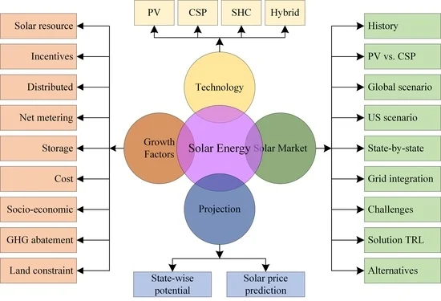

# 进程控制与状态转换

## 摘要

进程管理的核心是围绕进程生命周期状态机的控制，这需要通过精心设计的原语来确保关键操作的原子性，利用特权指令来有效管理 CPU 的运行状态，并依赖于高效的寄存器上下文保护机制来实现进程的快速切换，从而支持并发执行和系统资源的高效利用。

## 主题

【进程管理】核心在于进程生命周期状态机控制，通过原语设计保障原子操作，运用特权指令管理 CPU 状态，依赖寄存器上下文保护实现高效切换。

- **互斥**的核心是保护共享资源，确保同一时间只有一个线程可以访问。
- **同步**的核心是协调线程的执行顺序，确保它们按照某种逻辑协作。
- **同步包含了互斥**：同步机制通常需要互斥的支持，但互斥本身并不涉及线程间的协作。

> 重点难点
>
> **原子操作实现难点**：如何使用硬件或软件机制保障原语执行的不可中断性，避免竞态条件。
> **特权指令控制难点**：如何精确控制关中断/开中断的影响范围，防止过度关中断导致系统响应延迟，并正确理解和运用 PSW 的特权级别管理。
> **上下文切换代价难点**：如何降低寄存器上下文保存恢复的时间空间复杂度，优化切换性能，减少系统开销。

关键词：

[原子操作、PCB (进程控制块)、运行上下文、状态迁移图、PV 原语、系统调用、程序状态字 (PSW)、特权指令、上下文切换、进程生命周期、状态机控制、原语设计、特权指令运用、寄存器上下文保护。]

## 线索区

### 原语原子性实现（进程管理）

进程管理指令（例如创建进程、销毁进程、进程调度）也是如此。 操作系统内核必须保证这些指令的执行是原子性的，才能确保进程状态的正确切换和系统资源的合理分配。如果这些指令在执行过程中被中断，就可能导致：

- **进程状态错乱**：例如，一个进程本应进入阻塞态，但由于中断导致状态更新不完整，仍然停留在运行态，导致资源死锁。
- **资源竞争冲突**：多个进程同时尝试修改进程控制块（PCB）中的关键信息，如果没有原子性保护，可能导致数据覆盖和系统崩溃。
- **调度异常**：进程调度器在执行调度算法时，如果相关操作被中断，可能导致调度逻辑错误，甚至系统停滞。

您提到 "最小单位，系统调用如果需要实现某些原子操作可能需要"。 这里 "最小单位" 通常指的是 **指令序列** 或 **代码临界区**。

- **原子操作的最小单位不是单条指令，而是一段需要作为一个整体执行的代码**。 即使是简单的 `i++` 在汇编层面也可能分解为 "读取内存 - 加 1 - 写回内存" 三个指令，这三个指令序列就需要原子性保护。
- **系统调用** 是用户态程序请求操作系统内核服务的接口。 很多系统调用都需要在内核态执行一些**原子操作**来完成特权功能，例如：
  - **进程创建 `fork()`**: 内核需要原子地分配 PCB 结构、复制父进程资源、初始化进程状态。
  - **进程切换 `schedule()`**: 内核需要原子地保存当前进程上下文、恢复目标进程上下文、更新调度信息。
  - **信号量操作 `sem_wait()`/`sem_post()`**: 内核需要原子地检查信号量的值、修改等待队列、唤醒进程。

### **1. 原子性 (Atomicity)**

进程管理指令的原子性至关重要，它确保了操作系统进程管理机制的稳定性和可靠性。 就像银行转账必须作为一个不可分割的整体完成一样，进程管理的关键指令，例如创建进程、销毁进程和进程调度，也必须是原子操作。

这意味着这些指令在执行过程中不能被中断。如果进程管理指令不具备原子性，就可能导致进程状态错乱、资源竞争冲突和调度异常等严重问题，最终可能导致系统崩溃。

`原子性保证了操作的完整性，要么全部完成，要么完全不执行，避免了中间状态和数据不一致性`。

#### **2. 原子操作的最小单位与系统调用 (Minimum Unit of Atomic Operation and System Call)**

原子操作的最小单位通常不是单条指令，而是一段需要作为一个整体执行的代码序列或代码临界区。

即使像 `i++` 这样的简单操作，在汇编层面也可能分解为多个指令，这些指令序列就需要原子性保护.

系统调用是用户态程序请求操作系统内核服务的接口。 许多系统调用需要在内核态执行原子操作来完成特权功能，例如进程创建 `fork()`、进程切换 `schedule()` 和信号量操作 `sem_wait()/sem_post()` 等。

这些系统调用内部都包含了需要原子性保证的关键代码段，以确保操作的正确性和系统的稳定性。

### **3. 就绪态与阻塞态 (Ready State and Blocked State)**

进程的就绪态和阻塞态是进程生命周期中重要的状态。

**就绪态** 指进程已准备好运行，只等待 CPU 的调度，就像在起跑线前等待发令枪响的运动员。

**阻塞态** 指进程因为等待某个事件（例如 I/O 完成、用户输入或信号量）而暂停运行，就像比赛中受伤暂停治疗的运动员。 进入阻塞态是进程主动让出 CPU 资源的行为，目的是提高系统整体的资源利用率，而不是因为资源抢占或进程不重要。

阻塞态的核心原因是进程自身需要等待外部事件的发生。

所有进入阻塞态的进程都会让出 CPU 资源，这是操作系统进行进程调度的基本原则。

为了更清晰地对比就绪态、运行态和阻塞态，我们可以使用下表：

| 进程状态 (Process State) | 状态描述 (Description)                          | 状态转换触发条件 (Transition Trigger)           | 类似比喻 (Analogy)                          |
| :----------------------- | :---------------------------------------------- | :---------------------------------------------- | :------------------------------------------ |
| 就绪态 (Ready)           | 进程已具备运行条件，等待 CPU 调度               | 进程被创建完成，或阻塞解除，或时间片用完        | 起跑线前的运动员 (Athlete at starting line) |
| 运行态 (Running)         | 进程正在 CPU 上执行                             | 进程被调度器选中                                | 比赛中的运动员 (Athlete in race)            |
| 阻塞态 (Blocked/Waiting) | 进程等待某个事件发生（I/O，信号量等）而暂停运行 | 进程请求 I/O 操作，或等待信号量，或等待用户输入 | 受伤暂停治疗的运动员 (Injured athlete)      |

### **4. 保存进程运行状态与程序状态字 PSW (Saving Process Running State and Program Status Word)**

保存进程运行状态 (上下文切换) 的目的是为了实现进程的暂停和恢复。 当进程需要让出 CPU 时，操作系统必须保存该进程的 **上下文 (Context)**，即进程在 CPU 上执行时的关键信息，例如程序计数器 PC、程序状态字 PSW、通用寄存器和栈指针 ESP 等。

这些信息通常保存在进程控制块 (PCB) 中。 **程序状态字 (PSW)** 是一个特殊的寄存器，记录了当前程序的运行状态和处理器的状态，包括指示处理器特权级别的标志位，用于区分用户态和内核态。 用户态程序权限受限，不能执行特权指令，而内核态程序拥有更高权限。 PSW 中的特权级别标志位决定了 CPU 处于用户态还是内核态。

上下文切换时，PSW 的值也需要被保存和恢复，以确保进程恢复运行时保持正确的特权级别。

用户态程序尝试执行特权指令会触发异常，由操作系统内核捕获并处理，但这与上下文切换是不同的概念。

### [**5. PV 原语 (PV Primitives)**](./WIKI/pv_operator.md)

PV 原语是由荷兰计算机科学家 Edsger W. Dijkstra 提出的用于解决进程同步与互斥问题的两种原子操作。 "`P`" 代表 **Proberen** (荷兰语 "尝试") 或 **Passeren** (法语 "通过")， "`V`" 代表 **Verhogen** (荷兰语 "增加") 或 **Vrijgeven** (荷兰语 "释放")。

在英文文献中，P 通常被称为 **wait**、**acquire** 或 **down** 操作，V 通常被称为 **signal**、**release** 或 **up** 操作。

#### **5.1 PV 原语的作用与目的 (Purpose of PV Primitives)**

PV 原语的核心作用是 **管理和控制对共享资源的访问**，以实现进程间的 **同步 (Synchronization)** 和 **互斥 (Mutual Exclusion)**。

- **互斥 (Mutual Exclusion)**：保证在同一时刻，只有一个进程可以访问临界资源 (Critical Resource)。 例如，多个进程需要访问打印机，但同一时刻只能有一个进程使用打印机。 PV 原语可以确保对打印机的互斥访问。

- **同步 (Synchronization)**：控制多个进程按照一定的顺序协调执行。 例如，生产者-消费者问题中，生产者进程生产产品后，消费者进程才能消费。 PV 原语可以协调生产者和消费者进程的执行顺序。

#### **5.2 信号量 (Semaphore)**

PV 原语是基于 **信号量 (Semaphore)** 机制工作的。 信号量是一个特殊的 **变量**，用于表示可用资源的数量。 信号量的值可以是：

- **非负整数**：表示可用资源的数量。
- **二值信号量 (Binary Semaphore)**：取值只能为 0 或 1，用于实现互斥锁 (Mutex Lock) 的功能。

#### **5.3 P 操作 (P Operation - Wait/Acquire/Down)**

P 操作的 **原子性** 非常关键，必须作为一个不可分割的整体执行。 P 操作的步骤如下：

1. **检查信号量的值 (s)**：
   - 如果 `s > 0`，表示有可用资源，进程可以继续执行。
   - 如果 `s ≤ 0`，表示没有可用资源，进程需要等待。
  
2. **减 1 操作 (s = s - 1)**：如果 `s > 0`，则将信号量的值减 1，表示进程获取了一个资源。

3. **阻塞等待 (Block and Wait)**：如果 `s ≤ 0`，则进程会被 **阻塞 (Blocked)**，进入 **阻塞队列 (Waiting Queue)** 等待，直到有资源可用。 阻塞的进程会放弃 CPU，让出资源给其他进程。

**P 操作的逻辑可以理解为： "请求资源"。 进程尝试获取资源，如果资源可用 (信号量值大于 0)，则成功获取并继续执行；如果资源不可用 (信号量值小于等于 0)，则进程进入等待状态。**

#### **5.4 V 操作 (V Operation - Signal/Release/Up)**

V 操作的 **原子性** 同样非常关键。 V 操作的步骤如下：

1. **加 1 操作 (s = s + 1)**：将信号量的值加 1，表示释放了一个资源。

2. **唤醒等待进程 (Wake up waiting process)**：
   - 如果存在等待该信号量的 **阻塞队列 (Waiting Queue)**，则 **唤醒 (Wake up)** 队列中的 **一个** 进程 (通常按照先进先出 FIFO 的原则唤醒)。 被唤醒的进程从阻塞态变为就绪态，等待 CPU 调度。
   - 如果没有等待进程，则 V 操作结束。

**V 操作的逻辑可以理解为： "释放资源"。 进程释放资源后，信号量值增加，并尝试唤醒等待资源的进程。**

#### **5.5 PV 原语的原子性 (Atomicity of PV Primitives)**

为了保证 PV 原语的正确性和避免竞争条件，**P 操作和 V 操作本身必须是原子操作**。

这意味着 P 操作的 "检查信号量值 - 减 1 - 可能阻塞" 必须作为一个原子序列执行，V 操作的 "加 1 - 可能唤醒" 也必须作为一个原子序列执行。

操作系统内核通常会使用 **硬件支持的原子指令** (例如，测试并设置指令，比较并交换指令) 或者 **禁用中断** 等机制来实现 PV 原语的原子性。

#### **5.6 PV 原语的应用举例 (Examples of PV Primitives)**

#### **5.6.1 互斥锁 (Mutex Lock) - 使用二值信号量实现互斥**

- **初始化信号量 mutex 为 1** (表示初始时临界资源可用)。
- **进入临界区之前执行 P(mutex)**：
  - 如果 mutex 的值大于 0，P 操作成功，mutex 值减为 0，进程获得临界区访问权限。
  - 如果 mutex 的值等于 0，P 操作阻塞，进程等待其他进程释放临界区。
- **退出临界区之后执行 V(mutex)**：
  - V 操作将 mutex 的值加 1，释放临界区，如果有等待进程，则唤醒一个等待进程。

**代码示例 (伪代码):**

```c
semaphore mutex = 1; // 初始化互斥信号量

Process A:
    P(mutex);       // 进入临界区 (请求互斥锁)
    // 访问临界资源 ...
    V(mutex);       // 退出临界区 (释放互斥锁)

Process B:
    P(mutex);       // 进入临界区 (请求互斥锁)
    // 访问临界资源 ...
    V(mutex);       // 退出临界区 (释放互斥锁)
```

#### **5.6.2 同步 (Synchronization) - 使用信号量实现进程同步**

例如，假设进程 A 需要先执行某个操作，然后进程 B 才能继续执行。 我们可以使用信号量来同步这两个进程。

- **初始化信号量 sync 为 0** (表示初始时条件不满足)。
- **进程 A 执行完操作后执行 V(sync)**：表示条件已满足，通知进程 B。
- **进程 B 在开始执行之前执行 P(sync)**：
  - 如果 sync 的值大于 0，P 操作成功，进程 B 可以继续执行。
  - 如果 sync 的值等于 0，P 操作阻塞，进程 B 等待进程 A 通知。

**代码示例 (伪代码):**

```c
semaphore sync = 0; // 初始化同步信号量

Process A:
    // ... 执行操作 ...
    V(sync);        // 通知进程 B, 条件已满足

Process B:
    P(sync);        // 等待进程 A 通知, 条件满足后继续
    // ... 执行操作 ...
```

#### **5.7 PV 原语与系统调用和原子性 (PV Primitives, System Calls, and Atomicity)**

PV 原语通常以 **系统调用** 的形式提供给用户程序使用。 用户程序通过系统调用来请求操作系统内核执行 P 操作和 V 操作。 内核代码负责实现 PV 原语的原子性，并管理信号量和阻塞队列。

### **总结：**

PV 原语是操作系统中用于进程同步和互斥的重要机制。

它们基于信号量工作，通过原子性的 `P 操作 (请求资源)` 和 `V 操作 (释放资源)` 来控制对共享资源的访问，从而实现进程间的协同工作和资源的安全共享。

**工作机制**：

- 通过`关中断`（CLI）→ 执行关键代码 →`开中断`（STI）指令序列实现
- 关中断期间屏蔽外部中断，确保原语代码段执行完整性

**系统调用**：

```c
// Linux内核关中断实现（x86架构）
static inline void native_cli(void) {
    asm volatile("cli": : :"memory");
}
```

**时间复杂度**：

- 关中断时间窗口需严格优化，过长将导致系统响应延迟

---

### 进程状态迁移模型（进程管理）

**五状态转换图**：

```txt
新建 → 就绪 ↔ 运行 ←→ 阻塞
    ↘ 终止 ↗
```

**转换触发条件**：

| 转换类型    | 触发条件      | 典型原语   |
| ----------- | ------------- | ---------- |
| 就绪 → 运行 | 进程调度      | schedule() |
| 运行 → 阻塞 | 等待 I/O 完成 | sleep_on() |
| 阻塞 → 就绪 | 资源可用      | wake_up()  |

---

### 进程上下文切换（进程管理）

**寄存器保存清单**：

1. 程序计数器（PC）
2. 程序状态字（PSW）
3. 通用寄存器组（`EAX/EBX/ECX` 等）
4. 栈指针（ESP）
5. 基址指针（EBP）

**Linux 切换示例**：

```c
// arch/x86/kernel/process_64.c
__switch_to(struct task_struct *prev_p, struct task_struct *next_p)
{
    /* FPU状态保存 */
    switch_fpu_finish(next_p);

    /* 加载新进程TSS段 */
    load_TLS(next_p, cpu);

    /* 更新CR3寄存器（地址空间切换） */
    load_mm_cr4(next_p->mm);
}
```

### PV 原语和原语

> **1. 原子性是基石 (Atomicity as the Foundation)**

- **PV 原语的原子性**: P 操作和 V 操作自身必须是原子操作。这意味着在执行 P 操作时，"检查信号量值 - 减 1 - 可能阻塞" 必须作为一个不可分割的整体完成；同样，V 操作的 "加 1 - 可能唤醒" 也必须是原子的。 如果 PV 原语自身不具备原子性，就无法可靠地实现互斥和同步，整个并发控制机制将瓦解。
- **系统调用的原子性**: PV 原语通常作为系统调用提供。 为了实现 PV 原语的原子性，系统调用在内核态的执行过程也需要保证原子性。 例如，内核可能需要禁用中断、使用自旋锁或其他原子操作指令来保护共享数据结构 (如信号量的值和等待队列)。
- **进程状态转换的原子性**: 进程状态的切换，例如从运行态到阻塞态 (P 操作可能导致) 或从阻塞态到就绪态 (V 操作可能导致)，也需要在内核中原子地完成，以避免状态错乱。
- **总结**: 原子性是构建可靠并发系统的基础。 无论是进程管理指令、系统调用，还是并发控制原语 (如 PV 原语)，都离不开原子性的保障。 **没有原子性，一切并发控制机制都将是空中楼阁。**

> **2. 系统调用是桥梁 (System Calls as the Bridge)**

- **用户态与内核态的桥梁**: 系统调用是用户态程序请求内核服务的唯一入口。 PV 原语作为操作系统提供的并发控制机制，自然需要通过系统调用的方式供用户程序使用。
- **PV 原语的实现**: 用户程序调用 P 操作和 V 操作时，实际上会陷入内核态，执行相应的系统调用。 内核代码负责完成信号量的检查、修改、进程阻塞/唤醒等操作，并保证这些操作的原子性。
- **特权指令的执行**: PV 原语的实现往往需要执行特权指令，例如控制中断、访问特殊的硬件寄存器等。 这些特权指令只能在内核态执行，因此 PV 原语必须通过系统调用在内核中实现。
- **总结**: 系统调用是用户程序与操作系统内核交互的桥梁，也是操作系统向用户程序提供并发控制服务 (如 PV 原语) 的重要途径。 **PV 原语的强大功能，需要通过系统调用才能传递给用户程序。**

> **3. 进程状态转换是结果 (Process State Transitions as the Consequence)**

- **P 操作可能导致阻塞**: 当进程执行 P 操作，发现信号量资源不足时 (信号量值 ≤ 0)，进程会被阻塞，从运行态转换为阻塞态，并加入信号量的等待队列。

- **V 操作可能导致唤醒**: 当进程执行 V 操作，释放资源后，如果信号量的等待队列不为空，V 操作会唤醒队列中的一个或多个进程，被唤醒的进程从阻塞态转换为就绪态，等待 CPU 调度。

- **进程状态与资源利用率**: 通过 P 操作的阻塞和 V 操作的唤醒机制，操作系统可以有效地管理进程对共享资源的竞争，避免忙等待，提高 CPU 和系统资源的利用率。 阻塞态的存在正是为了让出 CPU 资源，提高系统整体效率。

- **总结**: PV 原语的操作直接影响进程的状态转换。 P 操作和 V 操作是进程状态在运行态、就绪态和阻塞态之间转换的重要触发条件。 **进程状态的转换是 PV 原语发挥作用的直接体现，也是操作系统实现并发控制和资源管理的重要手段。**

> **4. 上下文切换是保障 (Context Switching as the Guarantor of Concurrency)**

- **进程切换与并发**: 上下文切换使得多个进程可以在宏观上 "同时" 执行，是实现并发的基础。 在并发环境中，进程频繁地进行切换，CPU 在不同进程之间快速轮转。

- **PV 原语与进程切换**: 当进程因执行 P 操作而阻塞时，会发生上下文切换，CPU 将被调度给其他就绪态进程。 当进程被 V 操作唤醒后，它会进入就绪队列，等待调度器在未来的某个时刻再次进行上下文切换，将 CPU 分配给它。

- **保存和恢复状态**: 上下文切换需要保存和恢复进程的运行状态 (上下文)，包括程序计数器 PC、程序状态字 PSW、通用寄存器等。 这确保了进程在被重新调度执行时，能够从上次中断的位置继续执行，保证了并发执行的正确性。

- **总结**: 上下文切换机制是操作系统实现并发的基础保障。 PV 原语正是利用了上下文切换，使得进程在等待资源时可以主动让出 CPU，从而提高系统的并发度和资源利用率。 **没有高效的上下文切换，PV 原语的阻塞等待机制将失去意义。**

> **5. 程序状态字 PSW 体现特权 (PSW as the Embodiment of Privilege)**

- **用户态和内核态**: PSW 中的特权级别标志位区分了用户态和内核态。 用户态程序权限受限，内核态程序拥有更高权限。
- **PV 原语在内核态实现**: 由于 PV 原语需要执行原子操作、管理进程状态、操作硬件资源等特权操作，因此 PV 原语的实现必须在内核态完成。 用户程序通过系统调用进入内核态才能使用 PV 原语。

- **PSW 的作用**: PSW 不仅记录了特权级别，还包含其他程序运行状态信息，例如中断允许位、条件码等。 在上下文切换时，PSW 的保存和恢复保证了进程在不同特权级别下的正确运行。

- **总结**: PSW 体现了操作系统对特权级别的管理，保障了系统的安全性和稳定性。 PV 原语作为操作系统内核提供的核心功能，其实现和执行都受到 PSW 的特权级别控制。 **PSW 确保了 PV 原语等关键操作只能由内核可信地执行。**

> **整合总结**


这张图中，我们可以看到：

- **原子性** 是最底层的基石，贯穿于所有环节。
- **系统调用** 是用户程序使用 PV 原语的入口。
- **PV 原语** 是实现进程同步与互斥的核心机制。
- **进程状态转换** 是 PV 原语操作的直接结果，也是操作系统进行资源管理的方式。
- **上下文切换** 保障了并发执行的效率和正确性。
- **程序状态字 PSW** 确保了特权操作的安全执行。

**它们相互依赖，共同构成了操作系统中进程控制和并发管理的核心体系。** 理解这些关联性，就能从更深层次把握操作系统的工作原理，也能更好地运用 PV 原语等工具来解决实际的并发编程问题。

#### 信号量、互斥锁和自旋锁的对比

| 特性          | 信号量                     | 互斥锁                     | 自旋锁                     |
|---------------|----------------------------|----------------------------|----------------------------|
| 用途          | 多种同步需求               | 互斥                       | 互斥                       |
| 实现          | 计数器                     | 锁机制                     | 忙等待                     |
| 适用场景      | 复杂的同步需求             | 简单的互斥需求             | 锁持有时间非常短的场景     |
| 线程状态      | 可能进入睡眠状态           | 可能进入睡眠状态           | 一直占用CPU                |
| 开销          | 上下文切换开销             | 上下文切换开销             | 无上下文切换开销           |

**信号量**可以用来实现**互斥锁**，但信号量本身并不等同于互斥锁。信号量是一个更通用的同步机制，可以用来实现多种同步需求，而互斥锁是信号量的一种特例，专门用于实现互斥。

---

## 总结区

### 核心考点

1. **原语设计原则**：必须包含完整的关中断-操作-开中断三阶段
2. **PCB 存储结构**：每个进程的 task_struct 包含完整的寄存器快照
3. **状态转换约束**：阻塞 → 运行为非法转换，必须经就绪态中转

### 性能指标

- **上下文切换耗时**：现代处理器典型值约**1-10μs**
- **最大进程数**：Linux 系统受`pid_max`参数限制（默认 32768）

### 实验验证

```bash
# 跟踪进程切换次数（需root权限）
perf stat -e context-switches -p <PID>
```

> **延伸思考**：若取消关中断保护，在多核环境下可能引发哪些竞态条件？如何通过自旋锁替代？
