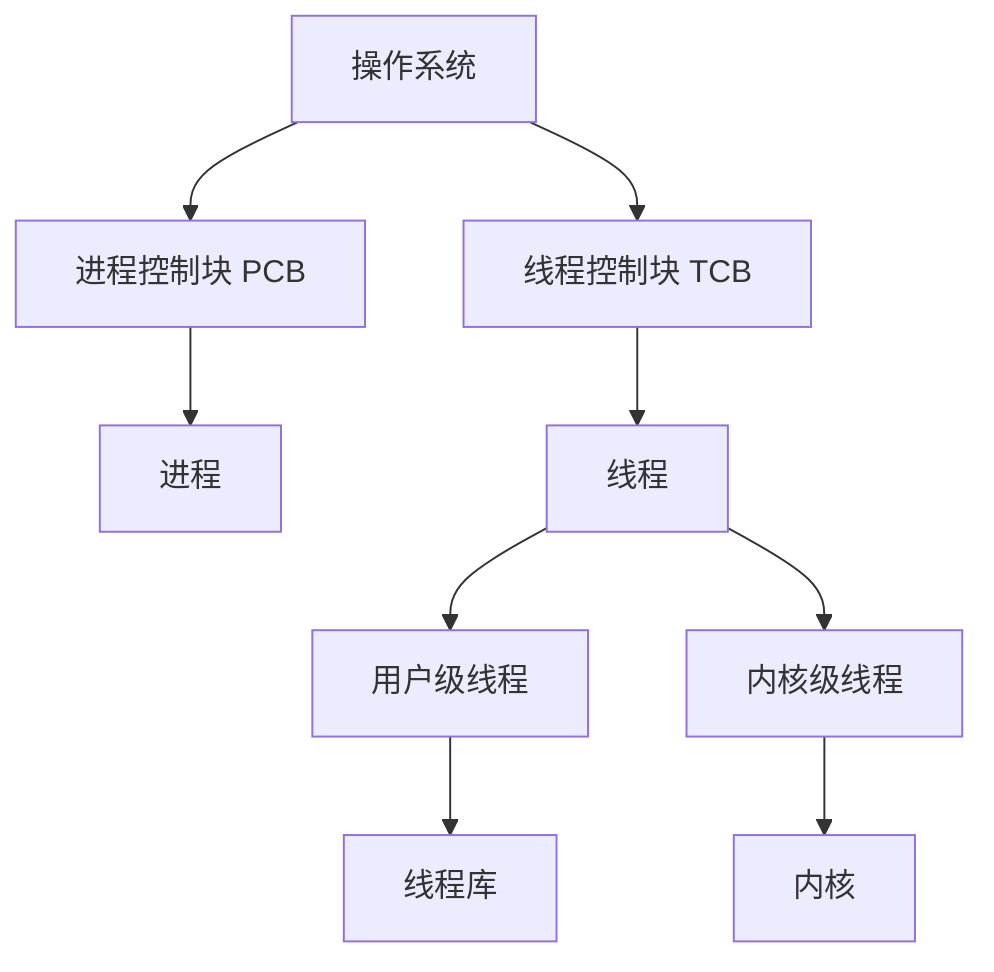
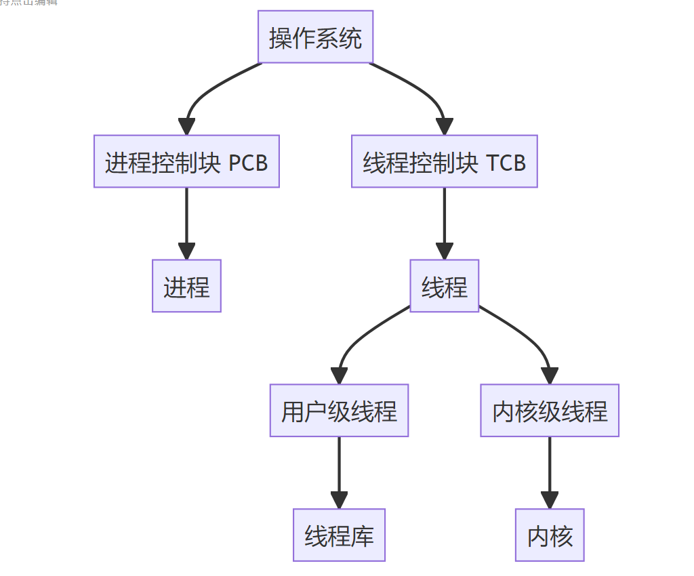
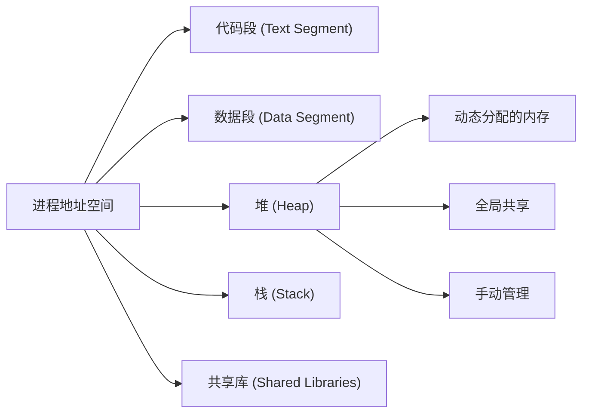
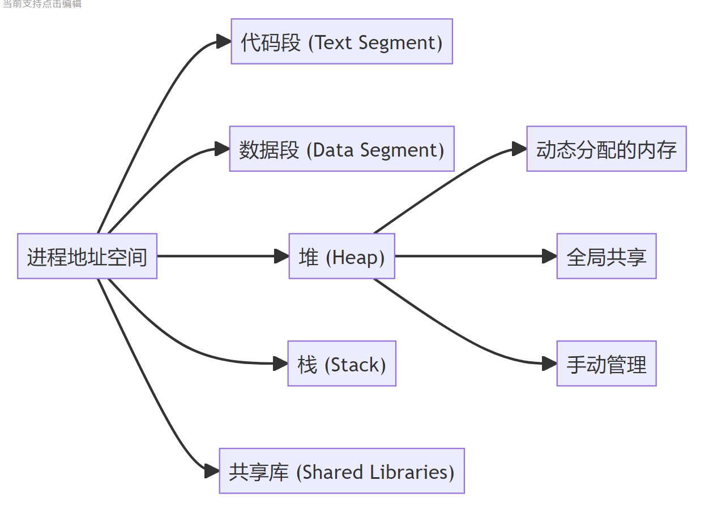
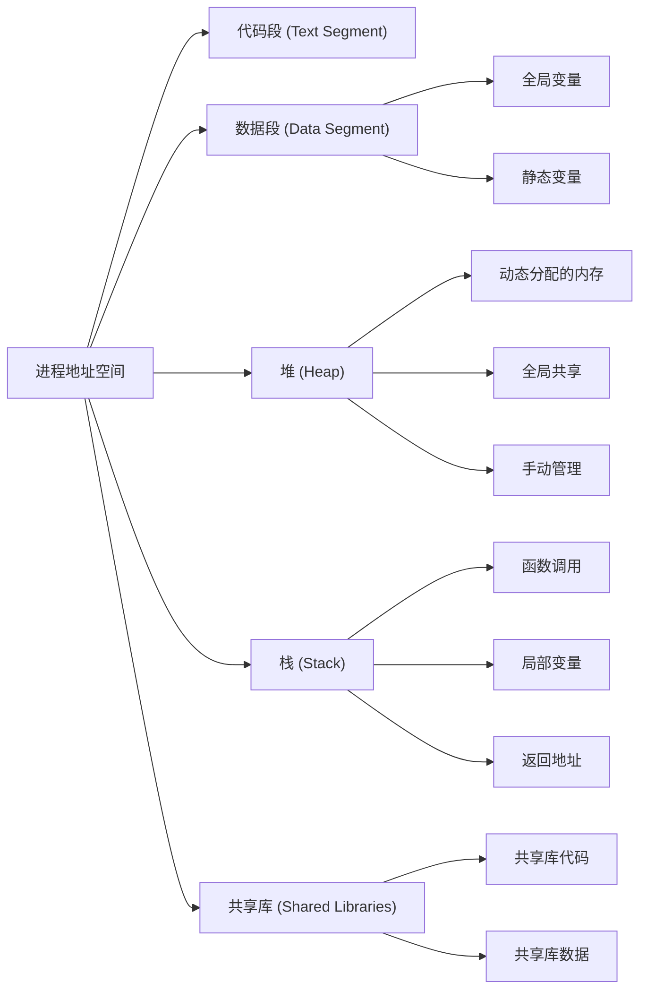
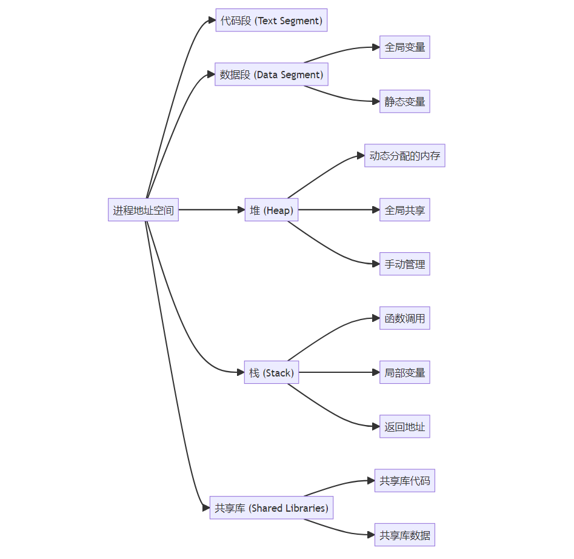

# 线程机制与线程管理

## 摘要

本讲解系统阐述了线程的核心概念、设计动机与实现优势。通过对比进程机制，解析了线程作为轻量级执行单元在并发控制与资源开销方面的创新价值，并结合图书馆调度等现实类比，揭示了线程切换的低开销特性。

---

## 主题

**线程作为 CPU 调度基本单位**，通过共享进程地址空间实现高效并发。核心机制包含 TCB 管理、上下文切换优化，需重点掌握其与进程的资源分配关系及并发优势实现原理。

> **重点难点**
>
> - 线程控制块（TCB）与进程控制块（PCB）的存储结构差异
> - 用户级线程 vs 内核级线程的调度开销对比
> - 多线程环境下共享资源的同步代价

---

## 线索区

### TCB 和 PCB 最本质的差别

**最本质的差别**：  
TCB（线程控制块）是管理**线程**的数据结构，而 PCB（进程控制块）是管理**进程**的数据结构。

- **线程**是程序执行的最小单位，是进程的一部分，共享进程的资源（如内存、文件等）。
- **进程**是资源分配的基本单位，拥有独立的内存空间和系统资源。

换句话说：

- **TCB** 只关心线程的执行状态（如程序计数器、寄存器、栈等），不关心资源分配。
- **PCB** 不仅关心执行状态，还管理进程的资源（如内存、文件、I/O 设备等）。

### [进程管理/线程管理] 线程核心特性

**工作机制**：

- 共享进程资源（代码段/数据段/文件描述符）
- 独立线程栈与寄存器上下文
- 通过 TCB（Thread Control Block）维护执行状态

**系统调用**：

```c
// POSIX线程创建
pthread_create(&tid, NULL, thread_func, arg);
```

**性能对比**：

| 维度       | 进程          | 线程         |
| ---------- | ------------- | ------------ |
| 创建开销   | 1-10ms 级     | 微秒级       |
| 上下文切换 | 涉及 MMU 重载 | 仅寄存器交换 |
| 通信成本   | IPC 机制      | 直接内存访问 |

---

### [进程管理/调度] 线程实现模型

**用户级线程（ULT）**：

- 优势：切换无需内核介入（**O(1)** 时间）
- 局限：阻塞操作导致整个进程阻塞

**内核级线程（KLT）**：

- Linux 通过 clone()系统调用实现
- 典型命令：`ps -eLf` 查看线程信息

**混合模型**：

```python
# Python多线程示例（GIL限制）
import threading
def worker():
    print("Thread ID:", threading.get_native_id())
threads = [threading.Thread(target=worker) for _ in range(4)]
for t in threads: t.start()
```

---

### 差异图





### 为什么非要 TCB 和 PCB 差异化设计？直接进程最高效率不行吗？

**不行**，原因如下：

1. **线程更轻量，切换开销小**

   - 线程共享进程的资源（如内存、文件等），切换时只需要保存和恢复线程的上下文（如寄存器、栈等），开销远小于进程切换。
   - 进程切换需要切换整个地址空间、文件表、I/O 状态等，开销很大。

2. **线程更适合并发**

   - 线程可以共享数据，通信更方便（直接通过共享内存），适合高并发任务（如 Web 服务器、数据库等）。
   - 进程之间通信需要通过复杂的机制（如管道、消息队列等），效率较低。

3. **资源利用率更高**

   - 线程共享进程的资源，避免了重复分配资源的开销。
   - 如果只用进程，每个进程都需要独立分配资源，浪费内存和 CPU 时间。

4. **设计灵活性**
   - 线程可以在一个进程内实现并行任务，而进程更适合隔离任务（如不同用户的程序）。
   - 线程和进程的结合让操作系统既能高效处理并发任务，又能保证任务之间的隔离性。

---

#### 1. **误解：线程和进程是一样的，只是名字不同**

- **误解原因**：线程和进程都是“执行任务”的单位，容易混淆。
- **澄清**：
  - 进程是资源分配的基本单位，拥有独立的内存空间、文件、I/O 资源等。
  - 线程是程序执行的最小单位，是进程的一部分，共享进程的资源。
  - **比喻**：进程像是一个公司，线程像是公司里的员工。公司拥有独立的资源（办公室、资金等），员工共享这些资源，但每个员工有自己的任务。

---

#### 2. **误解：线程比进程快**

- **误解原因**：线程切换开销小，学生误以为线程本身执行速度更快。
- **澄清**：
  - 线程的“快”体现在**切换开销小**，而不是执行速度更快。
  - 线程共享进程的资源，切换时只需要保存和恢复线程的上下文（如寄存器、栈等）。
  - 进程切换需要切换整个地址空间、文件表等，开销更大。
  - **比喻**：线程像是公司里的员工，切换任务时只需要换个工位；进程像是开一家新公司，需要租办公室、买设备，成本高。

---

#### 3. **误解：用户级线程和内核级线程是一样的**

- **误解原因**：两者都是线程，学生容易忽略它们的管理方式和调度开销的差异。
- **澄清**：
  - **用户级线程**：由用户空间的线程库管理，操作系统不知道这些线程的存在。切换速度快，但一旦一个线程阻塞，整个进程都会阻塞。
  - **内核级线程**：由操作系统内核直接管理。切换速度慢，但一个线程阻塞不会影响其他线程。
  - **比喻**：用户级线程像是你自己在家安排的任务，操作系统不知道你在干嘛；内核级线程像是公司安排的任务，老板（操作系统）知道你的一举一动。

---

#### 4. **误解：多线程一定比单线程快**

- **误解原因**：多线程可以并发执行，学生误以为线程越多性能越好。
- **澄清**：
  - 多线程的性能提升取决于任务类型和硬件支持：
    - 如果是 CPU 密集型任务，线程数超过 CPU 核心数反而会降低性能（因为频繁切换线程）。
    - 如果是 I/O 密集型任务，多线程可以提高效率（因为一个线程等待 I/O 时，其他线程可以继续运行）。
  - **比喻**：多线程像是多个人一起干活，但如果活是纯计算（比如算数学题），人多不一定快；如果是搬东西（I/O 操作），人多效率高。

---

#### 5. **误解：TCB 和 PCB 的功能可以合并**

- **误解原因**：TCB 和 PCB 都是管理任务的数据结构，学生误以为可以合并。
- **澄清**：
  - TCB 只管理线程的执行状态（如寄存器、栈等），不管理资源。
  - PCB 管理进程的执行状态和资源（如内存、文件等）。
  - 如果合并，会导致资源管理和执行状态混杂，设计复杂且低效。
  - **比喻**：TCB 像是员工的个人工作记录，PCB 像是公司的整体管理记录。合并后，公司管理会变得混乱。

---

#### 6. **误解：管程和协程是线程的一种**

- **误解原因**：管程和协程的名字中带有“程”，学生误以为它们和线程类似。
- **澄清**：
  - **管程**：是一种同步机制，用于管理对共享资源的访问，避免冲突。它不是线程，而是一个工具。
  - **协程**：是一种用户态的轻量级线程，由程序员显式控制切换。它和线程类似，但切换开销更小。
  - **比喻**：管程像是图书馆的管理员，负责协调大家借书还书；协程像是你自己安排的小任务，可以随时切换。

---

#### 7. **误解：线程之间完全独立**

- **误解原因**：线程可以并发执行，学生误以为线程之间没有联系。
- **澄清**：
  - 线程共享进程的资源（如内存、文件等），因此需要同步机制（如锁、信号量）来避免冲突。
  - 如果多个线程同时修改共享数据，可能会导致数据不一致。
  - **比喻**：线程像是公司里的员工，共享公司的打印机。如果不协调，可能会同时打印，导致混乱。

---

#### 8. **误解：进程切换一定会导致线程切换**

- **误解原因**：线程是进程的一部分，学生误以为进程切换时线程也会切换。
- **澄清**：
  - 进程切换时，操作系统会切换整个进程的上下文（包括所有线程）。
  - 但线程切换只发生在同一个进程内，不会影响其他进程。
  - **比喻**：进程切换像是换一家公司，所有员工（线程）都会切换；线程切换像是公司内部换任务，不影响其他公司。

---

### [内存管理] 线程资源隔离

**共享区域**：

- 堆内存
- 全局变量
- 文件描述符表

**独立区域**：

- 线程局部存储（TLS）
- 栈空间（通过**Guard Page**隔离）

**同步原语**：

```shell
# strace跟踪mutex系统调用
strace -e futex ./multithread_program
```

---





#### 1. **共享区域**

**共享区域**是线程之间可以共同访问的内存区域。线程是进程的一部分，因此它们共享进程的资源。具体包括：

#### （1）**堆内存**

- **定义**：堆是动态分配的内存区域，用于存储程序运行时动态创建的数据（如 `malloc` 或 `new` 分配的内存）。
- **特点**：
  - 所有线程共享同一个堆。
  - 线程可以在堆上分配和释放内存。
  - **!操作系统为每个`进程`提供堆内存**,**线程之间**堆栈`资源独立`.
- **问题**：
  - 如果多个线程同时修改堆上的数据，可能会导致数据竞争（Data Race）。
- **比喻**：堆像是公司里的公共仓库，所有员工（线程）都可以往里面存放或取出物品。如果没有管理机制，可能会出现混乱。

#### （2）**全局变量**

- **定义**：全局变量是在程序启动时分配的内存，所有线程都可以访问。
- **特点**：
  - 全局变量存储在数据段（Data Segment）中。
  - 线程可以直接读写全局变量。
- **问题**：
  - 如果多个线程同时修改全局变量，可能会导致数据不一致。
- **比喻**：全局变量像是公司里的公告板，所有员工都可以在上面写信息。如果没有协调机制，可能会出现信息冲突。

#### （3）**文件描述符表**

- **定义**：文件描述符表是进程打开的文件资源的列表，所有线程共享。
- **特点**：
  - 线程可以通过文件描述符访问同一个文件。
  - 文件描述符表由进程管理。
- **问题**：
  - 如果多个线程同时读写同一个文件，可能会导致文件内容混乱。
- **比喻**：文件描述符表像是公司里的共享文件柜，所有员工都可以打开和修改文件。如果没有锁机制，可能会导致文件内容错乱。

---

### 2. **独立区域**

**独立区域**是每个线程独有的内存区域，其他线程无法访问。具体包括：

#### （1）**线程局部存储（TLS）**

- **定义**：TLS 是每个线程独有的变量存储区域，用于存储线程私有的数据。
- **特点**：
  - 每个线程有自己的 TLS，其他线程无法访问。
  - TLS 通常用于存储线程特有的状态信息（如线程 ID、错误码等）。
- **比喻**：TLS 像是每个员工的私人抽屉，只有自己可以打开，其他人无法访问。

#### （2）**栈空间**

- **定义**：栈是用于存储函数调用、局部变量和返回地址的内存区域。
- **特点**：
  - 每个线程有自己的栈。
  - 栈空间通过 **Guard Page**（保护页）隔离，防止栈溢出影响其他线程。
- **问题**：
  - 如果栈空间不足，可能会导致栈溢出，但 Guard Page 可以防止溢出影响其他线程。
- **比喻**：栈空间像是每个员工的个人工作台，用于处理自己的任务。Guard Page 像是工作台周围的护栏，防止任务溢出影响其他人。

---

### 3. **同步原语**

**同步原语**是用于协调线程之间对共享资源访问的机制，避免数据竞争和资源冲突。具体包括：

#### （1）**锁（Lock）**

- **定义**：锁是一种同步机制，确保同一时间只有一个线程可以访问共享资源。
- **特点**：
  - 线程在访问共享资源前需要获取锁，访问完成后释放锁。
  - 常见的锁类型包括互斥锁（Mutex）和读写锁（Read-Write Lock）。
- **问题**：
  - 如果锁使用不当，可能会导致死锁（Deadlock）或性能下降。
- **比喻**：锁像是会议室的钥匙，只有拿到钥匙的团队才能使用会议室，其他团队需要等待。

#### （2）**信号量（Semaphore）**

- **定义**：信号量是一种计数器，用于控制多个线程对共享资源的访问。
- **特点**：
  - 信号量的值表示可用资源的数量。
  - 线程在访问资源前需要获取信号量，访问完成后释放信号量。
- **问题**：
  - 如果信号量初始值设置不当，可能会导致资源分配不均。
- **比喻**：信号量像是停车场的空位计数器，只有有空位时才能进入停车场。

#### （3）**条件变量（Condition Variable）**

- **定义**：条件变量用于线程之间的通信和同步，通常与锁配合使用。
- **特点**：
  - 线程可以等待某个条件成立，或者通知其他线程条件已成立。
  - 常用于生产者-消费者模型。
- **问题**：
  - 如果条件变量使用不当，可能会导致线程无法唤醒或虚假唤醒。
- **比喻**：条件变量像是员工之间的通知系统，比如“货到了”的通知，只有收到通知后才会去取货。

---

#### 总结

- **共享区域**：线程共享进程的资源（如堆内存、全局变量、文件描述符表），这是线程高效并发的基础，但也需要同步机制来避免冲突。
- **独立区域**：线程有自己的独立内存（如 TLS 和栈空间），这是线程安全的基础，确保线程之间的数据不会互相干扰。
- **同步原语**：用于协调线程对共享资源的访问，避免数据竞争和资源冲突。

---





---

### 1. **内存是操作系统固件吗？**

**不是**，内存（RAM）是硬件，不是操作系统固件。

- **内存（RAM）**：是计算机的硬件组件，用于临时存储数据和程序代码。它是易失性存储器，断电后数据会丢失。
- **操作系统固件**：通常指 BIOS 或 UEFI，是存储在主板上的只读存储器（ROM）中的低级软件，用于启动计算机和初始化硬件。

**动态调整内存频率**：

- 内存频率是由硬件（主板和内存条）支持的，操作系统无法直接动态调整内存频率。
- **超频**：是通过修改 BIOS/UEFI 设置或使用特定软件（如 Intel XMP）来手动提高内存频率，但这需要硬件支持。

---

### 2. **操作系统如何控制物理地址和虚拟地址映射？**

操作系统通过 **内存管理单元（MMU，Memory Management Unit）** 和 **页表（Page Table）** 来控制物理地址和虚拟地址的映射。

#### （1）**内存管理单元（MMU）**

- MMU 是 CPU 的一部分，负责将虚拟地址转换为物理地址。
- 当程序访问内存时，使用的是虚拟地址，MMU 会根据页表将虚拟地址转换为物理地址。

#### （2）**页表（Page Table）**

- 页表是操作系统维护的数据结构，用于记录虚拟地址和物理地址的映射关系。
- 页表将虚拟内存划分为固定大小的页（通常为 4KB），并将每个虚拟页映射到物理页。

#### （3）**映射过程**

1. 程序访问虚拟地址。
2. MMU 查找页表，找到对应的物理地址。
3. 如果页表中没有对应的映射（页错误），操作系统会处理页错误，将数据从磁盘加载到内存，并更新页表。
4. 程序继续执行。

---

### **为什么需要虚拟地址和物理地址的映射？**

虚拟地址和物理地址的映射是为了解决以下问题：

#### （1）**内存隔离**

- **问题**：如果没有虚拟地址，所有程序都直接访问物理内存，可能会导致程序之间互相干扰。
- **解决**：通过虚拟地址，每个程序都有自己的地址空间，互不干扰。

#### （2）**内存保护**

- **问题**：程序可能会错误地访问其他程序的内存，导致崩溃或安全漏洞。
- **解决**：通过虚拟地址，操作系统可以为每个程序设置权限（如只读、可写、可执行），防止非法访问。

#### （3）**内存扩展**

- **问题**：物理内存有限，无法满足所有程序的需求。
- **解决**：通过虚拟内存，操作系统可以将部分数据存储在磁盘上，扩展可用内存。

#### （4）**简化内存管理**

- **问题**：程序直接使用物理地址会导致内存管理复杂。
- **解决**：通过虚拟地址，操作系统可以更灵活地管理内存分配和释放。

---

### 1. **为什么页表是 4KB 大小？**

**4KB 页大小** 是经过多年实践和权衡的结果，主要基于以下历史缘由和技术考虑：

#### （1）**历史背景**

- 早期的计算机内存较小（几十 KB 到几 MB），4KB 的页大小在当时是一个合理的选择。
- 4KB 的页大小在 32 位系统中被广泛采用，并一直延续到 64 位系统。

#### （2）**技术考虑**

- **内存利用率**：4KB 的页大小在内存利用率和页表开销之间取得了较好的平衡。
  - 如果页太小（如 1KB），页表会变得非常大，占用大量内存。
  - 如果页太大（如 64KB），会导致内存浪费（内部碎片）。
- **磁盘 I/O 效率**：4KB 的页大小与磁盘块大小（通常为 512B 或 4KB）匹配，便于高效地将数据从磁盘加载到内存。
- **硬件支持**：早期的硬件（如 MMU）对 4KB 页大小有较好的支持。

#### （3）**兼容性**

- 4KB 的页大小已经成为事实标准，许多软件和硬件都基于这一假设进行优化。

---

#### 2. **什么是大页内存？**

**大页内存（Huge Pages）** 是一种将页表项大小从传统的 4KB 增加到更大的值（如 2MB 或 1GB）的技术。大页内存的主要目的是减少页表的大小和 [TLB](./../../王道视频改版/WIKI/tlb_page.md)（Translation Lookaside Buffer）的未命中率。

#### （1）**大页内存的常见大小**

- **2MB**：适用于大多数场景。
- **1GB**：适用于需要极大内存的应用（如数据库、虚拟化）。

#### （2）**大页内存的实现**

- 操作系统和硬件需要支持大页内存。
- 在 Linux 中，可以通过 `hugetlbfs` 或 `transparent huge pages` 来启用大页内存。

---

### 3. **使用大页内存的好处**

#### （1）**减少页表大小**

- **问题**：4KB 的页大小会导致页表非常大，占用大量内存。
- **解决**：大页内存减少了页表项的数量，从而减小了页表的大小。

#### （2）**提高 TLB 命中率**

- **问题**：TLB 是缓存页表项的硬件，容量有限。4KB 的页大小会导致 TLB 未命中率较高。
- **解决**：大页内存增加了每个 TLB 项覆盖的内存范围，提高了 TLB 命中率。

#### （3）**减少页错误**

- **问题**：4KB 的页大小会导致频繁的页错误（Page Fault）。
- **解决**：大页内存减少了页错误的发生频率。

#### （4）**提高性能**

- **问题**：频繁的页表查找和 TLB 未命中会降低性能。
- **解决**：大页内存减少了页表查找和 TLB 未命中的次数，提高了性能。

---

### 4. **大页内存的缺点**

#### （1）**内存浪费**

- 大页内存可能导致内部碎片（Internal Fragmentation），即分配的内存未被完全利用。

#### （2）**灵活性降低**

- 大页内存的分配粒度较大，可能不适合需要小内存块的应用。

#### （3）**兼容性问题**

- 某些应用程序可能不支持大页内存，需要进行修改。

> - 可以认为，大页内存的核心目标就是提高TLB命中率

## 总结区

**核心考点**：

1. 线程切换开销公式：  
   $$ T*{switch} = T*{reg} + T\_{cache} $$  
   其中寄存器保存/恢复时间占主导

2. **重点辨析**：
   - 多线程程序在 8 核 CPU 上不一定获得 8 倍加速（阿姆达尔定律）
   - 线程崩溃可能导致整个进程终止

**实验建议**：

- 使用`perf stat`对比进程/线程创建开销
- 通过`cat /proc/<pid>/maps`观察线程栈分布

**延伸阅读**：

- Linux 线程实现从 LinuxThreads 到 NPTL 的演进
- Windows Fiber 机制的用户态调度优化
