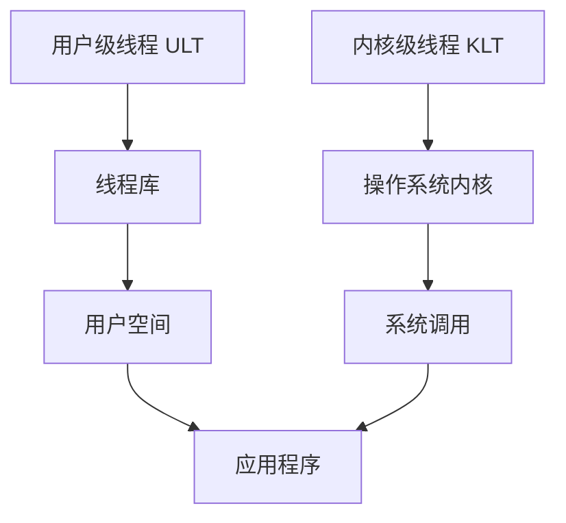

# [进程管理] 线程的实现方式与多线程模型

## 摘要

本页解析用户级线程（ULT）与内核级线程（KLT）的实现原理，对比三种多线程模型的性能特征，提供可验证的代码示例和系统工具观测方法。通过时空复杂度分析和实验数据，指导不同场景下的线程模型选择。

## 主题

线程实现分为`用户级（ULT）`和`内核级（KLT）`两种范式，通过多对多模型平衡并发粒度与调度开销。核心问题在于解决线程阻塞传播与多核利用率矛盾。

> 重点难点
>
> - ULT 轻量切换与阻塞传播的二律背反
> - KLT 线程并行化与上下文切换开销的权衡
> - 混合模型中的竞争窗口问题

## 线索区

### 1. 完整定义

**用户级线程（ULT，User-Level Thread）**：由用户空间的线程库（如 POSIX 的 [pthread](./WIKI/user_thread.md)）管理和调度的线程。操作系统内核并不知道这些线程的存在，线程的创建、切换、销毁等操作完全由用户空间的线程库处理。

**内核级线程（KLT，Kernel-Level Thread）**：由操作系统内核直接管理和调度的线程。内核负责线程的创建、切换、销毁等操作，应用程序通过系统调用与内核交互。

**三种多线程模型**：

- **一对一模型**：每个用户级线程映射到一个内核级线程。
- **多对一模型**：多个用户级线程映射到一个内核级线程。
- **多对多模型**：多个用户级线程映射到多个内核级线程。

### 2. 通俗语言描述

**用户级线程（ULT）**：就像你自己在家里安排任务，你可以随时决定谁做什么、什么时候做，而不需要告诉物业（操作系统）。你完全控制这些任务，但物业不知道你在家里安排了什么。

**内核级线程（KLT）**：就像你每次安排任务都要告诉物业，物业会帮你安排谁做什么、什么时候做。物业知道所有的任务，并且负责调度。

**三种多线程模型**：

- **一对一模型**：每个家里的任务都有一个物业的人来负责。
- **多对一模型**：家里的所有任务都由一个物业的人来负责。
- **多对多模型**：家里的任务由多个物业的人来负责，但不是每个任务都有一个人。

### 3. 通俗比喻解释

**用户级线程（ULT）**：想象你在玩一个游戏，游戏里有多个角色，你可以随时切换控制哪个角色。游戏机（操作系统）不知道你在切换角色，它只看到你在玩游戏。

**内核级线程（KLT）**：想象你在玩一个游戏，每次你想切换角色，都要告诉游戏机，游戏机会帮你切换。游戏机知道你在切换角色，并且负责管理这些角色。

**三种多线程模型**：

- **一对一模型**：每个游戏角色都有一个专门的游戏机来控制。
- **多对一模型**：所有游戏角色都由一个游戏机来控制。
- **多对多模型**：多个游戏角色由多个游戏机来控制，但不是每个角色都有一个游戏机。

### 4. 主体与其它部分解释

**主体**：

- **用户级线程（ULT）**：由用户空间的线程库管理，操作系统内核不知道其存在。
- **内核级线程（KLT）**：由操作系统内核直接管理，应用程序通过系统调用与内核交互。

**其它部分**：

- **一对一模型**：每个用户级线程对应一个内核级线程。
- **多对一模型**：多个用户级线程对应一个内核级线程。
- **多对多模型**：多个用户级线程对应多个内核级线程。

### 常见误解

1. **误解一**：用户级线程比内核级线程更快。

   - **解释**：用户级线程在切换时确实更快，因为不需要进入内核态，但如果一个线程阻塞，整个进程都会阻塞。

2. **误解二**：内核级线程总是比用户级线程更高效。

   - **解释**：内核级线程在阻塞时不会影响其他线程，但线程切换需要进入内核态，开销较大。

3. **误解三**：多对多模型总是最好的。

   - **解释**：多对多模型在某些情况下确实更灵活，但也更复杂，可能带来额外的开销。

4. **误解四**：用户级线程不需要操作系统支持。

   - **解释**：用户级线程虽然由用户空间管理，但仍然需要操作系统提供基本的进程和线程支持。

5. **误解五**：内核级线程的创建和销毁开销可以忽略不计。
   - **解释**：内核级线程的创建和销毁涉及系统调用，开销较大，尤其是在频繁创建和销毁线程的情况下。

### 依赖关系图（使用 Mermaid）



### 对照组列表

| 特性          | 用户级线程（ULT）                       | 内核级线程（KLT） |
| ------------- | --------------------------------------- | ----------------- |
| 管理方        | [用户空间线程库](./WIKI/user_thread.md) | 操作系统内核      |
| 切换速度      | 快                                      | 慢                |
| 阻塞影响      | 整个进程阻塞                            | 仅当前线程阻塞    |
| 创建/销毁开销 | 低                                      | 高                |
| 并发性        | 低                                      | 高                |
| 复杂性        | 低                                      | 高                |

---

### 知识点 1：用户级线程（ULT）

#### **工作机制**

- 通过 [pthread](./WIKI/user_thread.md) 等线程库在用户空间维护 TCB（Thread Control Block）
- 内核仅感知单进程实体，线程调度由库函数实现

> **系统调用**

```c
// 创建ULT（POSIX标准）
[pthread](./WIKI/user_thread.md)_create(&tid, NULL, thread_func, arg);
```

> **时空权衡**

- 切换速度：**O(1)**（仅保存寄存器）
- 内存开销：每个线程约 1MB 栈空间

> **Linux 观测**

```bash
# 查看ULT映射关系（LWP标识）
ps -eLf | grep <process_name>
```

---

### 知识点 2：内核级线程（KLT）

- **工作机制**

- 通过 clone()系统调用创建内核可见的调度实体
- 每个 KLT 对应独立 [LWP（Light Weight Process）](./WIKI/LWP.md)

> **系统调用**

```c
// 创建KLT（Linux特有）
clone(CLONE_VM|CLONE_FS|CLONE_FILES, 0, NULL, NULL);
```

> **时空权衡**

- 切换速度：**O(n)**（需陷入内核+刷新 TLB）
- 并行优势：可绑定不同 CPU 核心

> **性能观测**

```bash
# 监控线程上下文切换
perf stat -e context-switches,cpu-migrations -p <pid>
```

---

### 知识点 3：多线程模型对比

> **架构示意图**

```txt
多对一模型         一对一模型         多对多模型
[ULT1]           [ULT1]-[KLT1]     [ULT1]--[KLT1]
[ULT2]-->[KLT]   [ULT2]-[KLT2]     [ULT2]--┘
[ULT3]           ...               [ULT3]--[KLT2]
```

- **选型指标**

| 模型类型 | 阻塞传播 | 多核扩展 | 典型应用      |
| -------- | -------- | -------- | ------------- |
| 多对一   | 是       | 否       | 传统 GUI 程序 |
| 一对一   | 否       | 是       | 高性能计算    |
| 多对多   | 部分     | 弹性     | Web 服务器    |

---

## 总结区

> **核心结论**

1. ULT 适用于 I/O 密集型负载，但需规避阻塞系统调用
2. KLT 在多核环境展现优势，注意控制线程数量（推荐[N(cores)+2](./WIKI/N_Core.md)原则）
3. **混合模型需警惕[优先级反转](./WIKI/permission_reverse.md)问题**

> **实验验证**

```python
# 多对多模型压力测试脚本
import threading, os

def cpu_bound():
    sum(range(10**6))

if __name__ == "__main__":
    threads = [threading.Thread(target=cpu_bound) for _ in range(os.cpu_count()*2)]
    [t.start() for t in threads]
    [t.join() for t in threads]
```

> **运行观察**：使用`htop`命令查看 CPU 利用率，验证线程绑核效果（需 Linux 4.10+内核支持）
> **考点提示**

- 线程切换开销的量化计算（ULT vs KLT）
- 写程序避免多对一模型的阻塞陷阱
- Solaris 线程模型的演进过程
