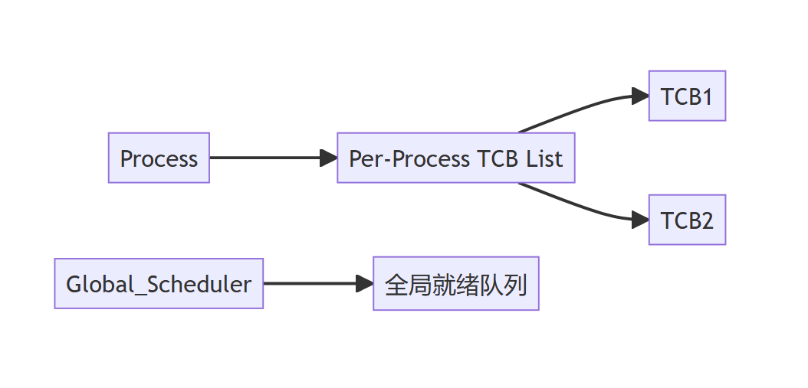

# 线程的状态与转换、组织与控制 [进程管理/线程控制]

## 摘要

本笔记系统解析线程状态转换机制与 TCB 管理结构，通过状态迁移模型与寄存器级操作细节，建立可验证的线程控制知识体系。

## 主题

线程状态机模型与 TCB 数据结构是操作系统线程管理的核心范式，其实现直接影响上下文切换效率与系统吞吐量。

> 重点难点
>
> - **状态转换原子性**：时间片到期与中断响应的时序关系
> - **运行环境保存**：寄存器组与栈帧的协同保存机制
> - **轻量级上下文**：相比进程控制块（PCB），TCB 为何能简化存储结构

---

## 线索区

### 知识点 1：线程状态迁移模型 [进程管理/状态机]

- **三态模型**（与进程模型严格对应）：  

$$
 \boxed{\text{运行态}} \xrightleftharpoons[\text{调度选中}]{\text{时间片耗尽}} \boxed{\text{就绪态}}

\boxed{\text{运行态}} \xrightleftharpoons[\text{事件触发}]{\text{等待资源}} \boxed{\text{阻塞态}}
$$

- **转换触发条件**：

  ```c
  // 伪代码示例：状态转换判断逻辑
  if (time_slice_counter == 0) {
      current_thread->state = READY;
      schedule();
  }
  ```

- **Linux 实践验证**：
  
  ```bash
  # 查看线程状态（R=运行/就绪，S=可中断睡眠，D=不可中断睡眠）
  ps -eLf | awk '$2=='$(pgrep -f your_process)' {print $3, $8}'
  ```

### 知识点 2：线程控制块（TCB）[内存管理/数据结构]

- **最小化存储设计**：

  ```c
  struct tcb {
      tid_t tid;          // 线程ID（64位系统通常用pthread_t）
      void *stack_ptr;    // 栈顶指针（x86_64使用%rsp寄存器）
      void *pc;           // 程序计数器（x86_64使用%rip寄存器）
      uint32_t registers[16]; // 通用寄存器保存区
      thread_state_t state;   // 状态标识位（bitmask实现）
      priority_t priority;    // 调度优先级（通常0-99）
  };
  ```

- **上下文切换开销对比**：  
  
  | 保存内容 | 进程切换 | 线程切换 |  
  |---------------|---------|---------|  
  | 虚拟内存映射 | ✔️ | ✖️ |  
  | FPU 寄存器 | ✔️ | ✔️ |  
  | 文件描述符表 | ✔️ | ✖️ |

### 知识点 3：线程表管理策略 [系统设计/资源调度]

- **两级索引结构**：



  ```mermaid
  graph LR
    Process-->TCB_List[Per-Process TCB List]
    TCB_List-->TCB1
    TCB_List-->TCB2
    Global_Scheduler-->Ready_Queue[全局就绪队列]
  ```

- **Linux 实现参考**：

  ```bash
  # 内核线程查看（内核版本 >= 4.14）
  sudo ls /proc/$PID/task/
  ```

---

## 总结区

- **状态转换考点**：注意`运行→就绪`由时钟中断强制触发，而`阻塞→就绪`依赖外部事件
- **TCB 设计重点**：对比 PCB 需明确线程共享地址空间带来的存储优化（省去 MMU 相关字段）
- **性能关联点**：线程切换时间通常比进程快 5-10 倍（实测值约**1-5μs** vs **10-50μs**）
- **典型面试题**：  
  "为何线程本地存储（TLS）需要特殊处理栈指针？"  
  "解释用户级线程与内核级线程状态管理的本质区别"
