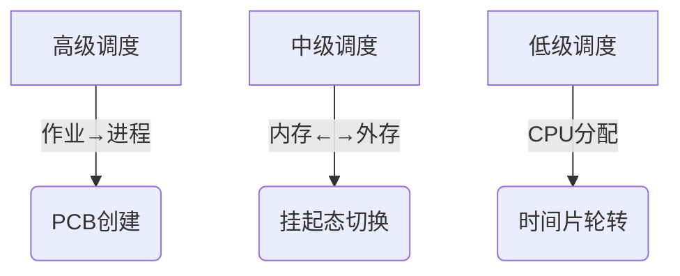

# 处理机调度与进程状态

## 摘要

本笔记系统解析处理机调度的三级架构与进程状态演变，通过分层调度机制实现资源优化配置。结合 Linux 环境实践演示，阐明作业调度（高级调度）、内存调度（中级调度）和进程调度（低级调度）的协同运作，并构建七状态模型解释挂起状态的应用场景。

## 主题

操作系统三级调度体系与进程生命周期管理

> 重点难点
>
> - **调度层次关联**：三级调度的功能边界与协作关系
> - **状态模型演进**：五状态到七状态模型的设计考量
> - **挂起状态本质**：内存换出与进程冻结的技术实现

## 线索区

### 知识点 1: 三级调度体系



**工作机制**：

- **高级调度**（Job Scheduling）：  
  通过`fork()`系统调用创建进程，将作业从磁盘加载到内存

  ```python
  import os
  pid = os.fork()  # 创建新进程
  ```

- **中级调度**（Memory Scheduling）：  
  使用`madvise()`内存建议系统调用管理换页

  ```bash
  # 查看内存页统计
  grep -E 'SwapCached|AnonPages' /proc/meminfo
  ```

- **低级调度**（Process Scheduling）：  
  Linux CFS 调度器通过红黑树（O(log n)）维护进程队列

  ```c
  struct sched_entity {
      struct rb_node run_node;  // 红黑树节点
      u64 vruntime;             // 虚拟运行时间
  };
  ```

### 知识点 2: 七状态模型

**状态迁移图**：

```text
新建态 ─┬─(高级调度)→ 就绪态
        └─(资源不足)→ 就绪挂起

就绪态 ←[中级调度]→ 就绪挂起
   ↓ (低级调度)
运行态 → 阻塞态 ←→ 阻塞挂起
   ↓ (时间片完)
终止态
```

**关键差异**：

- **阻塞态**：进程映像驻留内存，等待 I/O 完成（通过`select()`系统调用监控）
- **阻塞挂起**：进程映像换出到交换分区（使用`swapoff -a`命令管理）

### 知识点 3: 性能权衡

| 调度类型 | 时间开销 | 空间开销 | 典型实现     |
| -------- | -------- | -------- | ------------ |
| 高级调度 | O(n)     | 高       | 批处理系统   |
| 中级调度 | O(1)     | 动态调整 | 页面置换算法 |
| 低级调度 | O(log n) | 固定队列 | CFS 调度器   |

**实验验证**：

```bash
# 观察进程状态变化（需Linux 4.4+）
watch -n 1 'ps -eo stat,pid,comm | grep -E "D|S|T|Z"'
```

> **统计参数**：
>
> - **D**=不可中断睡眠（I/O 阻塞）
> - **S**=可中断睡眠
> - **T**=暂停状态（挂起）

## 总结区

**核心考点**：

1. 三级调度的触发时机与资源管理边界
2. 七状态模型中状态迁移的条件判断
3. 挂起状态与交换分区的关系

**典型试题**：

- 选择题：中级调度主要解决（）问题  
  A. CPU 利用率 B. 内存不足 C. I/O 瓶颈 D. 作业吞吐量  
  **答案**：B（内存资源管理）

**进阶思考**：

- 当系统频繁触发中级调度时，应如何优化内存配置？
- 为什么实时系统通常禁用挂起状态？


[2.2.2 调度的目标（调度算法的评价指标）](2.2.2%20调度的目标（调度算法的评价指标）.md)

[2.2.3_1+2.2.5 进程调度的时机、切换与过程、方式](2.2.3_1+2.2.5%20进程调度的时机、切换与过程、方式.md)

[2.2.3_2 调度器和闲逛进程](2.2.3_2%20调度器和闲逛进程.md)
