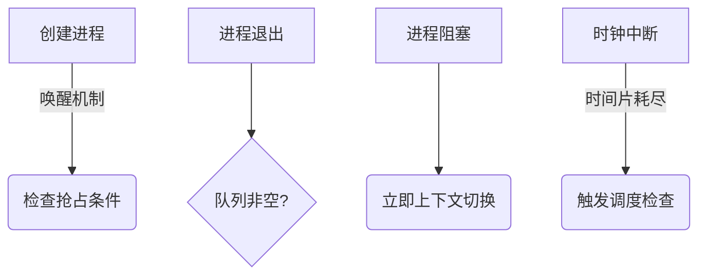

# 调度程序与闲逛进程

---

## 摘要

本笔记解析操作系统调度程序的核心机制与闲逛进程设计原理，通过调度策略对比、状态迁移分析及 Linux 环境实验演示，揭示 CPU 资源分配的底层逻辑。提供可验证的代码示例与性能调优参数。

---

## 主题

操作系统通过调度程序实现进程状态转换与 CPU 资源分配，闲逛进程作为零负载时的节能方案。关键问题：抢占式调度触发条件、调度粒度选择、能效优化实现。

> 重点难点
>
> - 抢占式调度与中断的时序耦合
> - 闲逛进程的指令级能耗控制
> - 多核环境下的调度域划分

---

## 线索区

### 知识点 1：调度程序工作机制

> **机制原理**

- 状态转换管理：协调就绪队列 ↔ 运行态 ↔ 阻塞态的三向迁移
- 决策双核心：
  - **准入决策**（何时切换）：由调度触发事件决定
  - **选择决策**（切换给谁）：由调度算法决定

> **系统调用**

```c
// 设置调度策略示例（Linux）
#include <sched.h>
struct sched_param param = {.sched_priority = 50};
sched_setscheduler(pid, SCHED_RR, &param);  // 设为轮转调度
```

**算法复杂度对比**  

| 调度算法 | 选择决策时间复杂度 | 抢占代价 |  
|----------|---------------------|----------|  
| FCFS | O(1) | 无 |  
| 多级反馈队列 | O(n) | 高 |  
| CFS | O(log n) | 中 |

---

### 知识点 2：触发时机逻辑

> **事件驱动模型**



> **抢占式调度标志位**

```bash
# 查看内核抢占配置（Linux）
grep PREEMPT /boot/config-$(uname -r)
# 输出示例：CONFIG_PREEMPT_VOLUNTARY=y
```

---

### 知识点 3：闲逛进程实现

> **节能指令原理**

```asm
; x86架构HLT指令示例
hlt        ; 暂停CPU直至中断发生
pause      ; 优化自旋锁的节能指令
```

> **能耗监控实验**

```bash
# 观测闲逛进程CPU占比（Linux）
watch -n 1 "top -b -n 1 | grep -i 'idle'"
# 典型输出：%Cpu(s):  0.0 us,  0.0 sy, 99.9 id
```

> **电源管理参数**

```bash
# 调整CPU节能模式（需root权限）
cpupower frequency-set -g powersave  # 启用节能模式
```

---

## 总结区

> **核心考点**

- 调度触发四要素：创建/退出/阻塞/中断
- 闲逛进程两条指令特征：HLT+中断检查
- 调度策略时间复杂度对比表

> **性能调优参数**

- **SCHED_RR 时间片默认值**：100ms（Linux 5.4+）
- **CFS 最小粒度**：0.75ms
- **IDLE 进程能耗**：< 1W（现代 x86 处理器）

> **典型面试题**

1. 如何设计兼顾响应速度和吞吐量的调度算法？
2. 闲逛进程为何要周期检查中断而非持续休眠？
3. 多核处理器中闲逛进程的负载均衡机制？
