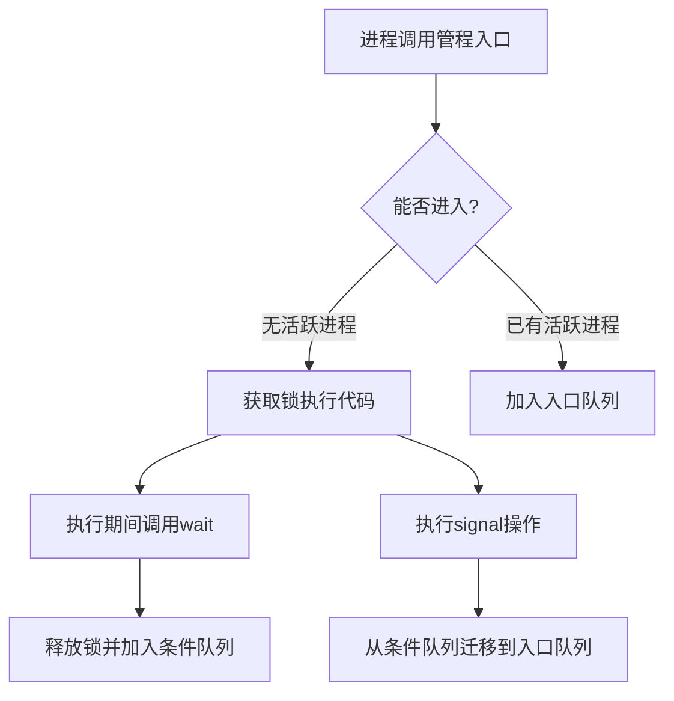

# 管程机制及其在多线程编程中的应用

---

## 摘要

管程是操作系统领域实现进程互斥与同步的高级机制，通过封装共享数据结构和操作函数，提供线程安全的访问接口。相比信号量机制，管程通过编译器自动处理互斥逻辑，并采用条件变量实现同步，显著降低并发编程复杂度。本笔记解析管程核心原理、对比传统信号量差异，并给出典型代码实现。

---

## 主题

**核心机制**：共享数据封装 + 条件变量同步  
**关键技术**：

- 编译器实现的自动互斥锁
- wait/signal 操作的条件变量
- 面向对象式接口封装

> 重点难点
>
> - 管程互斥的编译器实现原理（对比信号量手动 PV 操作）
> - 条件变量队列与进程状态迁移关系
> - Java synchronized 与管程的映射关系

---

## 线索区

### 知识点 1：管程核心组成

**工作机制**：

1. 共享数据结构（如缓冲区）
2. 入口函数集合（如 insert/remove）
3. 初始化代码块
4. 条件变量（condition variables）

**系统调用对比**：  

| 机制 | 互斥实现方式 | 同步方式 |  
|-----------|--------------|---------------|  
| 信号量 | 手动 P/V 操作 | 计数器控制 |  
| **管程** | **编译器自动加锁** | **条件变量+队列** |

**Java 代码示例**：

```java
class Monitor {
    private int buffer;
    private boolean empty = true;

    public synchronized void insert(int item) {
        while (!empty) wait();  // 条件变量等待
        buffer = item;
        empty = false;
        notifyAll();           // 唤醒等待线程
    }

    public synchronized int remove() {
        while (empty) wait();
        int val = buffer;
        empty = true;
        notifyAll();
        return val;
    }
}
```

---

### 知识点 2：条件变量操作原理

**状态迁移图**：

```txt
[运行态] --wait()--> [阻塞态] (进入条件变量队列)
[阻塞态] --signal()--> [就绪态] (移入入口队列)
```

**同步逻辑对比**：

- 信号量：通过计数器值直接控制进程阻塞/唤醒
- 管程：通过条件变量队列管理阻塞进程，**严格保证管程内仅一个活跃进程**

**Python 伪代码实现**：

```python
from threading import Condition

class Monitor:
    def __init__(self):
        self.cv = Condition()
        self.buffer = []

    def insert(self, item):
        with self.cv:
            while len(self.buffer) >= MAX_SIZE:
                self.cv.wait()  # 释放锁并阻塞
            self.buffer.append(item)
            self.cv.notify_all()

    def remove(self):
        with self.cv:
            while len(self.buffer) == 0:
                self.cv.wait()
            item = self.buffer.pop(0)
            self.cv.notify_all()
            return item
```

---

### 知识点 3：性能优化方向

**时间-空间权衡**：

- 朴素实现：每个条件变量使用链表队列（**O(n)** 唤醒耗时）
- 优化方案：采用哈希表存储条件变量（**O(1)** 快速定位）

**Linux 工具验证**：

```bash
# 查看线程状态变化（需root权限）
strace -f -e futex java MonitorDemo  # 跟踪futex系统调用（条件变量底层实现）
```

---

## 总结区

**核心考点**：

1. 管程的**自动互斥特性**（编译器生成锁代码 vs 信号量手动操作）
2. 条件变量的**双重队列管理**（入口队列+条件变量队列）
3. wait 操作必须**在持有锁时调用**的深层原因

**典型错误场景**：

- 未使用 while 循环检查条件（if 判断可能引发虚假唤醒）
- signal 操作后未及时释放锁（导致被唤醒进程长时间阻塞）

**关联扩展**：

- Linux futex 机制（用户态条件变量的内核支持）
- Java ReentrantLock 与 synchronized 的性能对比（管程不同实现方式差异）


