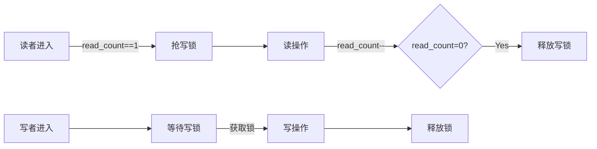

# 读者-写者问题 | 进程管理/同步与互斥

## 摘要

通过信号量机制实现多读者并行访问与写者独占访问的协调控制，提出基于 PV 操作的双层互斥方案，解决写者进程饿死问题，最终实现公平调度。采用计数器+双重互斥锁架构，时间复杂度为 O(1)的原子操作保证系统效率。

## 主题

多进程对共享资源的差异化访问控制，核心矛盾在于：

- **读者间无互斥**：允许并发读取
- **写者完全互斥**：需要独占访问
- **优先级反转**：写者等待时新读者可能持续抢占

> 重点难点
>
> - `读者优先`与`写者优先`的策略抉择
> - **计数器原子性保护**（count++/--的临界区）
> - **信号量队列饥饿预防**（FIFO 公平性保障）

---

## 线索区

### 1. 基本互斥模型

```c
semaphore rw_mutex = 1;  // 读写互斥锁
semaphore mutex = 1;     // 计数器保护锁
int read_count = 0;      // 当前读者数

// 读者进程
void reader() {
    P(&mutex);           // 🔒计数器互斥
    if(++read_count == 1)
        P(&rw_mutex);    // 首个读者抢写锁
    V(&mutex);

    /* 执行读操作 */

    P(&mutex);
    if(--read_count == 0)
        V(&rw_mutex);    // 末位读者释放写锁
    V(&mutex);
}

// 写者进程
void writer() {
    P(&rw_mutex);        // 🔒独占访问
    /* 执行写操作 */
    V(&rw_mutex);
}
```

**系统调用对照**：

- `sem_init()` 创建信号量
- `pthread_mutex_lock()` 实现互斥锁
- `atomic_fetch_add()` 保证计数器原子性

---

### 2. 写者优先改进方案

```python
import threading
w_mutex = threading.Semaphore(1)  # 写优先锁
rw_mutex = threading.Semaphore(1) # 读写锁
read_count = 0

def reader():
    w_mutex.acquire()    # 进入排队系统
    rw_mutex.acquire()   # 读操作锁
    w_mutex.release()

    global read_count
    read_count += 1      # 非原子操作需加锁保护
    if read_count == 1:
        rw_mutex.acquire()
    rw_mutex.release()

    # ...读操作...

    read_count -= 1
    if read_count == 0:
        rw_mutex.release()

def writer():
    w_mutex.acquire()
    rw_mutex.acquire()
    # ...写操作...
    rw_mutex.release()
    w_mutex.release()
```

**性能参数**：

- **信号量等待队列长度**受`/proc/sys/kernel/sem`配置限制
- **上下文切换开销**约 1-10μs（现代 CPU）

---

### 3. 状态迁移图解



---

## 总结区

### 核心考点

1. **PV 操作顺序**：写者优先方案中`w_mutex`的获取顺序
2. **原子性保障**：`read_count`修改必须位于临界区内
3. **饥饿检测**：`dmesg | grep hung_task` 监控长期阻塞进程

### 对比分析

| 方案       | 读者优先 | 写者优先 | 公平队列    |
| ---------- | -------- | -------- | ----------- |
| 新读者抢占 | ✅       | ❌       | ⚠️ 条件触发 |
| 写延迟     | 高       | 低       | 中等        |
| 实现复杂度 | 简单     | 中等     | 复杂        |

### 实验验证

```bash
# 编译POSIX信号量示例
gcc -pthread rw_problem.c -o rw_test
# 监控信号量状态
watch -n 1 "ipcs -s -i <semid>"
```

**内核依赖**：

- Linux 2.6+ 支持 FUTEX 快速用户态互斥
- CONFIG_PREEMPT_COUNT 配置影响调度延迟
