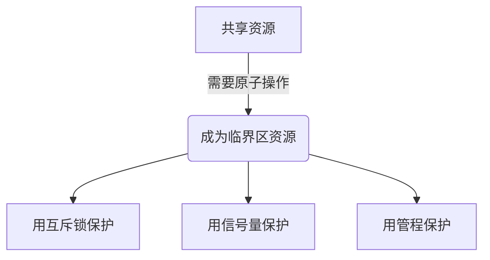
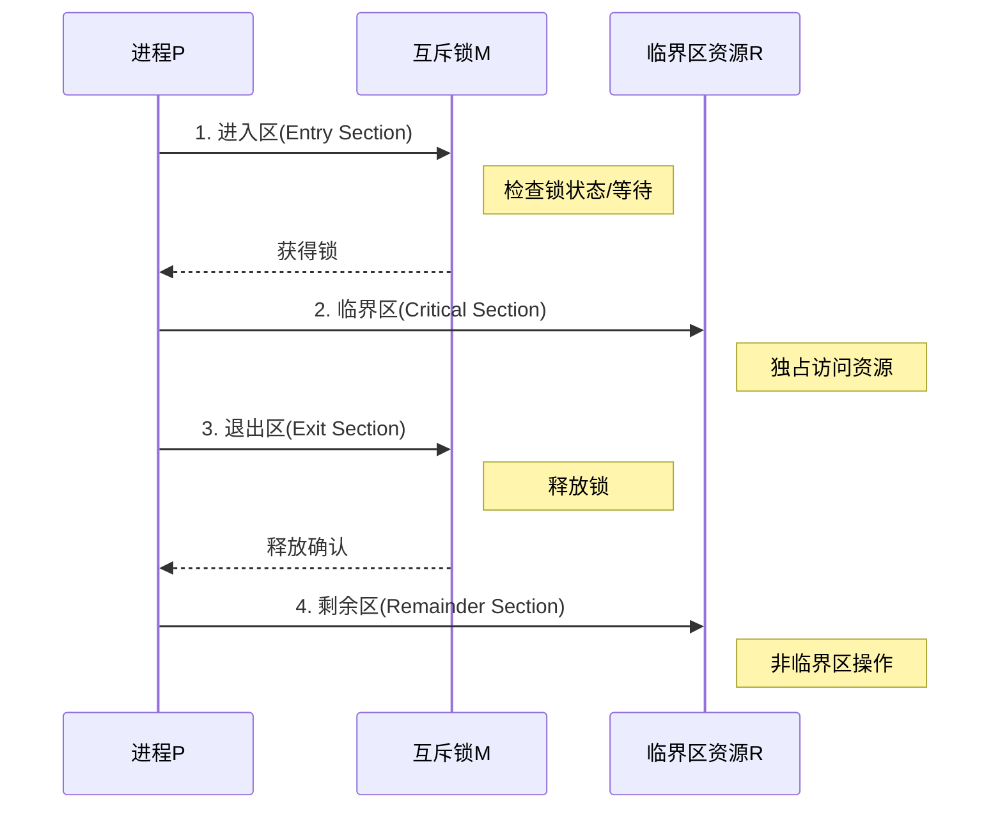

# 临界区资源详解

## 1. 完整定义

**临界区资源**(Critical Section Resource)指在多进程/线程环境中，一次仅允许一个执行单元访问的共享资源，访问该资源的代码段称为临界区(Critical Section)。其核心特征为：

- 互斥性(Mutual Exclusion)
- 原子性(Atomicity)
- 有限等待(Bounded Waiting)

数学表达：

$$
\forall t \in T, \exists \text{ at most one } p \in P \text{ executing } CS(p) \text{ at } t
$$

其中 T 为时间集合，P 为进程集合，CS(p)表示进程 p 的临界区。

## 2. 通俗描述

就像公共厕所的隔间，同一时间只能有一个人使用。在程序里就是多个线程都想修改的共享变量（比如全局计数器），必须保证修改时"独占使用"。

## 3. 生活比喻

**超市收银台**：

- 临界区资源 = 收银台
- 临界区代码 = 结账过程
- 锁机制 = 收银台的"正在使用"指示灯
- 竞争进程 = 排队等待的顾客

## 4. 定义分解

| 组成部分     | 解释说明         | 对应收银台案例             |
| ------------ | ---------------- | -------------------------- |
| **主体**     | 被保护的共享资源 | 收银台本身                 |
| **访问约束** | 互斥访问要求     | "一次只服务一个顾客"的规则 |
| **执行单元** | 进程/线程        | 排队结账的顾客             |
| **守护机制** | 锁/信号量等      | 收银台的指示灯/叫号系统    |

## 常见误解

1. **误解**：所有共享资源都是临界区资源  
   **正解**：只有需要原子操作的共享资源才是（比如只读的共享数据就不算）

2. **误解**：临界区就是加锁的代码段  
   **正解**：加锁是保护临界区的手段，临界区本质是被保护的共享资源访问代码

3. **误解**：临界区越大越好（反正已经加锁了）  
   **正解**：临界区应尽可能小（类比：结账过程越长，排队顾客等待越久）

4. **误解**：单核 CPU 不需要临界区保护  
   **正解**：线程切换可能发生在任何时刻，即使单核也需要保护

5. **误解**：临界区资源只能是内存变量  
   **正解**：文件/设备等 I/O 资源也可能成为临界区资源



## 临界区与互斥的关系解析

### 直接回答

**临界区本身不是互斥的**，但需要通过互斥机制来实现对临界区的保护。两者关系可以总结为：

- 临界区是需要保护的代码段
- 互斥是实现保护的手段

### 概念分解

| 概念       | 本质                    | 类比案例               | 是否互斥      |
| ---------- | ----------------------- | ---------------------- | ------------- |
| **临界区** | 需要保护的代码/资源区域 | 超市收银台             | ❌ 本身不互斥 |
| **互斥锁** | 保护临界区的机制        | 收银台的"使用中"指示灯 | ✅ 实现互斥   |

### 关键区别

1. **临界区**：

   - 是程序中的一个代码段（访问共享资源的部分）
   - 就像银行柜台办理业务的窗口区域
   - **天然不具备互斥性**，多个线程可以同时尝试进入

2. **互斥机制**：
   - 是强制单线程访问的技术手段（如 mutex/semaphore）
   - 就像银行取号机的排队系统
   - **专门用来实现互斥访问**

### 常见误解纠正

**误解**："临界区"和"互斥"是一回事  
**正解**：临界区是"需要被保护的对象"，互斥是"保护方法"，就像：

- 临界区 = 你家的大门
- 互斥 = 门锁系统
  （门本身不提供保护，需要额外加锁）

### 技术视角

```c
// 没有互斥保护的临界区（危险！）
int shared_data = 0;

void unsafe_increment() {
    // 临界区开始（没有互斥）
    shared_data++;
    // 临界区结束
}

// 正确的互斥实现
pthread_mutex_t lock = PTHREAD_MUTEX_INITIALIZER;

void safe_increment() {
    pthread_mutex_lock(&lock);  // 互斥开始
    shared_data++;              // 受保护的临界区
    pthread_mutex_unlock(&lock);// 互斥结束
}
```

### 生活场景对比

1. **无互斥的临界区**：

   - 像开放式厨房，谁都可以进来炒菜
   - 结果可能：盐放两次、火候失控

2. **有互斥保护的临界区**：
   - 像带门禁的厨房，一次只允许一位厨师进入
   - 保证做菜过程完整有序

记住这个核心关系：**临界区是本该互斥的区域，但需要额外机制来实现真正的互斥**。

---

## 临界区资源访问过程详解



### 完整定义

1. **进入区(Entry Section)**  
   请求访问权限的代码段，包含互斥机制（如锁获取）

2. **临界区(Critical Section)**  
   实际访问共享资源的独占代码段，满足互斥性

3. **退出区(Exit Section)**  
   释放访问权限的代码段（如锁释放）

4. **剩余区(Remainder Section)**  
   与共享资源无关的其他代码

数学表达进程 P 的执行流程：

$$
\text{Process } P_i \rightarrow
\begin{cases}
\text{Entry: } \text{acquire}(lock) \\
\text{Critical: } \text{access\_resource}() \\
\text{Exit: } \text{release}(lock) \\
\text{Remainder: } \text{other\_code}()
\end{cases}
$$

### 通俗描述

想象去网红餐厅吃饭：

- **进入区**：取号排队（申请权限）
- **临界区**：在餐桌吃饭（独占使用）
- **退出区**：结账离开（释放权限）
- **剩余区**：吃完饭去逛街（无关操作）

### 生活比喻

**共享单车使用流程**：

```txt
[扫码开锁] ——进入区——
[骑行] ——临界区——
[锁车付款] ——退出区——
[去购物] ——剩余区——
```

### 定义分解

| 阶段       | 技术含义                 | 单车案例         | 必要操作       |
| ---------- | ------------------------ | ---------------- | -------------- |
| **进入区** | 获取访问权限的代码       | 扫码开锁         | 检查车辆可用性 |
| **临界区** | 操作共享资源的代码       | 实际骑行过程     | 保持车辆独占   |
| **退出区** | 释放权限的代码           | 锁车并结束计费   | 重置车辆状态   |
| **剩余区** | 不涉及共享资源的普通代码 | 骑车后的其他活动 | 无特殊要求     |

### 常见误解2

1. **误解**：进入区和退出区属于临界区  
   **正解**：临界区仅包含实际操作共享资源的代码（如图红色部分）

   ```mermaid
   graph LR
       A[进入区: 获取锁] --> B[临界区: 操作资源]
       B --> C[退出区: 释放锁]
       C --> D[剩余区]
       style B fill:#ff9999
   ```

2. **误解**：剩余区代码可以无限长  
   **正解**：过长剩余区会导致其他进程饥饿（如单车用户骑完不锁车）

3. **误解**：进入区和退出区必须对称  
   **正解**：非对称实现也可能正确（如读写锁的不同释放方式）

4. **误解**：临界区内可以调用阻塞操作  
   **正解**：可能导致死锁（类比：骑行中把车钥匙扔河里）

5. **误解**：四个阶段必须显式编码  
   **正解**：高级语言可能隐式实现（如`synchronized`块）

### 关键对照

| 正确实现             | 错误实现                 |
| -------------------- | ------------------------ |
| 进入区包含完整性检查 | 直接跳转至临界区         |
| 退出区保证资源释放   | 忘记释放锁               |
| 临界区尽量短小       | 在临界区执行 I/O 操作    |
| 剩余区不操作共享资源 | 剩余区绕过锁直接访问资源 |
