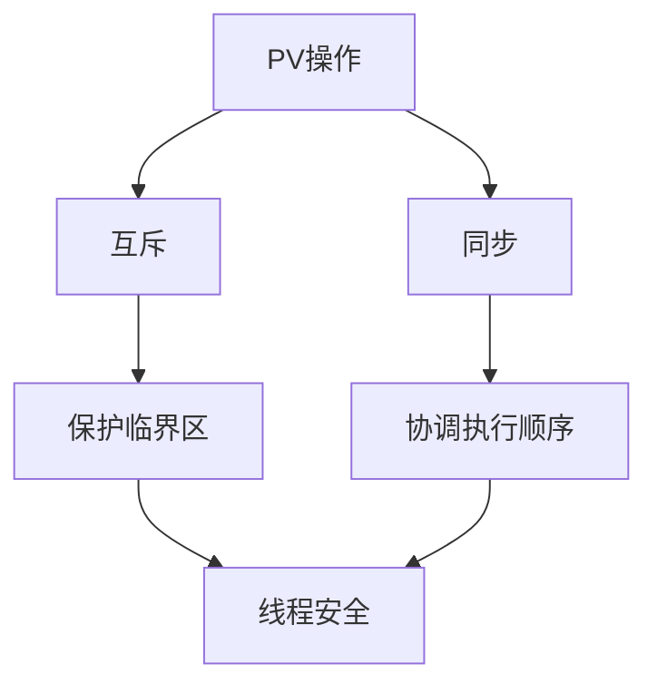

# **PV 操作实现进程互斥与同步模型**

## **1. 完整定义**

PV 操作是 **信号量（Semaphore）** 的核心操作，由 Dijkstra 提出：

- **P(S)**（荷兰语 "Proberen" - 尝试）：
  - 如果信号量 `S > 0`，则 `S--`，进程继续执行。
  - 如果 `S == 0`，则进程阻塞，直到 `S > 0`。
- **V(S)**（荷兰语 "Verhogen" - 增加）：
  - `S++`，并唤醒一个等待在该信号量上的进程（如果有）。

数学表示：

$$
\begin{cases}
P(S): & \text{while } S \leq 0 \text{ do nothing}; \ S = S - 1 \\
V(S): & S = S + 1; \ \text{wake up a waiting process}
\end{cases}
$$

---

## **2. 通俗语言描述**

- **信号量 `S`** 像一个“通行证计数器”：
  - **P(S)**：尝试领通行证，如果没有（`S == 0`）就排队等待。
  - **V(S)**：归还通行证，并叫醒一个排队的人。
- **互斥**：`S` 初始化为 `1`（二进制信号量），保证临界区只有一个进程进入。
- **同步**：`S` 初始化为 `0`，用于协调进程执行顺序（如生产者-消费者）。

---

## **3. 通俗比喻**

- **互斥场景**：公共厕所（临界区）只有一把钥匙（`S = 1`）：
  - **P(S)**：拿钥匙进门，如果没钥匙就等着。
  - **V(S)**：还钥匙，下一个人才能用。
- **同步场景**：妈妈（生产者）做饼干，孩子（消费者）吃：
  - 初始 `S = 0`（没有饼干）。
  - 妈妈做完饼干后 `V(S)`（`S++`），孩子才能 `P(S)` 吃。

---

## **4. 代码实现（C 伪代码）**

```c
#include <semaphore.h>

sem_t mutex;  // 互斥信号量（初始化为1）
sem_t sync;   // 同步信号量（初始化为0）

// 进程A（互斥+自增）
void process_A() {
    P(&mutex);      // 进入临界区
    counter++;      // 自增操作
    V(&mutex);      // 离开临界区
    V(&sync);       // 通知进程B
}

// 进程B（互斥+自减，需等待A）
void process_B() {
    P(&sync);       // 等待A完成
    P(&mutex);      // 进入临界区
    counter--;      // 自减操作
    V(&mutex);      // 离开临界区
}
```

---

# **关键设计要点**

## **1. 互斥（Mutex）**

- **信号量初始化**：`sem_init(&mutex, 1, 1)`（二进制信号量，初始值 1）。
- **临界区保护**：
  ```c
  P(&mutex);  // 加锁
  /* 临界区操作（如 counter++） */
  V(&mutex);  // 解锁
  ```

## **2. 同步（Synchronization）**

- **信号量初始化**：`sem_init(&sync, 1, 0)`（初始值 0，表示“尚未就绪”）。
- **进程间协调**：
  - **生产者**先执行，完成后 `V(&sync)` 通知消费者。
  - **消费者**调用 `P(&sync)` 等待生产者。

## **3. 自增/自减的线程安全**

- 即使 `counter++` 是单行代码，实际编译为多条机器指令（非原子），必须用互斥锁保护。

---

# **所有可能情况的处理**

| **场景**                  | **解决方案**                           | **信号量初始化**  |
| ------------------------- | -------------------------------------- | ----------------- |
| 纯互斥（如修改全局变量）  | `P(mutex)` + `V(mutex)`                | `mutex = 1`       |
| 纯同步（A 完成后 B 运行） | `P(sync)` 等待 + `V(sync)` 通知        | `sync = 0`        |
| 混合（互斥+同步）         | 组合使用 `mutex` 和 `sync`             | `mutex=1, sync=0` |
| 多资源竞争（如读者-写者） | 复杂信号量组合（如 `read_count` 管理） | 依场景定制        |

---

# **常见误解**

1. **误解**：`counter++` 是原子操作，无需保护。  
   **正解**：自增/自减在多数平台非原子，需加锁。

2. **误解**：PV 操作只能用于互斥。  
   **正解**：通过初始值设计，PV 可实现互斥（`S=1`）或同步（`S=0`）。

3. **误解**：`V(S)` 必须由同一进程调用 `P(S)`。  
   **正解**：PV 可跨进程/线程，只要操作同一信号量。

4. **误解**：信号量能解决所有并发问题。  
   **正解**：复杂场景（如死锁避免）需结合其他机制（如条件变量）。

---

# **对照组：PV vs 其他同步机制**

| **机制**     | PV 操作       | 互斥锁 (Mutex) | 条件变量 (Condition)  |
| ------------ | ------------- | -------------- | --------------------- |
| **功能**     | 互斥 + 同步   | 仅互斥         | 同步 + 复杂条件等待   |
| **阻塞方式** | 自动阻塞/唤醒 | 阻塞/唤醒      | 需显式唤醒 (`signal`) |
| **适用场景** | 简单同步/互斥 | 纯互斥         | 多线程复杂协调        |

---

# **Mermaid 依赖关系**



通过合理设计信号量初始值，PV 操作可覆盖所有进程互斥与同步需求。
