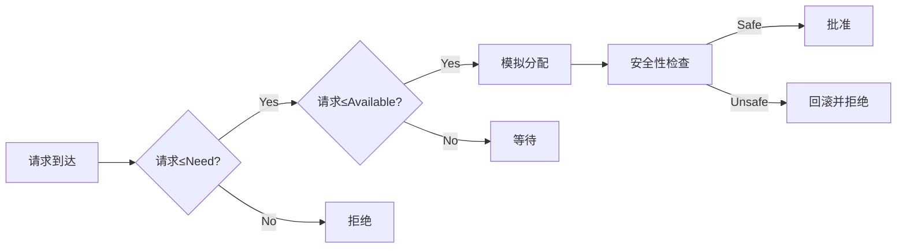

# 银行家算法

## 1. 完整定义

**银行家算法**（Banker's Algorithm）是一种避免死锁的资源分配算法，由 Edsger Dijkstra 提出。它通过模拟资源分配请求，检查系统是否处于安全状态（即所有进程能否按某种顺序完成），从而决定是否批准当前请求。

- **数学描述**：
  - 设系统有 $n$ 个进程和 $m$ 种资源。
  - 定义以下矩阵/向量：
    - **Available**（可用资源）：长度为 $m$ 的向量，表示每种资源的剩余数量。
    - **Max**（最大需求）：$n \times m$ 矩阵，表示每个进程对每种资源的最大需求。
    - **Allocation**（已分配）：$n \times m$ 矩阵，表示每个进程当前已占用的资源。
    - **Need**（需求）：$n \times m$ 矩阵，$Need = Max - Allocation$，表示每个进程还需要的资源。
  - 算法步骤：
    1. 检查请求是否小于等于 $Need$ 和 $Available$。
    2. 临时模拟分配，更新 $Available$ 和 $Allocation$。
    3. 执行**安全性检查**，寻找一个安全序列（所有进程可完成的顺序）。

## 2. 通俗描述

想象银行有一笔钱（资源），一堆客户（进程）来贷款。每个客户会提前声明自己最多需要多少钱（最大需求），但实际可能只借一部分。银行每次收到贷款请求时，会先算一笔账：

- 如果借出这笔钱，剩下的钱还能不能让其他客户顺利借到并还钱（避免所有人卡在半路）。
- 如果能，就批准；否则就拒绝，等下次再处理。

## 3. 通俗比喻

**好比**一个餐厅的餐桌分配：

- **资源**：10 张桌子（不可共享）。
- **进程**：4 组客人，分别预定了最多 [4, 2, 3, 3] 张桌（最大需求），但当前已占用了 [1, 0, 1, 2] 张（已分配）。
- **请求**：第 2 组客人要 1 张桌。
- **银行家算法**：老板会想——如果借出这 1 张，还剩 $10-1-0-1-2=6$ 张，能否满足其他组的需求（比如第 1 组还需要 3 张，第 3 组需要 2 张等）。如果能找到一种顺序让所有组最终都能吃完走人（释放桌子），就批准；否则让第 2 组等一等。

## 4. 主体与其它部分分解

### **主体**：**安全性检查**

- **目标**：找到一个安全序列（进程执行顺序），使得按此顺序分配资源后，所有进程都能完成。
- **方法**：
  1. 检查当前剩余资源是否能满足某个进程的全部需求。
  2. 假设该进程完成，释放其占用的资源。
  3. 重复上述步骤，直到所有进程被加入序列（安全）或无法继续（不安全）。

### **其它部分**：

- **资源请求处理**：在安全性检查前，先验证请求是否合法（不超过声明需求和当前可用资源）。
- **数据结构**：维护 $Available$、$Max$、$Allocation$、$Need$ 表格，动态更新。

## 对照组（银行家算法 vs 死锁预防）

| **特性**   | **银行家算法**             | **死锁预防**                     |
| ---------- | -------------------------- | -------------------------------- |
| **策略**   | 动态避免                   | 静态限制（如一次性分配所有资源） |
| **开销**   | 计算复杂度高（需实时检查） | 低（规则简单）                   |
| **灵活性** | 高（按需分配）             | 低（可能浪费资源）               |

## 依赖关系（mermaid）

---

> - 案例 假设进程互斥，6 个并发进程每个要 5 个资源，那不发生死锁最小资源数是多少？

每个进程需要 \( m = 5 \) 个资源，共有 \( n = 6 \) 个进程。  
关键是最坏情况下，所有进程都只差 1 个资源即可完成。此时，系统必须能保证至少有一个进程能获得全部资源。

公式为：  
\[
\text{最小资源数} = n \times (m - 1) + 1 = 6 \times (5 - 1) + 1 = 25
\]

**验证**：

- 若总资源为 25，每个进程分配 4 个资源（共占用 \( 6 \times 4 = 24 \) 个），剩余 1 个资源。
- 这个剩余资源可让某个进程凑齐 5 个，执行后释放 5 个资源，供其他进程使用。

若资源数为 24，所有进程均分配 4 个后无剩余，导致死锁。因此，**最小资源数为 25**。

是的，你的问题与**银行家算法（Banker's Algorithm）**的抽象思想直接相关，但更准确地说，它属于**死锁避免（Deadlock Avoidance）**中**资源分配的安全性检查**的数学抽象。以下是具体分析：

---

### 1. **银行家算法的核心思想**

银行家算法是一种**死锁避免**策略，其核心是通过预判资源分配后系统是否处于**安全状态**（即是否存在一个进程执行序列能使所有进程顺利完成）。

- 它需要已知每个进程的**最大需求**（如你的问题中每个进程需要 5 个资源）。
- 你的计算（\( n \times (m-1) + 1 \)）本质上是**确保至少有一个进程能获得足够资源**，从而打破死锁的必要条件（循环等待）。

---

### 2. **你的问题 vs. 银行家算法**

- **相同点**：
  - 都基于进程的**最大资源需求**（5 个资源/进程）。
  - 都要求系统保留足够的资源以避免所有进程因资源不足而阻塞（即避免**不安全状态**）。
- **不同点**：
  - 银行家算法是动态的（运行时检查每次请求是否安全），而你的问题是静态的（直接计算最小资源数）。
  - 你的公式是银行家算法中**最坏情况下的资源下限**，即保证系统**至少有一个安全序列**的最小资源数。

---

### 3. **数学本质：组合学与死锁条件**

你的计算实际上规避了死锁的四个必要条件之一——**循环等待**：

- 如果系统有 \( n \times (m-1) + 1 \) 个资源，则**至少有一个进程能获得全部资源**，从而打破潜在的循环等待链。
- 这与银行家算法中**安全序列必须存在**的要求一致。

---

### 4. **更一般的公式**

对于 \( n \) 个进程，每个进程最大需要 \( m \) 个资源，且系统共有 \( k \) 个资源时：

- **不死锁的充分条件**：\( k \geq n \times (m-1) + 1 \)。
- **银行家算法的扩展**：若资源动态请求，则需实时检查 \( \text{可用资源} \geq \text{某个进程的剩余需求} \)。

---

问题**抽象了银行家算法的安全性条件**，但更侧重于静态的**资源下限计算**。银行家算法则进一步动态管理资源分配，确保每次请求后系统仍处于安全状态。两者共同的目标是**避免死锁**，但实现层次不同。

## 总结

银行家算法像精明的会计，每次借钱前都算清“万一所有人同时要钱，我能不能兜住”。虽然计算麻烦，但能避免系统“卡死”。
