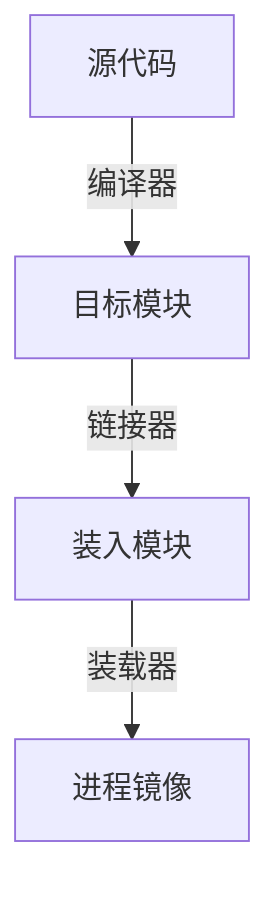

# 内存管理与程序执行流程

## 摘要

研究程序从编码到执行的全流程内存管理机制，解析逻辑地址到物理地址转换策略。通过三类装入方式（绝对/静态重定位/动态重定位）与三种链接方式（静态/装入时动态/运行时动态）对比，揭示现代操作系统内存管理核心技术。

---

## 主题

程序执行全生命周期中的内存管理关键技术

> **核心方法**

- 地址空间分层策略（逻辑/物理地址映射）
- 动态重定位寄存器机制
- 模块化链接技术

> 重点难点
>
> - 动态重定位实时地址转换原理
> - 装入方式与内存分配策略的耦合关系
> - 链接时延对程序性能的影响

**关键词**  
`MMU` `ELF格式` `页表基址寄存器` `延迟绑定`

---

## 线索区

### 1. 内存编址基础

**定义**  
内存按存储单元组织，每个单元具有唯一物理地址，编址方式由计算机架构决定：

- 字节编址：每个地址对应 1 字节（x86 架构）
- 字编址：每个地址对应机器字长（DSP 常见）

> **关键参数**

- 32 位系统地址空间：**4GB**（$2^{32}$）
- 64 位系统地址空间：**16EB**（$2^{64}$）

> 现实类比：内存如同酒店客房，物理地址是房间号，进程如旅客需要动态分配房间

---

### 2. 程序执行四阶段



> **编译阶段**

- 符号解析：建立函数/变量引用关系
- 重定位信息：记录需修改的地址字段

> **典型问题**

- 链接时未解析符号（undefined reference）
- 地址越界（stack overflow）

---

### 3. 地址转换策略对比

| 装入方式   | 转换时机 | 硬件需求       | 内存连续性 | 典型应用         |
| ---------- | -------- | -------------- | ---------- | ---------------- |
| 绝对装入   | 编译时   | 无             | 必须连续   | 嵌入式裸机程序   |
| 静态重定位 | 装入时   | 重定位装入器   | 必须连续   | 早期 DOS 系统    |
| 动态重定位 | 运行时   | MMU+基址寄存器 | 可不连续   | 现代 OS 进程管理 |

> **动态重定位公式**

$$
\text{物理地址} = \text{逻辑地址} + \text{基址寄存器值}
$$

_注：现代系统采用分页机制，实际公式为$\text{物理地址} = \text{页表}[\text{虚拟页号}] + \text{页内偏移}$_

---

### 4. 链接技术演进

> **静态链接**

- 优点：执行效率高
- 缺点：内存冗余（如多个进程使用相同 libc）

> **动态链接**

- PLT(Procedure Linkage Table)：延迟绑定技术
- GOT(Global Offset Table)：存储外部符号地址

> 类比：静态链接如自带工具箱，动态链接如共享工具房

---

## 总结区

> **知识图谱**

```text
内存管理
├── 地址空间
│    ├── 逻辑地址（程序视角）
│    └── 物理地址（硬件视角）
├── 装入策略
│    ├── 绝对装入（地址固定）
│    ├── 静态重定位（装入时调整）
│    └── 动态重定位（运行时调整）
└── 链接技术
     ├── 静态链接（提前绑定）
     ├── 装入时动态链接（加载时解析）
     └── 运行时动态链接（按需加载）
```

> **高频考点**

1. 动态重定位对虚拟内存的支持机制
2. 静态链接与动态链接的空间效率对比
3. 重定位寄存器在地址转换中的具体作用

> **实验关联**

- GDB 调试中观察 ELF 文件段结构（readelf -a）
- 通过/proc/[pid]/maps 查看进程内存布局

---

请确认是否需要调整内容深度或补充特定技术细节。
