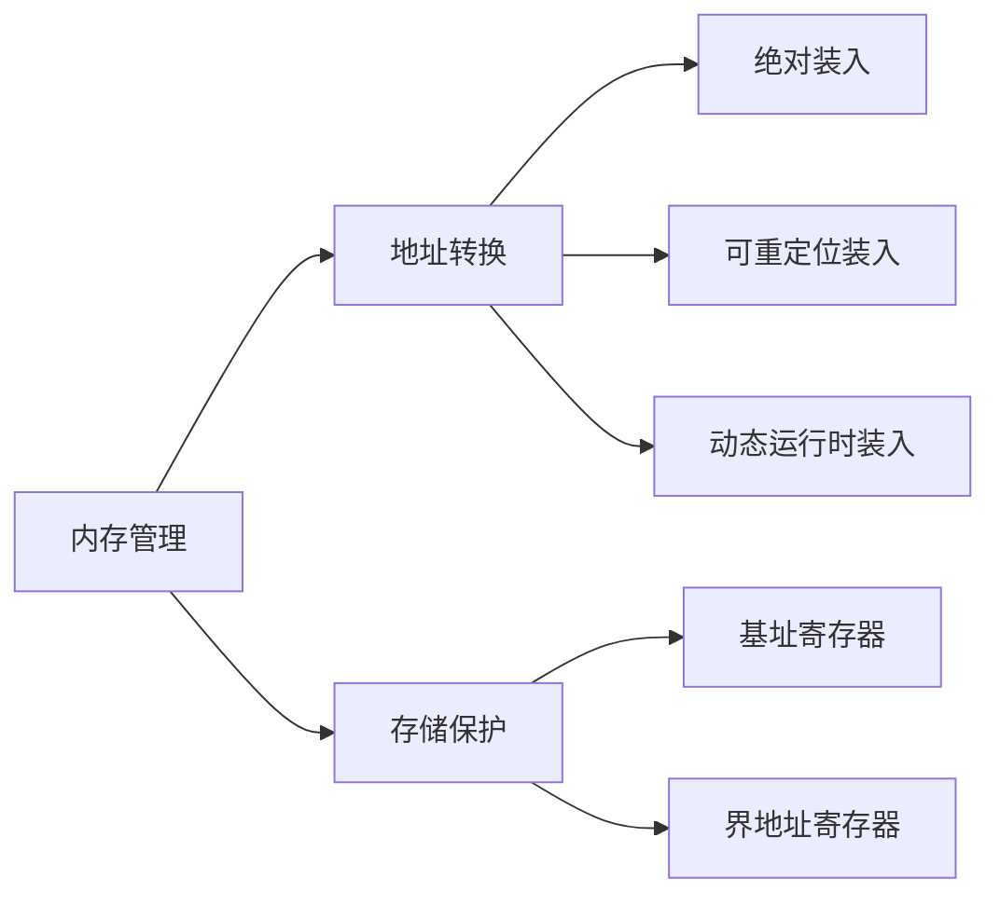

# 内存管理

## 摘要

**目的**：实现物理内存高效利用与进程安全隔离  
**方法**：地址转换机制（绝对/可重定位/动态装入） + 存储保护寄存器组  
**结果**：逻辑地址空间虚拟化、进程间内存隔离保护  
**结论**：现代 OS 通过动态运行时装入与界地址寄存器实现灵活内存管理

---

## 主题

**核心任务**：

1. 内存分配/回收
2. 虚拟内存扩展
3. 逻辑 → 物理地址转换
4. 进程存储保护

**关键技术**：

- 三级地址转换体系
- 寄存器组保护机制（基址/界地址/重定位）

> 重点难点
>
> - **动态地址转换**：运行时基址寄存器动态计算物理地址
> - **越界检测**：逻辑地址与界地址寄存器的实时比对机制

---

## 线索区

### 内存管理框架

**定义**：OS 对物理内存的抽象管理模型  
**四大功能**：

1. 分配与回收（连续/非连续）
2. 虚拟化扩展（swap 技术）
3. 地址转换（$物理地址=基址+逻辑地址$）
4. 存储保护（硬件级隔离）

### 地址转换技术

#### 绝对装入（Absolute Loading）

- **原理**：编译时直接生成物理地址
- **局限**：仅适用于单道程序系统
- **公式**：$物理地址 = 编译地址$

#### 可重定位装入（Relocatable Loading）

- **原理**：加载时通过偏移量修正地址
- **公式**：$物理地址 = 加载基址 + 逻辑地址$
- **典型应用**：早期多道批处理系统

#### 动态运行时装入（Dynamic Run-time Loading）

- **原理**：运行时通过基址寄存器动态计算
- **公式**：$物理地址 = BR + L$
  - $BR$: 基址寄存器(Base Register)
  - $L$: 逻辑地址(Logical Address)
- **优势**：支持进程动态换入换出

### 存储保护机制

#### 寄存器组架构

```plaintext
        +---------------+
        | 界地址寄存器  | → 存储最大允许逻辑地址L_max
        +---------------+
               ↓
        +---------------+
        |   比较器      | → 触发越界中断当L > L_max
        +---------------+
               ↓
        +---------------+
        | 基址寄存器    | → 存储物理基地址BR
        +---------------+
```

#### 保护流程

1. CPU 发送逻辑地址$L$
2. 比较器验证$L ≤ L_{max}$
3. 若未越界：$物理地址=BR + L$
4. 若越界：触发内存保护异常

---

## 总结区

**知识图谱**：



**考点聚焦**：

1. 三种地址转换方式的演进关系
2. 动态运行时装入的硬件实现原理
3. 越界中断触发条件计算

**典型问题**：

- 给定基址寄存器值 BR=0x5000，界地址寄存器 LR=0x2000：
  - 逻辑地址 L=0x1500 → 有效物理地址？
  - 逻辑地址 L=0x2100 → 系统响应？

**性能参数**：

- 动态地址转换延迟 ≤ **2 个时钟周期**（现代处理器）
- 典型寄存器位宽：**32/64 位**

---

请核对优化后的笔记结构是否符合需求，需要进一步调整请随时告知。
