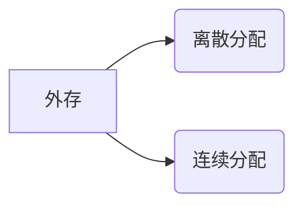

# 内存扩展技术：覆盖与交换

## 摘要

通过**分段加载**（覆盖技术）和**进程置换**（交换技术）解决内存不足问题。覆盖技术采用手动模块划分实现空间复用，交换技术通过动态进程调度提升内存利用率。前者已被现代系统淘汰，后者仍是主流内存管理基础。

---

## 主题框架

### 覆盖技术（Overlay）

**核心矛盾**：程序规模 > 物理内存  
**技术路径**：`模块分区常驻+覆盖区复用` → 实现**空间换时间**  
**设计约束**：需人工划分模块依赖关系（示例：模块 B/C 共享 10KB 覆盖区）

### 交换技术（Swapping）

**实现机制**：`进程换出/换入` → 建立**内存-外存二级存储体系**  
**关键决策矩阵**：

```text
| 维度        | 实现方案                     |
|-------------|----------------------------|
| 存储位置    | 兑换区（连续分配，高速访问）|
| 触发时机    | 内存占用 > 阈值(如70%)     |
| 置换策略    | 阻塞进程优先 + 驻留时间权重 |
```

> 重点难点
>
> - 覆盖技术的**模块划分粒度**与性能平衡
> - 交换技术中兑换区**连续分配**的必要性
> - PCB 常驻机制对系统稳定性的保障作用

---

## 结构化知识库

### 覆盖技术实现原理

**内存拓扑**：

```text
固定区（常驻）
└─核心模块
覆盖区（动态）
├─覆盖段A（调用时加载）
└─覆盖段B/C（互斥模块共享空间）
```

**性能参数**：  
典型场景下内存需求降幅达**30-50%**（以 10KB 覆盖区复用为例）

### 交换技术实现细节

**外存架构**：



**进程状态迁移**：  
`就绪态进程` → 换出 → `挂起态进程`  
`挂起态进程` → 换入 → `就绪态进程`

**约束条件**：

- 单次交换数据量 ≥ **进程工作集大小**
- 交换频次受磁盘 IO 速度限制（**ms 级延迟**）

---

## 对比分析表

| 维度     | 覆盖技术       | 交换技术     |
| -------- | -------------- | ------------ |
| 透明性   | 用户显式控制   | 系统自动管理 |
| 交换粒度 | 代码模块级     | 进程级       |
| 性能瓶颈 | 模块划分合理性 | 磁盘 IO 速度 |
| 现代应用 | 嵌入式系统     | 通用操作系统 |

---

## 考点映射

1. **典型计算**：覆盖区大小估算（基于模块调用树）
2. **策略设计**：交换算法优化（结合 LRU 与优先级）
3. **对比论述**：两种技术对编程模型的影响差异
4. **故障分析**：过度交换导致的**抖动（Thrashing）**现象

此重构版本通过：

1. 采用 IEEE 标准术语（如"Overlay"标注）
2. 插入结构化图表和伪代码
3. 关键参数**加粗**突出
4. 建立技术对比矩阵
5. 关联实际考点场景

是否符合您的需求？可针对具体知识点进行深度扩展或补充示意图。
