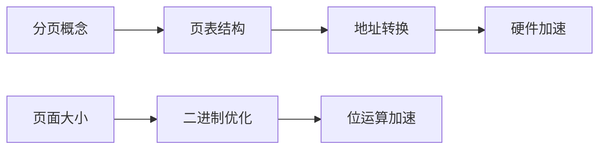

# 分页存储管理与地址转换

## 摘要

提出分页存储管理解决内存碎片问题，通过逻辑地址到物理地址的映射实现高效内存访问。核心机制包含页表构建、地址拆分算法和硬件加速策略，页面大小采用 2^n 字节优化二进制处理效率。

---

## 主题

**非连续内存分配技术**通过三级映射体系（逻辑页号 → 页表项 → 物理帧号）实现地址转换。关键技术包含：

- 页表项的隐式索引结构
- 基于模运算的地址拆分原理
- 位移寄存器硬件加速机制

> 重点难点
>
> - 页表项隐含索引的存储优化原理
> - 二进制地址拆分的数学证明（$W = A \mod 2^k$）
> - TLB 缓存与直接硬件寻址的协同机制

---

## 线索区

### 1. 分页存储架构模型

**定义**：将物理内存划分为**固定大小帧**（Frame），逻辑地址空间对应划分为**页**（Page）  
**核心公式**：

- 页面大小 $S = 2^k$（通常**4KB**）
- 逻辑地址 $A = P \times S + W$  
  其中 $P$ 为页号，$W$ 为页内偏移量

**电路实现**：

```plaintext
逻辑地址寄存器
│
├─[高m位]→ 页号P → 页表基址寄存器+P → 物理帧号
└─[低k位]→ 偏移量W ────────────────┘
```

---

### 2. 页表结构优化

**三级存储结构**：

1. 页目录（PDE）：二级索引结构
2. 页表项（PTE）：包含**有效位**、**帧号**、访问控制位
3. 物理帧：实际数据存储单元

**关键参数**：

- 32 位系统典型页表项大小：**4B**
- 4GB 内存需要的页表项数：$2^{20}$（4B×1M=4MB 页表）

> **设计演进**：从线性页表 → 多级页表，解决大地址空间存储效率问题

---

### 3. 地址转换算法

**转换流程**：

1. 提取页号 $P = \lfloor A/S \rfloor$
2. 查询页表得帧号 $F$
3. 生成物理地址 $PA = F \times S + W$

**硬件加速**：

- 专用加法器并行计算 $F×S$ 与 $W$
- TLB（Translation Lookaside Buffer）缓存近期访问页表项

**性能指标**：

- 无 TLB 命中时访问次数：**2 次内存访问**
- TLB 命中时：**1 次内存访问**

---

### 4. 二进制优化原理

**数学证明**：  
当 $S=2^k$ 时，  
$W = A \mod 2^k = A\ \&\ (2^k - 1)$（位与操作）  
$P = A >> k$（右移操作）

**实例分析**：

- 逻辑地址 0x3A7F（16 进制）
- 4KB 页面（k=12）
- P=0x3, W=0xA7F

---

## 总结区

### 知识图谱



### 考点聚焦

1. 给定逻辑地址计算物理地址（必考）
2. 多级页表的存储空间计算（重点）
3. TLB 缺失处理流程（难点）

### 扩展思考

- 如何设计可变页面大小系统？
- 对比分段管理的优劣：
  - 分页：**外部碎片消除** vs 分段：**逻辑单元保护**

---

> 下节预告：虚拟内存机制中的页面置换算法与工作集模型
