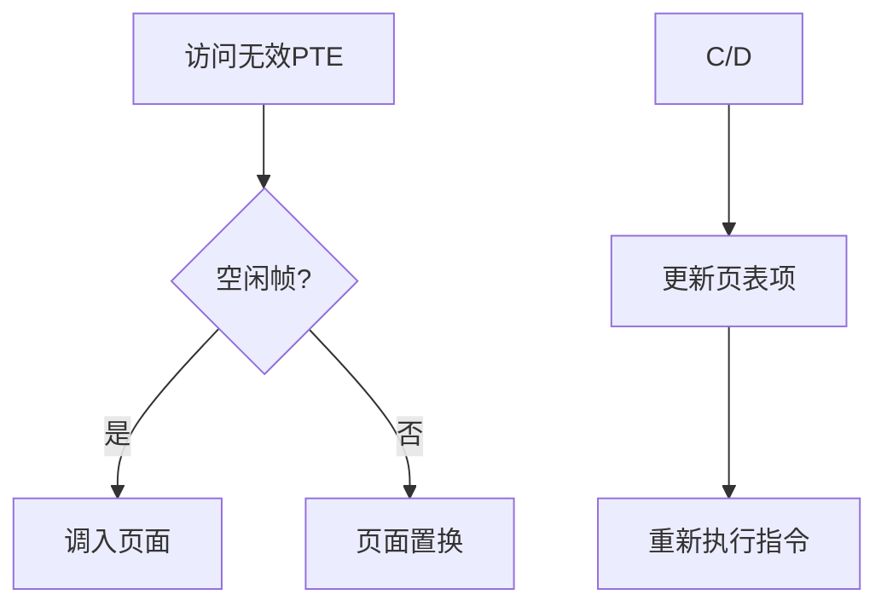

# 两级页表与虚拟存储技术

## 摘要

通过构建分级页表结构，解决单级页表内存连续存储问题，实现虚拟存储的动态加载。重点分析 32 位系统地址转换流程（3 次访存），阐明页表分级原理与缺页中断机制。

---

## 主题

**核心方法**：空间换时间的分治策略  
**关键技术**：

- 页号二次编码（10+10+12 位拆分）
- 页目录表索引映射（CR3 寄存器定位）
- 页表项状态位控制（存在位/修改位）

> 重点难点
>
> - 地址转换过程与访存次数的定量关系（**3=2+1**）
> - 缺页中断与页面调入的硬件/软件协同机制
> - 页表项数据结构设计对系统性能的影响

---

## 线索区

### 知识点 1：页表分级原理

**问题建模**：

- 单级页表缺陷：
  - 需**连续存储**（32 位系统需$2^{20}$×4B=4MB 连续空间）
  - **内存常驻**要求高（即使进程仅使用部分页面）

**两级页表实现**：

1. **结构拆分**：
   - 页目录表（Page Directory）：$2^{10}$项，每项 4B → 占 4KB 内存块
   - 二级页表：1024 个独立页表，每个 4KB
2. **动态加载**：
   - 仅当前使用的二级页表需驻留内存
   - 页目录表项设置存在位（**P 标志**）指示二级页表状态

$\text{内存节省量} = 4\text{MB} - (4\text{KB} + n×4\text{KB})$ （n 为活跃二级页表数量）

---

### 知识点 2：地址转换流程

**逻辑地址结构**：

$$
\underbrace{0000000000}_{页目录号(10位)} \
\underbrace{0000000000}_{页表索引(10位)} \
\underbrace{000000000000}_{页内偏移(12位)}
$$

**转换步骤**（以 x86 架构为例）：

1. **CR3 定位页目录表**：
   - 从进程控制块（PCB）获取 CR3 寄存器值
   - 计算页目录项地址：$\text{PDE\_addr} = \text{CR3} + \text{页目录号}×4$
2. **获取二级页表基址**：
   - 访问内存读取 PDE（需**第 1 次访存**）
   - 检查 PDE 存在位（若为 0 触发缺页中断）
3. **定位物理页框**：
   - 计算页表项地址：$\text{PTE\_addr} = \text{PDE\_base} + \text{页表索引}×4$
   - 访问内存读取 PTE（需**第 2 次访存**）
4. **合成物理地址**：
   - 物理地址 = $\text{页框号}×2^{12} + \text{页内偏移}$
   - 访问目标内存单元（需**第 3 次访存**）

---

### 知识点 3：虚拟存储协同机制

**页表项扩展**：  

| 位域 | 名称 | 功能说明 |
|------|---------|--------------------------|
| 0 | P | 页面存在标志（1=在内存） |
| 1 | R/W | 读写权限控制 |
| 5 | A | 访问位（用于页面置换算法） |

**缺页中断处理流程**：

**性能影响因子**：

- 缺页率（$\text{Page Fault Rate}$）与有效访问时间关系：
  $$
  EAT = (1-p)×\text{内存访问时间} + p×(\text{中断处理时间} + \text{磁盘访问时间})
  $$

---

## 总结区

**核心考点**：

1. 地址转换计算（给定逻辑地址推算物理地址）
2. 多级页表访存次数与级数的数学关系（**N+1 法则**）
3. 缺页中断处理与页面置换算法联动机制

**设计权衡**：

- 页表级数增加 → 内存占用减少，但访存次数线性增加
- 页面尺寸增大 → 页表项减少，但内部碎片率升高

**演进方向**：

- 反向页表（Inverted Page Table）解决大地址空间问题
- TLB（Translation Lookaside Buffer）加速地址转换

> 下节预告：TLB 工作原理与局部性原理的工程实现
