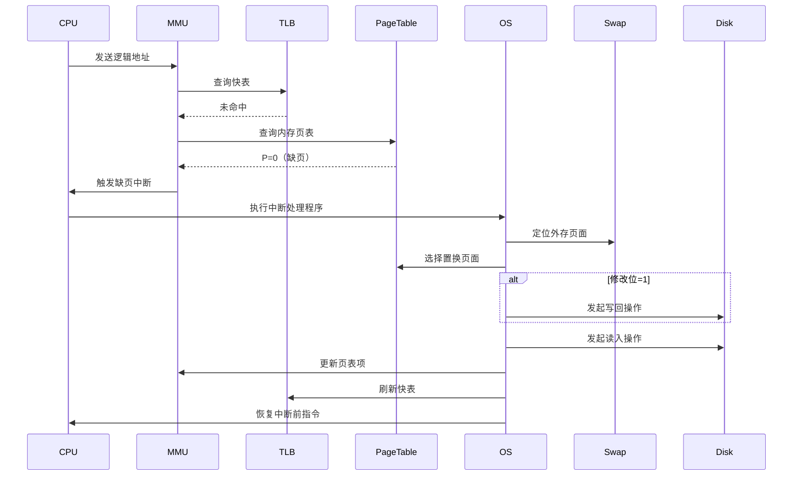

# 请求分页管理方式

## 摘要

请求分页管理通过扩展页表结构（状态位/访问字段/修改位）与缺页中断机制，实现虚拟内存管理。采用请求调页（按需加载）和页面置换（LRU 等算法）策略，解决物理内存不足问题。性能关键指标：**缺页率**和置换算法效率。

## 主题

虚拟内存核心实现技术，通过软硬件协同实现动态页面调度。核心矛盾：**时空局部性利用**与**置换开销控制**。

> 重点难点
>
> - 页表字段与地址变换的硬件交互
> - 缺页中断处理与 I/O 阻塞的时序关系
> - 修改位对置换算法性能的影响

## 线索区

### 系统架构原理

1. 硬件支持：
   - **MMU**：管理页表查询与 TLB 刷新
   - **中断控制器**：处理缺页中断（向量号 14）
2. 核心公式：
   $$\text{有效访问时间} = (1-p)\times t_{mem} + p\times (t_{swap} + t_{mem})$$
   其中$p$为缺页率，$t_{swap}$含页面置换时间

### 页表结构演进

| 字段      | 位数 | 功能描述          | 硬件操作                 |
| --------- | ---- | ----------------- | ------------------------ |
| 状态位(P) | 1    | 页面驻留状态标识  | TLB 查询失败触发         |
| 访问位(A) | 8    | 最近访问时间/频率 | 每次访问自动置 1         |
| 修改位(D) | 1    | 写回脏页标识      | 写操作置 1，换出时需写回 |
| 外存地址  | 20   | 交换空间物理地址  | 缺页时 DMA 控制器读取    |

> 📌 设计演进：相比基本分页增加 4 个控制字段，硬件成本增加约 15%（以 x86 架构为例）

### 缺页中断处理流程

### 性能优化技术

1. **预调页策略**：进程创建时预先加载常用页面（如**ELF 头**段）
2. **写时复制**：fork()使用 COW 技术减少物理页复制
3. **全局置换** vs **局部置换**：
   - 全局置换：系统级页面池，避免进程"内存饥饿"
   - 局部置换：进程独立页面集，保证公平性

## 总结区

### 核心考点

1. 地址变换过程中硬件（MMU）与 OS 的交互时序
2. 修改位对置换算法选择的影响（如 Clock 算法实现）
3. 缺页率与物理块数的关系曲线分析（Belady 现象）

### 典型题型

1. 计算不同置换算法下的缺页次数（LRU/FIFO/OPT）
2. 分析多级页表下的有效访问时间
3. 设计带访问位/修改位的页面置换算法

### 实践关联

- Linux 实现：do_page_fault()函数处理流程
- 性能监控：使用**sar -B**查看系统缺页统计
- 优化案例：MySQL 的 innodb_buffer_pool 预加载机制

> 建议通过 Wireshark 捕获页面交换流量，观察实际 I/O 模式与理论模型的差异。
