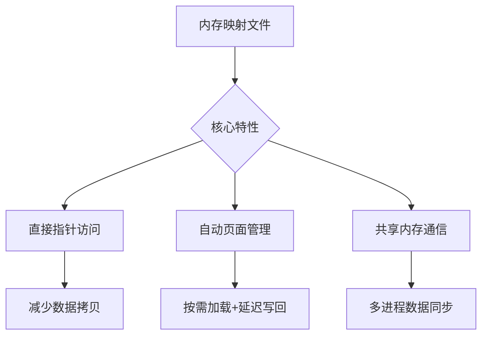

# 内存映射文件

## 摘要

内存映射文件通过虚拟地址空间映射实现文件高效访问，相比传统文件 IO 减少系统调用次数，支持多进程共享数据。核心优势包括：操作简化（指针直接访问）、自动数据同步（OS 管理页面置换）、共享内存通信机制。

## 主题

**文件访问范式革新**：通过虚拟内存管理技术将磁盘文件映射至进程地址空间  
**核心方法**：mmap 系统调用 + 缺页异常处理 + 共享物理页帧  
**技术关键词**：虚拟地址映射、写回策略、进程间通信(IPC)

> 重点难点
>
> - **地址空间映射机制**（虚拟地址 ↔ 物理地址 ↔ 磁盘区块的转换关系）
> - **写回时序控制**（内存修改与磁盘同步的触发条件）
> - **共享冲突处理**（多进程并发修改的可见性问题）

---

## 线索区

### 1. 传统文件访问流程

**定义**：通过显式系统调用(read/write)进行数据搬运的 IO 模式  
**执行流程**：

1. `open()`获取文件描述符
2. `seek()`调整文件指针位置
3. `read()`/`write()`执行数据搬运
4. 手动管理缓冲区与同步时机

**性能瓶颈**：

- 频繁上下文切换（用户态 ↔ 内核态）
- 数据多次拷贝（内核缓冲区 ↔ 用户缓冲区）

> _类比_：传统方式如同用桶从井里打水，每次取水需完整操作流程

---

### 2. 内存映射核心原理

**系统调用**：

```c
void *mmap(void *addr, size_t length, int prot, int flags, int fd, off_t offset);
```

**映射过程**：

1. 建立虚拟地址空间与文件区域的映射关系
2. 访问映射区域触发缺页异常
3. OS 按需加载 4KB 文件块至物理内存
4. 建立页表项完成虚实地址转换

**数据同步**：

- 主动同步：调用`msync()`强制刷盘
- 被动同步：`munmap()`时自动写回
- 周期同步：OS 后台线程定时刷新

---

### 3. 共享访问机制

**实现方式**：

1. 多进程映射同一文件区域
2. OS 通过页表指向相同物理内存页
3. 修改操作直接反映到共享物理页

**并发控制**：

- 读操作：多进程可并发访问
- 写操作：需要额外同步机制（如互斥锁）
- **COW 机制**：部分系统采用写时复制保证数据一致性

> _应用场景_：
>
> - 大型媒体文件编辑（视频剪辑软件）
> - 进程间大数据传输（数据库共享缓冲区）

---

### 4. 性能优化策略

**OS 级优化**：

- **预读取**：根据访问模式提前加载后续数据块
- **缓存策略**：LRU 算法管理内存中的文件页
- **批量写回**：合并多次修改后统一写入磁盘

**开发者控制参数**：

- `MAP_PRIVATE`/`MAP_SHARED` 映射模式选择
- `madvise()` 提供访问模式提示（顺序/随机访问）

---

## 总结区

### 知识图谱



### 考点聚焦

1. **对比分析题**：传统 IO 与内存映射的性能差异（上下文切换次数、数据拷贝次数）
2. **机制阐述题**：缺页异常在内存映射中的作用流程
3. **设计应用题**：如何利用内存映射实现进程间通信

### 难点突破

- **写回时序**：理解`msync()`与自动刷新的触发条件差异（参考文件打开模式 O_SYNC）
- **地址对齐**：掌握文件偏移量必须是 4096 倍数的重要约束
- **大文件处理**：超过物理内存时的分块映射策略

> _记忆口诀_：  
> "映射替代搬运，指针取代读写  
> 共享无需拷贝，OS 自动调度"
