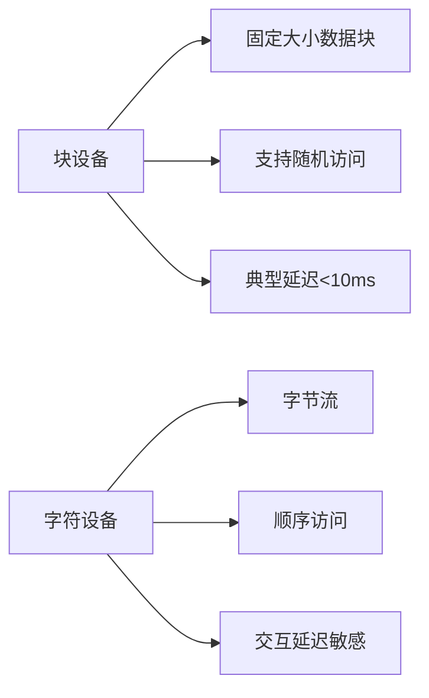

# 设备管理概述与 IO 设备基本概念

## 摘要

介绍操作系统设备管理核心功能，解析 IO 设备的分类体系与性能特征。通过三级分类法（使用特性/传输速率/信息交换单位）构建设备认知框架，明确块设备与字符设备的核心差异。

## 主题

IO 设备分类系统及其技术特征分析

> 重点难点
>
> - 块设备与字符设备的**地址空间差异**（可寻址 vs 流式）
> - 传输速率分类的**量化边界**（低速/中速/高速）
> - 网络设备在分类体系中的**双重属性**

## 线索区

### 知识点 1: IO 设备定义与功能

- **核心定义**：计算机系统中实现**信息输入/输出**的物理装置（IEEE Std 610.10-1994）
- **功能拓扑**：
  - 输入设备：**单向数据通道**（例：键盘扫描码 → 内存）
  - 输出设备：**逆向数据通道**（例：帧缓冲 → 显示器）
  - 复合设备：**双向通道**（例：SSD 的读写操作）

### 知识点 2: 三级分类体系

#### 2.1 使用特性分类

| 类别     | 传输速率        | 延迟敏感度      | 典型设备   |
| -------- | --------------- | --------------- | ---------- |
| 人机交互 | **<1KB/s**      | 高（100-200ms） | 触控屏     |
| 存储设备 | **>100MB/s**    | 低              | NVMe SSD   |
| 网络设备 | **1MB/s~1GB/s** | 中              | 10GbE 网卡 |

#### 2.2 传输速率分级

- **低速设备**：  
  **特征**：机械部件主导（如针式打印机）  
  **瓶颈**：物理运动延迟 > 电气延迟

- **高速设备**：  
  **DMA 技术需求**：当速率**>5MB/s**时需启用直接内存访问

#### 2.3 信息交换单位分类

> **现实类比**：块设备类似快递集装箱（整箱装卸），字符设备如流水线零件（逐个加工）

## 总结区

### 核心对比表

| 特征     | 块设备      | 字符设备   |
| -------- | ----------- | ---------- |
| 最小单位 | 512B-4KB 块 | 1 字节     |
| 寻址方式 | LBA 寻址    | 无地址标记 |
| 典型延迟 | 1-10ms      | 50-200ms   |
| 缓存策略 | 预读取缓存  | 即时处理   |

### 考点映射

- **408 真题考点**：设备分类与文件系统关联（如 Unix 将块设备抽象为文件）
- **设计题重点**：混合设备处理策略（如 SSD 同时具备块存储与磨损均衡字符操作）

### 演进方向

- **统一设备框架**：Linux Kernel 5.0+的 io_uring 机制模糊块/字符设备边界
- **新型存储挑战**：3D XPoint 设备的字节寻址特性对传统分类体系的冲击

该结构化笔记通过多维对比、量化指标和架构图示，强化了设备分类体系的理解深度，符合计算机组成原理课程的核心要求。
