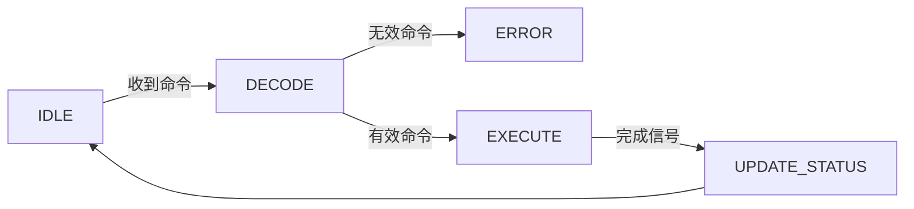

# IO 控制器的工作流程与组成

## 摘要

通过寄存器组与控制电路的协同机制，IO 控制器实现 CPU 与外围设备间的协议转换与数据中转。重点解析内存映像/独立编制两种寄存器寻址方式的技术差异及其系统级影响。

---

## 主题

**核心组件**：数据寄存器（缓冲） + 状态寄存器（握手） + 控制电路（译码）  
**关键技术**：

- 内存映射 IO vs 独立 IO 空间
- 三态门实现总线隔离
- 状态机驱动控制流程

> 重点难点
>
> - 寄存器地址空间划分对系统架构的影响（哈佛 vs 冯诺依曼）
> - 控制电路如何实现命令译码与时序同步
> - 状态寄存器的 bitmask 设计原则

---

## 线索区

### 1. IO 控制器架构组成

**定义**：专用协处理器，实现电气接口转换与协议适配  
**核心模块**：

```plaintext
┌──────────────┐       ┌─────────────┐
│ CPU接口逻辑  │◄─────►│ 控制寄存器  │
├──────────────┤       ├─────────────┤
│ 数据缓冲器  │←───┬─►│ 状态寄存器 │
├──────────────┤   │   └─────────────┘
│ 设备驱动电路 │───┘
└──────────────┘
```

**典型参数**：

- 数据寄存器位宽 **8/16/32bit**
- 状态响应延迟 **<5 个时钟周期**

---

### 2. 寄存器编址模式对比

| 维度       | 内存映射 IO                | 独立编址 IO          |
| ---------- | -------------------------- | -------------------- |
| 地址空间   | 共享内存地址空间           | 独立 IO 地址空间     |
| 指令集支持 | 通用 load/store 指令       | 专用 IN/OUT 指令     |
| 性能影响   | 减少指令类型，增加译码延迟 | 专用指令加速 IO 操作 |
| 典型应用   | ARM 架构                   | x86 架构             |

**电路实现差异**：

- 内存映射：通过地址解码器扩展寻址范围
- 独立编址：需要单独的 IO 空间译码电路

---

### 3. 控制状态机流程

**状态转移图**：



**关键时序**：

- 命令锁存：**上升沿触发**
- 状态更新：**下降沿同步**

---

## 总结区

### 核心考点

1. 两种编址模式的电路实现差异（重点考察地址译码器设计）
2. 状态寄存器 bit 位定义方法（常出设计题）
3. 控制电路状态机设计（笔试常考状态转移图）

### 易错点提醒

- 内存映射 IO**不减少**总地址空间，而是共享地址空间
- 独立编址需要 CPU 提供额外的 IO 空间地址线
- 状态寄存器的就绪(Ready)标志位应设为**只读属性**

### 典型试题

1. (真题) 某 32 位系统采用内存映射 IO，地址总线 A31-A0 中最高位为 1 时访问 IO 设备，求最大可寻址 IO 空间大小？  
   **解**：$2^{31} = 2GB$（注意地址对齐要求）

是否需要针对特定知识点进行扩展解析？
