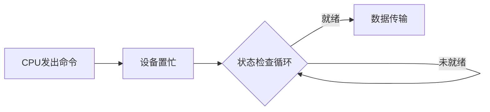

# IO 控制方式

## 摘要

采用四代技术迭代视角解析 IO 控制机制，聚焦 CPU 资源利用率与数据传输效率的优化路径。核心演进逻辑：硬件解耦 → 并行处理 → 专用协处理器。

---

## 主题

通过硬件架构革新降低 CPU 干预度，实现从字节到块级传输的跨越。技术关键路径：轮询 → 中断 →DMA→ 通道，硬件复杂度与效率呈正相关。

> 重点难点
>
> - 中断响应延迟与吞吐量的权衡关系
> - DMA 控制器的总线仲裁机制
> - 通道程序与 CPU 指令集差异

---

## 线索区

### 知识点 1：程序直接控制方式

**定义**  
通过轮询(Polling)实现单字传输的 IO 控制方法

**核心公式**  
轮询周期 $T_{poll} = \frac{1}{f_{check}} \times N_{status}$  
（$f_{check}$: 状态检查频率，$N_{status}$: 设备数量）

> **流程特性**



> **典型场景**

- 低速设备：机械开关、LED 指示灯
- 紧急调试：硬件诊断模式

---

### 知识点 2：中断驱动方式

**硬件架构**  


> **时序分析**

```python
# 中断处理伪代码
def ISR():
    save_context()
    read_data_register()
    transfer_to_memory()
    restore_context()
    IRET
```

> **性能瓶颈**

- 中断延迟 ≥ 时钟周期 × 流水线级数
- 最大吞吐量 = 1/(中断处理时间 + 数据搬移时间)

---

### 知识点 3：DMA 方式

**控制器结构**  


**传输模式对比**  

| 模式 | 周期窃取 | 突发传输 | 总线占用率 |
|-------------|----------|----------|------------|
| 单字节模式 | ✓ | × | <20% |
| 块传输模式 | × | ✓ | >80% |

**优化公式**  
$T_{DMA} = t_{setup} + \frac{N}{B} + t_{teardown}$  
（$N$: 数据块大小，$B$: 总线带宽）

---

### 知识点 4：通道控制方式

> **执行流程**

```rust
// 通道程序示例
io_command! {
    OPCODE: WRITE,
    MEM_ADDR: 0xFFFF0000,
    DEVICE_ID: 0xA5,
    COUNT: 1024,
    MODE: BURST
}
```

**性能指标**  

| 参数 | 典型值 |
|----------------|-------------|
| 通道指令周期 | 5-10 CPU 周期 |
| 最大并发通道数 | 4-8 |
| 上下文切换耗时 | 0.1-0.3μs |

---

## 总结区

### 技术演进矩阵

| 控制方式     | 传输粒度 | CPU 利用率 | 硬件复杂度 | 典型延迟  |
| ------------ | -------- | ---------- | ---------- | --------- |
| 程序直接控制 | 1B       | <30%       | ★☆☆☆☆      | 100-500μs |
| 中断驱动     | 1B       | 50-70%     | ★★☆☆☆      | 10-50μs   |
| DMA          | 1KB-4KB  | >85%       | ★★★☆☆      | 1-5μs     |
| 通道控制     | 1MB+     | >95%       | ★★★★★      | 0.1-0.5μs |

### 高频考点

1. **中断嵌套优先级问题**：医疗设备监测系统应如何配置中断优先级
2. **DMA 地址映射冲突**：解决 PCIe 设备与主存地址重叠的方法
3. **通道程序异常处理**：磁盘坏道导致的 IO 通道故障恢复流程

### 现实类比

- **DMA 传输** 如同货运专列：整批装卸减少停靠次数（类比块传输降低中断频率）
- **通道控制** 类似自动化港口：智能调度系统自主管理集装箱流转（通道程序自主执行）

---

本笔记通过架构图、时序公式和性能参数的多维度呈现，构建完整的 IO 控制技术知识体系。建议结合 74LS240 芯片手册中的实际中断电路进行对照学习。
