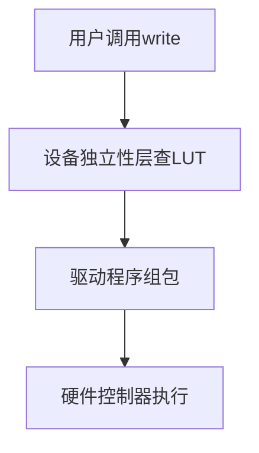
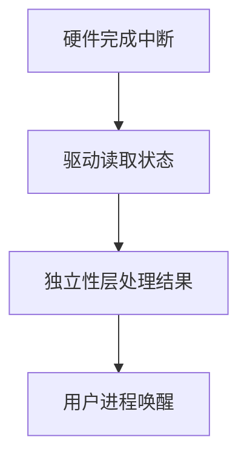

# I/O 软件层次结构与设备管理

## 摘要

通过四层软件架构实现用户 I/O 操作到硬件执行的转换，重点解析逻辑设备表（LUT）映射机制、驱动程序的硬件适配功能、以及跨层 I/O 请求处理流程。建立设备命名解耦、分层处理、中断响应三大核心机制。

## 主题

四层 I/O 架构的协同工作原理与关键技术实现

> 重点难点
>
> - **LUT 的双层映射**：逻辑/物理设备名解耦机制
> - **驱动程序的硬件适配**：寄存器级操作规范
> - **双向处理流水线**：请求下发与中断反馈路径

## 线索区

### 层次架构

#### 用户层软件

- **功能**：提供标准 I/O 库（如`printf`）
- **接口特性**：屏蔽硬件差异，通过系统调用触发内核服务
- **典型场景**：格式化输出、缓冲管理

#### 设备独立性层

- **核心能力**：
  - 逻辑设备名 → 物理设备名映射（LUT）
  - 设备访问权限控制（**设备保护**）
  - 错误重试与日志记录（**差错处理**）
- **优化机制**：缓冲区池管理提升吞吐量

#### 设备驱动层

- **硬件适配**：
  - 寄存器配置（如 DMA 控制器设置）
  - 状态轮询（**忙等待检测**）
  - 中断使能/屏蔽控制
- **性能指标**：时钟同步精度、中断响应延迟

#### 中断处理层

- **工作流程**：
  1. 保存现场状态（压栈）
  2. 读取设备状态寄存器
  3. 错误码解析（如 DMA 传输超时）
  4. 唤醒阻塞进程

### 关键技术实现

#### 逻辑设备表（LUT）

- **映射机制**：

  ```plaintext
  用户进程 → 逻辑设备名 → LUT查询 → 物理设备地址
  ```

- **多用户管理**：
  - 单用户模式：全局唯一映射表
  - 多用户模式：进程级 LUT（类比文件系统树形目录）
- **冲突解决**：逻辑名哈希+二次探测法

#### 驱动程序加载

- **安装流程**：
  1. 设备识别（PCIe 枚举/ACPI 表解析）
  2. 驱动签名验证（数字证书校验）
  3. 中断向量注册（IDT 表更新）
- **热插拔支持**：通过 sysfs 实现动态加载

### 处理流水线

#### 请求下发路径



#### 中断反馈路径



## 总结区

### 核心考点

1. **LUT 设计对比**：

   - 单用户 LUT ≈ 单级目录
   - 多用户 LUT ≈ 树形目录
   - 映射冲突解决方案

2. **驱动开发要点**：

   - 寄存器位操作规范（如位掩码使用）
   - 中断上下文限制（不可阻塞）
   - DMA 缓冲区对齐要求

3. **性能优化方向**：
   - 批处理减少上下文切换
   - 预读机制提升吞吐
   - 中断聚合降低 CPU 负载

### 典型问题

- 如何设计支持多厂商网卡的驱动框架？
- 当 LUT 出现哈希冲突时应如何解决？
- 为何驱动程序不能直接访问用户空间内存？

---

该笔记通过层次分解与流程图解，构建完整的 I/O 处理知识框架。重点掌握设备命名解耦、驱动硬件适配、中断双向流水线三大核心机制，理解从高级语言接口到硬件信号触发的完整路径。
