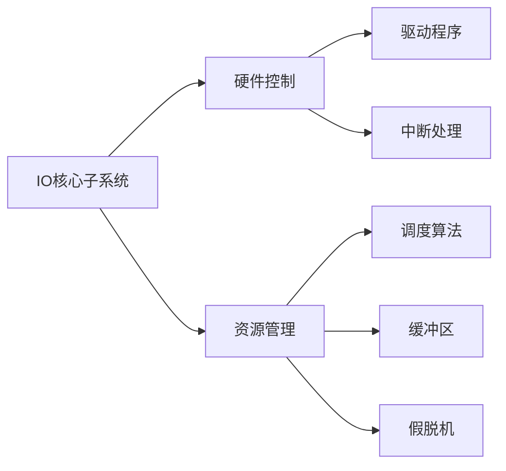

# IO 核心子系统

## 摘要

IO 核心子系统通过分层架构实现设备管理，主要功能包含调度优化、资源控制、虚拟化支持。核心方法包括硬件抽象（设备驱动）、请求调度（算法决策）、安全控制（文件化权限）。关键结论：子系统通过层次解耦平衡效率与安全性。

## 主题

操作系统 IO 管理的核心控制模块，实现层次化设备管理方案

**核心架构**：硬件接口层 → 设备驱动层 → 独立服务层 → 用户接口层  
**关键技术**：调度算法 | 权限映射 | 虚拟化缓冲  
**典型问题**：如何优化 IO 密集型任务延迟？设备共享冲突如何解决？

> 重点难点
>
> - 层次架构的交互边界划分（驱动层/独立层）
> - 假脱机技术的实现层级矛盾（用户层服务调用内核功能）
> - 设备保护与文件系统的权限映射机制

## 线索区

### 知识点 1：功能层次架构

> **1.1 硬件交互层**

- **设备驱动程序**：直接操作寄存器的硬件接口程序
- **中断处理**：采用**下半部机制**减少关中断时间（典型延迟<10μs）

> **1.2 设备独立性服务**

- **IO 调度器**：  
  ▸ 算法类型：FCFS（默认）| 优先级（实时系统）| 时限调度（SCAN 变种）  
  ▸ 性能指标：**吞吐量最大化** vs **公平性保障**
- **缓冲区管理**：  
  ▸ 环形缓冲（生产者-消费者模型）  
  ▸ 双缓冲技术（交替写入：_Buf_A_ ↔ _Buf_B_）

> **1.3 用户层服务**

- **假脱机(SPOOL)实现**：

  ```plaintext
  用户进程 → 守护进程（daemon）→ 磁盘缓冲 → 设备队列
  ```

  ▸ 关键优势：解耦申请与执行（类似打印队列）

### 知识点 2：关键技术实现

> **2.1 设备保护机制**

- **文件化映射**：  
  ▸ 设备文件 inode 包含**major/minor 号**（如`crw-rw---- 1 root 4, 64 /dev/ttyS0`）  
  ▸ 访问控制：FCB 权限位（rwx）→ 驱动层验证

> **2.2 分配回收策略**

- **静态分配**：进程生命周期内独占设备（易死锁）
- **动态分配**：银行家算法预防死锁（需**预先声明**最大需求）

> **2.3 延迟优化**

- **调度算法对比**：  
  
  | 算法类型 | 平均响应时间 | 公平性 | 适用场景 |
  |----------|--------------|--------|------------------|
  | FCFS | 较高 | 好 | 低负载环境 |
  | SJF | 最低 | 差 | 批处理系统 |
  | 优先级 | 可变 | 中等 | 实时系统 |

## 总结区

**知识图谱**：



**考点延伸**：

1. 设备文件权限设置与实际硬件操作的关系（FCB 到驱动的控制流）
2. 不同调度算法在机械硬盘 vsSSD 的性能差异分析
3. SPOOLING 技术在现代系统中的演变（如 CUPS 打印系统）

**重点辨析**：

- 「设备独立性」≠「用户层实现」：假脱机虽在用户层运行，但依赖内核提供的缓冲服务
- 「静态分配」的安全代价：避免死锁但降低设备利用率

是否需要针对特定知识点进行扩展说明？或调整内容结构？
