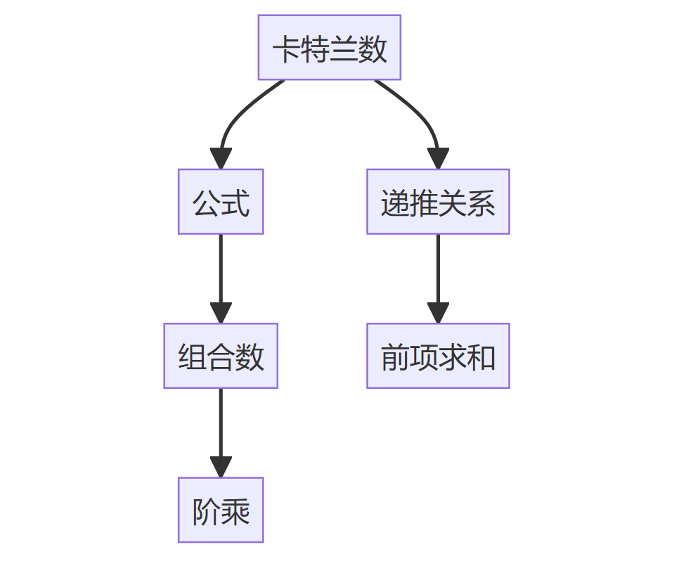
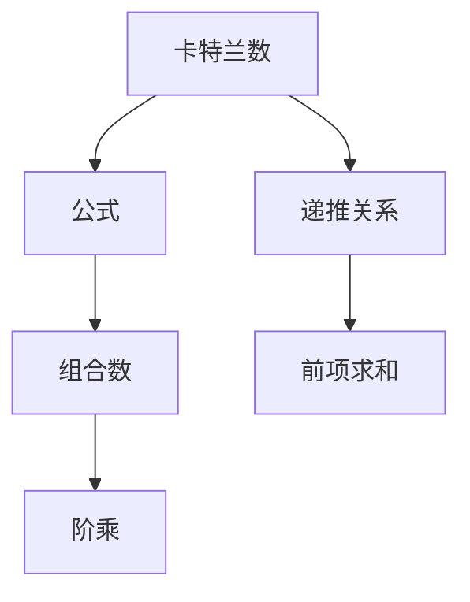

# 卡特兰数

## 1. 卡特兰数的完整定义

卡特兰数（Catalan Numbers）是一系列在组合数学中非常重要的自然数，通常用 $C_n$ 表示。卡特兰数的定义如下：

$$
C_n = \frac{1}{n+1} \binom{2n}{n} = \frac{(2n)!}{(n+1)! \, n!}
$$

其中， 是二项式系数，表示从 $2n$ 个元素中选出 $n$ 个元素的组合数。

## 2. 通俗的语言描述

卡特兰数可以理解为在某些特定的组合问题中，合法的排列或组合方式的数量。比如，给你 $n$ 对括号，合法的括号匹配方式的数量就是第 $n$ 个卡特兰数。

## 3. 通俗的比喻解释

想象你有一个电影院，有 $n$ 个人在排队买票，每个人都要买一张票。票价是 5 元，但每个人要么带了一张 5 元的钞票，要么带了一张 10 元的钞票。售票员一开始没有零钱。卡特兰数就是计算有多少种排队方式，使得售票员在每个人买票时都能找零。

## 4. 定义的主体与其它部分

- **主体**：卡特兰数 $C_n$ 是一个数列，表示在某些特定的组合问题中，合法的排列或组合方式的数量。
- **其它部分**：
  - **公式**：$C_n = \frac{1}{n+1} \binom{2n}{n}$，这个公式用来计算第 $n$ 个卡特兰数。
  - **组合数**：$\binom{2n}{n}$ 是从 $2n$ 个元素中选出 $n$ 个元素的组合数。

## 常见的误解

1. **误解一**：卡特兰数只适用于括号匹配问题。

   - **纠正**：卡特兰数适用于多种组合问题，如二叉树的结构、合法的括号序列、Dyck 路径等。

2. **误解二**：卡特兰数的公式 $C_n = \frac{1}{n+1} \binom{2n}{n}$ 是唯一的定义。

   - **纠正**：卡特兰数有多种等价定义，如递推关系 $C*{n+1} = \sum*{i=0}^{n} C*i C*{n-i}$。

3. **误解三**：卡特兰数只适用于小规模的 $n$。

   - **纠正**：卡特兰数适用于任意自然数 $n$，但随着 $n$ 的增大，计算复杂度也会增加。

4. **误解四**：卡特兰数和双端队列没有关系。
   - **纠正**：卡特兰数可以用来计算某些双端队列操作的合法序列数，如合法的入队和出队操作序列。

## 卡特兰数与双端队列的关系

双端队列（Deque）是一种允许从两端插入和删除元素的数据结构。卡特兰数可以用来计算某些双端队列操作的合法序列数。例如，给定 $n$ 个元素的入队和出队操作序列，卡特兰数可以表示这些操作序列中合法的数量。

## 公式与依赖关系

## 对照组

- **卡特兰数**：适用于合法的括号序列、二叉树结构、Dyck 路径等。
- **斐波那契数**：适用于线性递归问题，如兔子繁殖问题。
- **贝尔数**：适用于集合划分问题。

**数列**就是一列按照一定规律排列的数。你可以把它想象成一个有序的“数字列表”，每个数字都有一个特定的位置（通常是第 1 个、第 2 个、第 3 个……）。数列中的每个数被称为**项**，第 $n$ 个数被称为第 $n$ 项。

## 举个例子

- 一个简单的数列：1, 2, 3, 4, 5, …  
  这是一个**自然数数列**，每一项都比前一项大 1。

- 卡特兰数列：1, 1, 2, 5, 14, 42, 132, …  
  这是一个**卡特兰数数列**，每一项都遵循卡特兰数的定义公式 $C_n = \frac{1}{n+1} \binom{2n}{n}$。

---

## 数列的特点

1. **有序性**：数列中的数是按顺序排列的，位置很重要。比如第 1 项是 1，第 2 项是 1，第 3 项是 2，等等。
2. **规律性**：数列通常有某种规律或公式来生成每一项。比如卡特兰数列的规律是 $C_n = \frac{1}{n+1} \binom{2n}{n}$。
3. **无限或有限**：数列可以是无限的（如自然数数列），也可以是有限的（如 1, 2, 3, 4, 5）。

---

## 数列和“一列数”的区别

虽然数列就是一列数，但**数列**更强调**规律性和数学意义**，而“一列数”可能只是随机的数字集合。比如：

- **数列**：1, 2, 3, 4, 5, …（有规律：每次加 1）
- **一列数**：3, 7, 2, 9, 4（没有明显规律）

---

## 卡特兰数列的特殊性

卡特兰数列不仅仅是“一列数”，它还有很强的**组合数学意义**。它的每一项都对应着某些组合问题的解的数量，比如：

- 合法的括号匹配方式数
- 二叉树的结构数
- 双端队列的合法操作序列数

因此，卡特兰数列不仅是一个数列，更是一个**数学工具**，用来解决实际问题。

---

## 卡特兰数列的特殊性-常见的误解

1. **误解**：数列就是随便一列数。

   - **纠正**：数列是有规律的、有序的数字排列，通常有数学意义。

2. **误解**：卡特兰数列只是一个普通的数列。

   - **纠正**：卡特兰数列有明确的定义公式和组合数学意义，不是随机的数列。

3. **误解**：数列一定是无限的。
   - **纠正**：数列可以是有限的，也可以是无限的，取决于定义。
