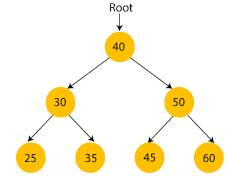
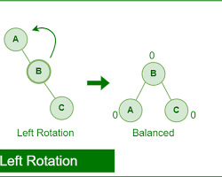
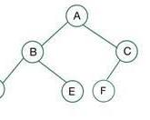

# 二叉排序树与平衡二叉树

## 摘要

本笔记总结了二叉排序树与平衡二叉树（AVL 树）的基本概念、核心特性以及关键操作。二叉排序树通过维护特定的节点顺序，实现了高效的查找与插入操作。平衡二叉树，作为二叉排序树的优化，通过强制性的平衡策略，进一步提升了查找效率，避免了最坏情况下的性能退化。此外，本笔记还阐述了完全二叉树与满二叉树的定义及重要特性，尤其是在考察算法性能的场景中，这些树形结构扮演着基础而关键的角色。

## 主题

深入理解二叉排序树与平衡二叉树的概念、性质和操作，掌握完全二叉树与满二叉树的关键特性，为高效数据检索与算法设计奠定基础。

> 重点难点
>
> - 二叉排序树的**有序性**在搜索与插入操作中的应用
> - 平衡二叉树为维持**平衡**所付出的额外开销及其带来的性能提升
> - 完全二叉树与满二叉树在**节点数量**和**树形结构**上的约束关系

## 线索区

### 知识点 1: 二叉排序树 (Binary Search Tree, `BST`) 的特性与搜索

> **核心思想**

二叉排序树是一种特殊的二叉树，其最显著的特点是 **有序性**。这种有序性体现在每个节点与其子树节点值的关系上：

- **节点值特性**：对于树中任意节点，其 **左子树** 中所有节点的关键字均 **小于** 该节点的关键字，其 **右子树** 中所有节点的关键字均 **大于** 该节点的关键字。
- **递归定义**：二叉排序树的 **左子树** 和 **右子树** 本身也必须是二叉排序树。

> **搜索操作**

利用二叉排序树的有序性，可以高效地进行关键字搜索。搜索过程类似于在有序数组中进行二分查找：

1. **从根节点开始**，比较目标关键字与当前节点关键字。
2. 若 **目标关键字等于当前节点关键字**，则搜索成功，返回当前节点。
3. 若 **目标关键字小于当前节点关键字**，则目标节点可能存在于 **左子树** 中，递归在左子树中进行搜索。
4. 若 **目标关键字大于当前节点关键字**，则目标节点可能存在于 **右子树** 中，递归在右子树中进行搜索。
5. 若搜索到 **空子树** (叶子节点的子节点)，仍未找到目标关键字，则搜索失败。

> **时间复杂度分析**

- **平均情况**：在平衡良好的二叉排序树中，搜索路径的长度近似于树的高度 $log_2n$（$n$ 为节点总数），因此平均时间复杂度为 $O(logn)$。
- **最坏情况**：在极端不平衡的情况下（例如，退化成链表），搜索路径可能遍历所有节点，时间复杂度退化为 $O(n)$。

### 知识点 2: 二叉排序树的插入操作

> **核心思想**

二叉排序树的插入操作旨在将新节点插入到树中的合适位置，并 **保持二叉排序树的特性** 不被破坏。

#### **插入步骤**

1. **从根节点开始**，按照搜索操作的逻辑，比较待插入关键字与当前节点关键字。
2. 若 **待插入关键字小于当前节点关键字**，则向 **左子树** 递归搜索插入位置。
3. 若 **待插入关键字大于当前节点关键字**，则向 **右子树** 递归搜索插入位置。
4. 当搜索到 **空子树** 时，即找到了合适的插入位置。将新节点创建为该空子树的叶子节点。
5. **关键操作：保证插入后仍然满足二叉排序树的定义。**

> **时间复杂度分析**

- 插入操作的时间复杂度与搜索操作类似，平均情况下为 $O(logn)$，最坏情况下为 $O(n)$。

### 知识点 3: 平衡二叉树 (Balanced Binary Tree) 的定义与特性

> #### **核心思想**

平衡二叉树，最常见的实现为 **AVL 树 (Adelson-Velsky and Landis Tree)**，是一种特殊的二叉排序树。它的核心目标是 **维持树的平衡**，从而避免二叉排序树在最坏情况下退化成链表，保证高效的搜索性能。

> **定义**

平衡二叉树的定义基于 **平衡因子 (Balance Factor)** 的概念。 平衡因子衡量了树的平衡程度，通常定义为 **左子树的高度减去右子树的高度**。

$$
平衡因子 = 左子树高度 - 右子树高度
$$

**平衡二叉树的特性：**

- **首先，它是一棵二叉排序树。** 具备二叉排序树的所有特性。
- **平衡因子约束：** 对于树中 **任意节点**，其 **平衡因子的绝对值不超过 1**。 即，每个节点的左子树和右子树的高度差至多为 1。

> #### **非平衡二叉树示例**

如果二叉树不满足平衡因子的约束，例如，某个节点的左子树高度远高于右子树高度，则它不是平衡二叉树，可能会导致搜索效率降低。

旋转操作是 AVL 树维持平衡的关键手段。  当在 AVL 树中插入或删除节点后，可能会导致某些节点的平衡因子超出 ±1 的范围， 破坏平衡性。  旋转操作的目的就是通过调整节点的连接关系（改变树的局部结构），在不破坏 BST 有序性的前提下，降低树的高度，使其重新满足平衡因子的约束。

简单来说，旋转就像是“拧麻花”一样，通过局部调整，让“过高”的子树变矮，“过矮”的子树变高，最终达到整体平衡。

AVL 树的旋转操作主要有四种类型：`LL` 旋转、`RR` 旋转、`LR` 旋转、`RL` 旋转，  分别对应不同的不平衡类型，每种旋转操作都有一套特定的调整规则，  核心思想都是在保持 BST 有序性的前提下，降低不平衡子树的高度。  学习 AVL 树的难点和考点也主要集中在对这四种旋转操作的理解和应用上。

### 知识点 4: 平衡二叉树的优势

> #### **核心优势： 提升搜索效率**

平衡二叉树通过强制性的平衡策略，有效地控制了树的高度，使其始终保持在 **对数级别** ($O(logn)$)。 相比之下，普通的二叉排序树在极端情况下可能退化成线性结构，导致搜索时间复杂度退化为 $O(n)$。

> #### **优势对比**

| 特性          | 二叉排序树 (BST)            | 平衡二叉树 (AVL 树)         |
| ------------- | --------------------------- | --------------------------- |
| 平衡性        | 不保证平衡                  | 强制平衡                    |
| 搜索效率      | 平均 $O(logn)$，最坏 $O(n)$ | 稳定 $O(logn)$              |
| 插入/删除效率 | 平均 $O(logn)$，最坏 $O(n)$ | 稳定 $O(logn)$ (带旋转调整) |
| 空间复杂度    | $O(n)$                      | $O(n)$                      |
| 实现复杂度    | 较低                        | 较高 (需要维护平衡)         |

**总结：** 平衡二叉树牺牲了少量的插入和删除操作的复杂度（需要进行旋转操作来维持平衡），换取了 **更稳定、更高效的搜索性能**。 在对搜索效率要求较高的场景中，平衡二叉树是更优的选择。

### 知识点 5: 完全二叉树和满二叉树的特性

> **核心概念**

完全二叉树和满二叉树是两种特殊的二叉树形式，它们在某些算法（如堆排序）和数据结构（如堆）中有着重要的应用。

> **满二叉树 (Full Binary Tree)**

**定义：** 一棵深度为 $k$ 且 **恰好** 包含 $2^k - 1$ 个节点的二叉树，或者说，除了叶子节点外， **所有分支节点都拥有两个子节点** 的二叉树。

满二叉树 (Full Binary Tree):  就像一个 **完美** 的二叉树，每一层的节点都填满，所有 `非叶子节点`都有 `两个子节` 点，  并且 `所有叶子节点都在最后一层`。

> **完全二叉树 (Complete Binary Tree)**

**定义：** 对一棵具有 $n$ 个节点的二叉树按层序编号（从上到下，从左到右），如果其节点编号与同样深度的满二叉树的前 $n$ 个节点的编号 **一一对应**，则称之为完全二叉树。

完全二叉树 (Complete Binary Tree):  是 `接近满二叉树` 的一种形态，  它在结构上比满二叉树 略微宽松。  只需要保证除了最后一层外，其他层都是满的， 并且最后一层的叶子节点都 `尽可能`  地集中在`左侧`。

**更直观的理解：**

1. **最后一层叶子节点可以不满**，但都 **集中在树的左部**。
2. **倒数第二层如果有叶子节点，则叶子节点也都在树的右部连续排列**。
3. **只能是最后一层和倒数第二层出现叶子节点。**
4. **如果一个节点只有一个子节点，那一定是左节点。** （最多只有一个度为 1 的节点，且该节点只有左孩子）

> **节点编号规律 (针对完全二叉树)**

对于按层序编号的完全二叉树，若节点 $i$ 的编号为 $i$，则：

- **父节点编号：** $\lfloor i / 2 \rfloor$ (向下取整) (当 $i > 1$ 时)
- **左子节点编号：** $2i$ (当 $2i \leq n$ 时， $n$ 为节点总数)
- **右子节点编号：** $2i + 1$ (当 $2i + 1 \leq n$ 时)

## 总结区

本笔记详细阐述了二叉排序树与平衡二叉树的核心概念、特性及操作流程，并对比分析了它们在搜索效率上的差异。二叉排序树以其天然的有序性为高效搜索奠定基础，而平衡二叉树则通过维护树的平衡性，进一步稳定了搜索性能，避免了极端情况下的效率衰退。同时，笔记也梳理了完全二叉树与满二叉树的定义与特性，强调了它们在理解特定算法和应对考研中的重要性。 掌握这些树形结构，对于深入学习数据结构与算法，以及解决实际问题具有重要的理论与实践意义。
