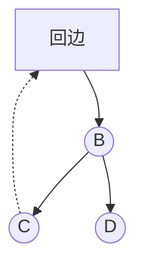

# 深度优先搜索（DFS）算法与生成树

## 摘要

本笔记系统解析深度优先搜索（DFS）的核心原理与实现细节，涵盖算法执行流程、时空复杂度分析、生成树构建策略及连通性判断方法。通过邻接矩阵与邻接表的对比，揭示遍历序列唯一性规律，提供可实践代码模板与典型 LeetCode 题号索引。

## 主题

DFS 通过递归/栈实现纵深探测与回溯机制，用于解决**图遍历、连通分量统计、路径查找**等问题。关键特征包括后进先出探索顺序、线性空间消耗、树形结构生成能力。

> 重点难点
>
> - **递归栈空间管理**：最大递归深度与图结构的关系
> - **邻接表遍历不确定性**：存储顺序影响访问序列
> - **生成树边类型识别**：树边、回边、前向边、横跨边
> - **有向图强连通性判断**：Kosaraju 算法与 DFS 结合策略

---

## 线索区

### 1. DFS 算法执行过程（图论）

**核心思想**：

```python
def dfs(u):
    visited[u] = True
    for v in adj[u]:
        if not visited[v]:
            dfs(v)  # 树边
```

**关键阶段**：

1. **访问标记**：顶点首次被访问时标记为已访问
2. **纵深探索**：优先选择首个未访问邻接点深入
3. **回溯恢复**：当前顶点邻接点全部访问后返回上层

**非连通图处理**：

```cpp
for (int u = 0; u < V; ++u)
    if (!visited[u])
        dfs(u);  // 每个连通分量独立调用
```

---

### 2. 时空复杂度分析

| 存储方式 | 时间复杂度 | 空间复杂度 |
| -------- | ---------- | ---------- |
| 邻接矩阵 | O(V²)      | O(V)       |
| 邻接表   | O(V+E)     | O(V)       |

**递归深度极限**：链状图递归深度达 O(V)，需防范栈溢出风险

---

### 3. 遍历序列特性对比

| 特性       | 邻接矩阵     | 邻接表       |
| ---------- | ------------ | ------------ |
| 存储唯一性 | 唯一         | 不唯一       |
| 遍历确定性 | 固定序列     | 依赖存储顺序 |
| 典型题     | LeetCode 547 | LeetCode 133 |

**示例场景**：

- 邻接表不同边序导致遍历序列变化
- 矩阵存储保证相同起点产生相同遍历序列

---

### 4. 生成树构建规则

**树边保留原则**：



> **边类型判定表**：  

| 边类型 | 发现方式 |  
|----------|------------------------|  
| 树边 | 到达未访问节点 |  
| 回边 | 指向已访问祖先节点 |  
| 前向边 | 指向已访问后代节点 |  
| 横跨边 | 指向非祖先的已访问节点 |

---

### 5. 连通性判断标准

**无向图**：

- DFS 调用次数 = 连通分量数
- 边数 ≥ V-1 是连通图的必要条件

**有向图强连通**：

1. Kosaraju 算法：正反两次 DFS
2. Tarjan 算法：单次 DFS 记录 low 值

---

## 总结区

**核心考点**：

- DFS 递归实现 vs 栈实现的转换方法
- 生成森林边分类在环检测中的应用
- 邻接表遍历序列不唯一性的数学证明

**高频题型**：

- 岛屿问题（LeetCode 200）
- 课程安排（LeetCode 207）
- 克隆图（LeetCode 133）

**代码规范要点**：

```python
# LeetCode 200 标准解法
def numIslands(grid):
    def dfs(i, j):
        if not (0<=i<len(grid) and 0<=j<len(grid[0])): return
        if grid[i][j] != '1': return
        grid[i][j] = '#'  # 关键标记
        dfs(i+1, j)  # 下
        dfs(i-1, j)  # 上
        dfs(i, j+1)  # 右
        dfs(i, j-1)  # 左
    count = 0
    for i in range(len(grid)):
        for j in range(len(grid[0])):
            if grid[i][j] == '1':
                dfs(i, j)
                count += 1
    return count
```
