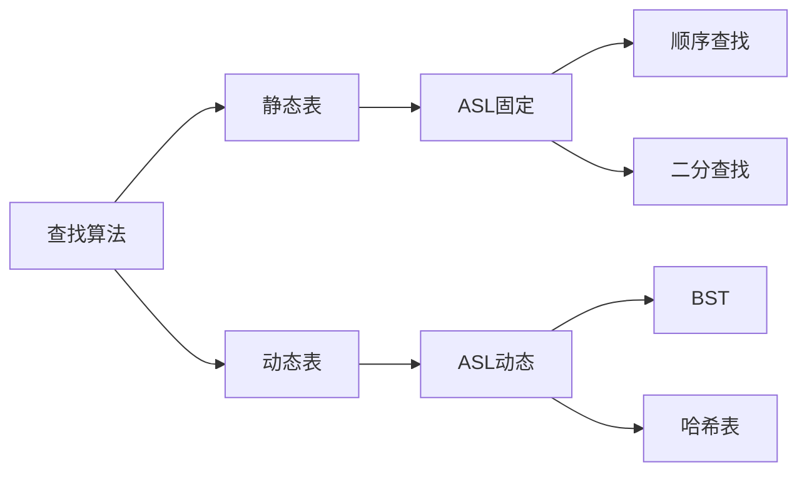

# 查找算法的基本概念与评价

## 摘要
研究数据结构中目标元素的定位方法，通过分析静态/动态查找表特性与平均查找长度（ASL）计算模型，建立查找算法评价体系，为后续具体算法选择提供理论基础。

---

## 主题
通过三层次框架解析查找算法：  
`基本概念` → `结构分类` → `量化评价`  
**核心方法**：ASL概率模型、操作类型划分  
**关键词**：ASL、静态查找表、动态查找表、时间复杂度  

> 重点难点
> 
> - 动态查找表的**插入/删除操作**对ASL影响
> - **ASL概率模型**中成功/失败场景的权重分配
> - 不同数据结构（线性表 vs 树）的查找效率差异

---

## 线索区

### 1. 查找算法基础框架
**定义**：在数据集$D$中定位满足条件$C(x)$的元素$x$的操作  
**核心要素**：  
- **查找表**：支持`Search`操作的数据结构  
- **关键字**：唯一标识元素的字段（数学表达：$key: D \rightarrow \mathbb{K}$）  
- **判定规则**：$Compare(key_x, target)$比较函数  

**类比**：图书馆索书系统 = （书库，ISBN号，分类规则）

---

### 2. 查找表类型学
| 特征        | 静态查找表                  | 动态查找表                  |
|-------------|---------------------------|---------------------------|
| **操作集**   | Search                    | Search+Insert+Delete      |
| **存储结构** | 顺序表/链表                | BST/哈希表                |
| **ASL特性**  | 固定值                    | 随操作动态变化            |
| **典型应用** | 预编译符号表              | 数据库索引                |

**技术演进**：静态结构→动态结构的演变源于实时数据更新需求，推动BST（二叉搜索树）等结构的诞生

---

### 3. ASL量化模型
**公式表达**：  
$$
ASL_{success} = \sum_{i=1}^{n} P_i \times C_i \quad (P_i: 查找第i个元素的概率)  
$$  
$$
ASL_{failure} = \sum_{j=0}^{m} Q_j \times C_j \quad (Q_j: 落入第j个区间的概率)
$$

**参数说明**：  
- **$C_i$**：查找成功时比较次数  
- **$C_j$**：查找失败时区间判定次数  
- **最优情况**：有序表二分查找ASL=$\log_2(n+1)-1$（**时间复杂度O(log n)**）

**工程权衡**：当插入频率$f_{insert} > 10^3$/s时，应优先选择**平衡二叉搜索树**而非静态表

---

## 总结区

### 知识图谱

### 考点映射
1. **选择题**：静态/动态表操作集差异（常混淆Delete操作归属）
2. **计算题**：二叉搜索树的ASL计算（注意叶节点与非叶节点的查找路径差异）
3. **设计题**：根据操作频率选择数据结构（高频查询→静态表，高频更新→平衡树）

### 进阶思考
当数据分布非均匀时（如Zipf分布），如何重构ASL模型？此时传统均匀假设的误差范围是多少？