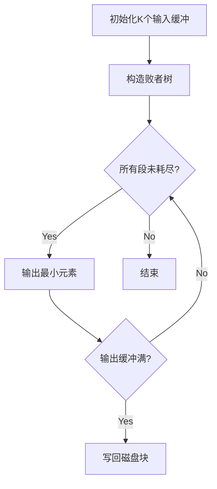

# 外部排序优化与实现

## 摘要

外部排序通过归并排序处理超内存容量数据，核心优化策略为增加归并路数(K)和减少初始归并段(R)。该方法通过多缓冲区管理和归并算法优化，显著降低磁盘 I/O 次数与时间复杂度。

## 主题

大规模数据排序方法，通过缓冲区管理与归并策略优化解决内存受限问题。关键技术涉及多路归并、置换选择排序、磁盘 I/O 效率优化。

> 重点难点
>
> - 多路归并的缓冲区管理策略
> - 归并趟数计算与优化平衡
> - 内存-磁盘数据传输效率瓶颈

## 线索区

### 知识点 1：基础架构与核心参数

**定义**：处理外存数据排序的算法，需解决内存容量与数据规模的矛盾  
**关键参数**：

- $K$：归并路数，决定并行比较能力
- $R$：初始归并段数，反映数据分块粒度
- $S$：归并趟数，$S = \lceil \log_K R \rceil$

**硬件约束**：

- 缓冲区数量 ≥ $K+1$（$K$输入缓冲+1 输出缓冲）
- 缓冲区大小 ≡ 磁盘块尺寸（典型值 1KB）

### 知识点 2：两阶段执行流程

> **阶段 1：生成归并段**

1. 数据块读入内存（2 输入缓冲区轮转）
2. 内部排序（快速排序等**$O(n\log n)$算法**）
3. 有序段写回磁盘（生成$R$个初始段）

> **阶段 2：多路归并**

### 知识点 3：关键优化技术对比

| 优化维度  | 实现方法     | 数学表征                         | 代价分析                 |
| --------- | ------------ | -------------------------------- | ------------------------ |
| 增加 K 值 | 多路平衡归并 | $S↓ = \lceil \log_K R \rceil$    | 内存消耗 ↑，比较次数 ↑   |
| 减少 R 值 | 置换选择排序 | $R↓ = \lceil \frac{N}{L} \rceil$ | 算法复杂度 ↑，内存需求 → |
| 混合策略  | 多阶段归并   | $T_{total} ∝ (2S+1)N$            | 实现复杂度 ↑↑            |

**注**：$L$为置换选择生成的平均段长，理想情况下$L=2M$（M 为内存容量）

### 知识点 4：工程实现考量

**磁盘 I/O 模型**：

- 总传输时间 = $2N(1+\lceil \log_K R \rceil ) \times t_{block}$
- 旋转延迟与寻道时间占比 ≥ 60%（机械硬盘场景）

**内存管理技巧**：

1. 双缓冲技术：隐藏 I/O 延迟
2. 块预读取：利用磁盘顺序访问特性
3. 败者树优化：将比较次数从$O(K)$降为$O(\log K)$

## 总结区

**核心考点**：

1. 归并趟数公式推导（对数运算特性）
2. 置换选择排序的段长计算（**2M 定理**）
3. 败者树构建过程（二叉树结构可视化）

**典型题型**：

- 给定内存容量$M$、数据总量$N$，计算最优$K$值
- 对比简单归并与置换选择排序的 I/O 次数差异
- 分析多路归并时缓冲区溢出处理方案

**实践提示**：

- 在 SSD 环境下可适当增大 K 值（随机访问性能提升）
- 使用 Huffman 树优化非均匀长度归并段处理
- 分布式场景下结合 MapReduce 实现外部排序（如 Hadoop TeraSort）
