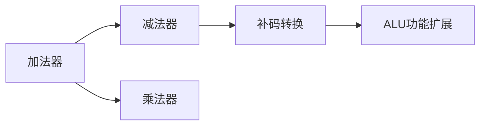

# 算术逻辑单元（ALU）的结构与实现

## 摘要

ALU 作为 CPU 核心运算部件，通过加法器基础架构实现算术/逻辑运算。关键设计要素包括：

- 控制信号位数与功能数量的对数关系
- 多路复用架构实现功能切换
- 补码转换等辅助功能硬件实现

---

## 主题

**ALU 架构三要素**：运算基础单元、控制信号系统、功能扩展机制  
**关键词**：加法器核心、控制信号编码、多路选择器、功能扩展  
**高频考点**：

- 控制信号位数计算（$m \geq \lceil \log_2 k \rceil$）
- 典型 ALU 结构框图识别

> 重点难点
>
> - 加法器的运算延展原理（减法 → 补码加法）
> - 多路选择器的时延叠加效应
> - 功能扩展时的面积-速度权衡

---

## 线索区

### 1. ALU 基础架构

**定义**：算术逻辑单元（Arithmetic Logic Unit）是执行基本运算的组合逻辑电路  
**核心组件**：

- 加法器：实现二进制加法 $S = A + B + C_{in}$
- 逻辑运算阵列：按位操作（如 AND: $Y_i = A_i \cdot B_i$）

**运算扩展原理**：  

| 运算类型 | 实现方法 | 示例 |
|----------|-------------------------|-----------------------|
| 减法 | 补码加法 $A - B = A + \overline{B} + 1$ | 需要补码生成电路 |
| 乘法 | 移位-累加 | 时序电路实现 |

### 2. 控制信号系统

**信号位数公式**：  
$$m \geq \lceil \log_2 k \rceil$$  
其中：

- $m$：控制信号位数
- $k$：支持功能数量

**典型配置**：  

| 功能数量 | 最小位数 | 示例芯片 |
|----------|----------|-----------------|
| 4 | 2 | 74LS181 基本型 |
| 8 | 3 | 现代 CPU 常用配置 |

### 3. 多路复用架构

**电路结构**：

```plaintext
          +------------+
A,B ---->| 功能单元1   |----\
        |  (加法器)    |    \
        +------------+     \
                             MUX ---> Y
        +------------+     /
        | 功能单元2   |----/
        | (逻辑AND)   |
        +------------+
               ↑
          控制信号S
```

**关键参数**：

- 功能单元延迟差异：**加法器 ≈4 门级** vs **逻辑运算 ≈1 门级**
- 选择器附加延迟：**2 门级/每级 MUX**

### 4. 功能扩展实例

**补码生成电路**：

- 实现公式：$\overline{B} + 1$
- 硬件方案：
  1. 反相器阵列生成$\overline{B}$
  2. 进位输入置 1 实现+1 操作

**直送模式**：

- 电路等效：0 级逻辑门
- 应用场景：数据通路直连

---

## 总结区

**知识图谱**：



**考点解析**：

1. 控制信号计算：给出 8 功能 ALU，求最小控制位数 →**3 位**
2. 结构识别题：带多路选择器的功能单元组合 → 标准 ALU 结构
3. 延迟计算：加法(4 门)+MUX(2 门)=**总延迟 6 门级**

**设计权衡**：

- 面积优化：共享运算部件（增加时序复杂度）
- 速度优化：并行功能单元（增加电路面积）

**典型芯片**：  
74LS181（4 位 ALU）支持 16 种功能，采用**4 位控制信号**实现超集功能选择，延迟参数**22ns 典型值**。
