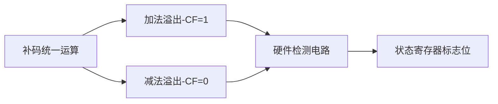

# 无符号数加减运算及溢出检测机制

## 摘要

本笔记系统阐述无符号数加减运算规则及其溢出判断方法，通过统一数学建模与硬件实现原理分析，揭示补码运算与无符号数的内在关联。重点解析最高位进位信号的物理意义，提供手算验证与机器判定的双重判断范式。

## 主题

无符号数运算通过补码机制实现加减统一，溢出判定依赖比特位宽与进位信号分析。核心方法包括：

- 补码运算数学建模
- 最高有效位(MSB)进位检测
- 十进制范围验证法  
  关键词：补码转换、MSB 进位、比特容量约束

> 重点难点
>
> - **补码减法转加法的位操作逻辑**
> - **加法溢出(CF=1)与减法溢出(CF=0)的物理意义差异**
> - **n 位无符号数合法范围 [0, 2ⁿ-1] 的边界判定**

---

## 线索区

### 1. 补码运算统一原理

**定义**：无符号数与有符号数共享补码加减运算规则，实现硬件电路复用  
**数学表达**：

- 加法：$A + B = \sum_{i=0}^{n-1} (a_i + b_i + C_{i-1}) \cdot 2^i$
- 减法：$A - B = A + (-B)_{补} = A + (\overline{B} + 1)$

**电路实现**：

```plaintext
        ┌───────┐
A[n-1:0]│       │
        │ 加法器 │←─Cin(减法时置1)
B[n-1:0]│       │
        └───┬───┘
            ↓
        结果[n:0] (n+1位含进位)
```

_应用场景_：ALU 设计、嵌入式系统底层运算

---

### 2. 溢出判断双模机制

**硬件判定**（以 4 位系统为例）：  

| 运算类型 | 条件 | 状态灯类比 |
|----------|-----------------|--------------------|
| 加法溢出 | MSB 进位=1 | 水桶溢出(>15) |
| 减法溢出 | MSB 进位=0 | 借位不足(<0) |

**手算验证**：

- 加法：若$A+B ≥ 2^4=16$ → **溢出**
- 减法：若$A-B < 0$ → **溢出**

_典型案例_：  
`12+5=17`（4 位系统最大值为 15）→ **CF=1**  
`3-5=-2` → 转换为`3+11=14` → **CF=0**

---

### 3. 实现原理与优化

**减法电路优化路径**：

1. 输入 B 经非门阵列取反
2. 最低位 Cin 置 1 实现+1 操作
3. 复用加法器完成减法

**关键参数**：

- **4 位 CLA 电路延迟**≈2 门级
- 面积开销：增加 n 个非门

---

## 总结区

### 知识图谱



### 考点聚焦

1. 计算题：给定 8 位无符号数`A=0xFE, B=0x19`，判断`A+B`是否溢出
2. 设计题：画出减法转加法的门级电路图
3. 概念题：解释 CF 标志位在加减运算中的相反含义

### 易错提示

- 混淆无符号与有符号溢出条件（CF vs. OF）
- 末位加 1 操作遗漏（常见于手工补码转换）
- 比特位宽误判（如将 4 位系统数值范围记作 0-16）

> 记忆口诀：**"加看进 1 减看 0，比特容量是铁律"**
