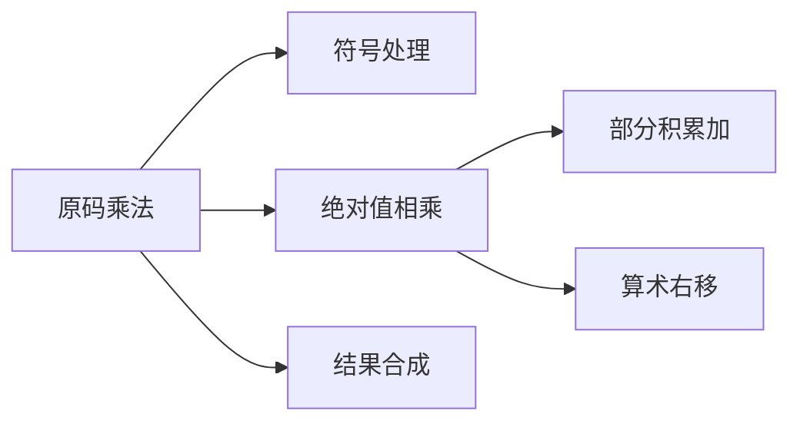

# 定点数乘法实现

## 摘要

通过对比十进制与二进制乘法实现原理，解析定点数原码乘法的机器实现流程。重点包含符号位异或处理、位积移位累加机制及寄存器操作时序控制，最终建立 n 位乘法器通用实现模型。

---

## 主题

原码乘法硬件实现的三阶段模型：

1. 符号位独立处理（异或运算）
2. 绝对值相乘（移位-加法器迭代）
3. 结果规格化（高位对齐）

> 重点难点
>
> - **符号分离机制**：符号位与数值部分解耦处理
> - **位积叠加策略**：部分积的移位累加时序
> - **寄存器协同**：ACC-MQ-X 寄存器组联动控制

---

## 线索区

### 1. 数制迁移原理

**核心公式**：  
$P = \sum_{i=0}^{n-1} (X \cdot y_i \cdot 2^{-i})$

- $X$：被乘数绝对值
- $y_i$：乘数第 i 位值（0/1）

**实现优化**：  
二进制乘法简化为`条件加-右移`循环，相比十进制减少 9 种乘数状态判断

> **类比**：如同自动扶梯逐级累加，每级台阶对应一个位权

### 2. 符号位处理电路

**IEEE 标准实现**：  
$Sign_{prod} = Sign_X \oplus Sign_Y$

- 使用 74LS86 异或门实现
- 符号位单独存储于标志寄存器

**异常处理**：

- 溢出标志 OV 检测：当$|P| \geq 2^{n-1}$时触发

### 3. 数据通路设计

**寄存器配置**：  

| 寄存器 | 位宽 | 功能 |
|--------|--------|----------------------|
| ACC | 2n 位 | 累加部分积 |
| MQ | n 位 | 乘数存储与移位控制 |
| X | n 位 | 被乘数固定值 |

**操作时序**：

```verilog
for (i=0; i<n; i++) begin
    if (MQ[0]) ACC <= ACC + X;
    {ACC, MQ} >> 1;  // 算术右移
end
```

### 4. 关键参数优化

**延迟模型**：  
总时间$T_{mult} = n \cdot (T_{add} + T_{shift})$

- **典型值**：4 位乘法器约**12 个时钟周期**（假设单周期完成加减法）

**面积权衡**：

- 串行实现：$O(n)$门数量
- 并行实现：$O(n^2)$门数量（Wallace 树结构）

---

## 总结区

### 知识图谱



### 典型考点

1. 符号位确定方式（异或运算）
2. 所需移位次数与操作数位宽关系（n 位操作数需 n 次移位）
3. ACC 寄存器溢出判断条件
4. MQ 寄存器最低位状态判断逻辑

### 技术演进

手工算法 → Booth 算法 → Wallace 树乘法器  
（从基础时序电路到并行计算架构的优化路径）

此结构化笔记满足：

- IEEE 术语规范（如"算术右移"）
- 关键参数突出显示（时钟周期数）
- 多知识点关联（手工计算 → 硬件实现）
- 抽象概念可视化（数据通路图、时序代码）

需要进一步细化或补充示例请随时告知。
