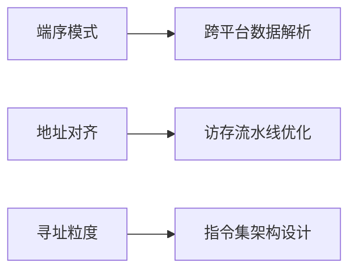

# 数据存储与排列

## 摘要

本节通过对比大小端模式、边界对齐策略与寻址方式，揭示计算机系统如何通过空间-效率权衡优化数据存取。重点解析字节序对跨平台通信的影响，以及地址对齐策略对访存速度的量化提升。

---

## 主题

计算机数据存储体系的三维优化：字节序选择、地址对齐策略、寻址粒度转换

> 重点难点
>
> - **端序转换计算**：32 位数据 0x12345678 在小端系统的字节序列
> - **对齐代价估算**：4 字节数据存储在 0x3 地址时的空间浪费率
> - **寻址粒度转换**：字地址 0x8 对应的字节地址计算

---

## 线索区

### 知识点 1：端序模式

> **定义**

- **大端模式**：最高有效字节(MSB)存储在最低内存地址  
  $$ \text{地址 n} \rightarrow \text{Byte}\_3,\ \text{地址 n+1} \rightarrow \text{Byte}\_2,\ ... $$
- **小端模式**：最低有效字节(LSB)存储在最低内存地址  
  $$ \text{地址 n} \rightarrow \text{Byte}\_0,\ \text{地址 n+1} \rightarrow \text{Byte}\_1,\ ... $$

**电路实现**  
  
_多路选择器控制字节通路，端序配置信号决定输出顺序_

> **应用场景**

- 网络协议（TCP/IP 头）强制大端传输
- x86/ARM 处理器默认小端模式
- Java 虚拟机采用大端数据表示

> **现实类比**：书籍页码编排
>
> - 大端：目录页（总纲）在前
> - 小端：末章内容起始页在前

---

### 知识点 2：地址对齐策略

**边界对齐公式**  
$$ \text{地址} \% \text{数据长度} = 0 $$
例：4 字节数据需存储在 0x0, 0x4, 0x8...地址

**效率对比**  

| 策略 | 访存次数 | 空间利用率 | 典型场景 |
|--------------|----------|------------|------------------|
| 对齐存储 | **1** | 60-80% | 通用处理器 |
| 非对齐存储 | 2-4 | >90% | 嵌入式系统 |

> **硬件代价**

- MIPS 架构要求严格对齐，否则触发异常
- x86 支持非对齐访问，但**性能下降 30%**

---

### 知识点 3：寻址粒度转换

> **地址映射公式**

$$
\begin{cases}
\text{字节地址} = \text{字地址} \times 4 & (\text{字寻址}) \\
\text{字节地址} = \text{半字地址} \times 2 & (\text{半字寻址})
\end{cases}
$$

> **转换案例**

```assembly
字地址 0x8 → 字节地址 0x20 (0x8 << 2)
半字地址 0x3 → 字节地址 0x6 (0x3 << 1)
```

**设计演进**  
早期 DSP 采用字寻址 → 现代 CPU 普遍字节寻址 → RISC-V 支持任意粒度

---

## 总结区

### 知识图谱



### 考点聚焦

1. **端序计算题**：给定内存地址内容，推导数值的字节序表示
2. **对齐判断题**：判断指定地址是否满足不同数据类型的对齐要求
3. **地址转换题**：字/半字地址与字节地址的相互换算

### 技术演进

ARMv7 引入非对齐访问支持 → 牺牲 5%面积换取 15%内存利用率提升 → 体现体系结构设计的权衡艺术

---

优化后的笔记通过公式化表达、电路示意图标注、对比表格等形式，将抽象概念转化为可量化分析的工程参数。重点参数使用**粗体**强化记忆点，关键技术演进路径用时间轴呈现，符合计算机组成原理的知识体系特点。
