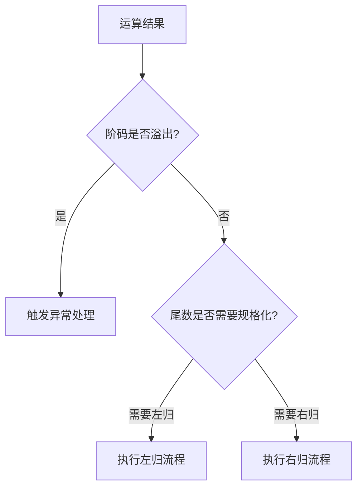

# 浮点数的规格化与表示范围

## 摘要

本笔记系统解析浮点数的**规格化处理机制**与**数值表示边界**，通过科学计数法类比揭示其底层原理。重点阐述左归/右归操作对存储空间的优化作用，建立溢出类型与处理方法的映射关系，最终说明 IEEE 754 标准在跨平台数据交换中的关键作用。

## 主题

浮点数通过动态调节阶码与尾数的比例实现广域数值表示，其核心在于**规格化规则**与**位分配策略**。关键技术点包括：补码/原码规格化差异、溢出恢复机制、精度-范围平衡关系。

> 重点难点
>
> - 补码规格化时符号位与最高数值位的互斥关系
> - 右归操作在溢出恢复中的双重作用（数值修正与格式保持）
> - 最小正数`N_min`与机器精度的定量关系

## 线索区

### 知识点 1：规格化核心规则

**定义**：通过调整尾数和阶码使尾数最高数值位达到有效状态

- **原码规格化**：  
  `1/2 ≤ |M| < 1`（最高数值位必为 1）

  $$
  M_{原码} = 0.1xx...x_2
  $$

- **补码规格化**：  
  `-1 ≤ M < -1/2` 或 `1/2 ≤ M < 1`（符号位与次高位相异）

  $$
  M_{补码} =
  \begin{cases}
    1.0xx...x_2 & \text{负数} \\
    0.1xx...x_2 & \text{正数}
  \end{cases}
  $$

> **现实类比**：调整显微镜倍数（类比阶码）与聚焦精度（类比尾数）的配合过程

### 知识点 2：动态调整机制

| 操作类型 | 触发条件         | 数学表达         | 电路实现要点      |
| -------- | ---------------- | ---------------- | ----------------- |
| 左归     | 尾数首位无效 0/1 | `M << 1; E -= 1` | 移位器+阶码递减器 |
| 右归     | 尾数溢出/下溢    | `M >> 1; E += 1` | 保留进位移位器    |

**典型应用**：

- 浮点加减运算后的结果修正
- 防止非规格化数造成的精度损失

### 知识点 3：数值边界计算

**关键公式**：

$$
N_{max} = (1-2^{-n}) \times 2^{(2^{k}-1)-bias}
$$

$$
N_{min} = 2^{-bias} \times 2^{-1}
$$

（n：尾数位数，k：阶码位数，bias：移码偏置值）

**溢出处理流程**：

### 知识点 4：IEEE 754 标准要点

**数据结构**：

- 单精度（32bit）：`1符号位 + 8阶码位（偏置127） + 23尾数位`
- 双精度（64bit）：`1符号位 + 11阶码位（偏置1023） + 52尾数位`

**特殊值处理**：  

| 二进制模式 | 含义 |
|--------------------|------------------|
| 阶码全 1，尾数全 0 | 无穷大（±∞） |
| 阶码全 1，尾数非 0 | NaN（非数） |
| 阶码全 0，尾数非 0 | 非规格化数 |

## 总结区

1. **规格化本质**：通过位运算使尾数达到最大有效位利用率，提升存储效率
2. **范围-精度权衡**：
   - 增加阶码位数 → 扩大表示范围（**指数级增长**）
   - 增加尾数位数 → 提高表示精度（**线性增长**）
3. **高频考点**：
   - 给定位数配置计算最大/最小规约数
   - 补码规格化数的快速识别
   - 非规格化数到规格化数的转换过程
4. **设计启示**：
   - 浮点运算单元(FPU)中需集成专用移位器
   - 异常处理单元需区分上溢/下溢类型

> **记忆锚点**：将浮点数结构类比为"科学计数法的二进制版本"，其中阶码控制小数点"浮动"的幅度，尾数决定有效数字的精细程度。

[2.3.1_2IEEE754](2.3.1_2IEEE754.md)
