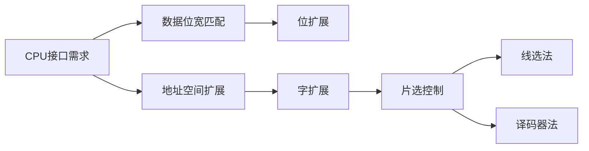

# 存储芯片与 CPU 的连接及扩展方法

## 摘要

通过位扩展/字扩展技术实现存储容量适配，采用片选信号与译码器解决总线冲突问题，完成存储系统与 CPU 的物理层对接。

## 主题

存储器扩展核心方法：位扩展（数据位宽适配）→ 字扩展（地址空间扩展）→ 译码器控制（片选逻辑）

> 重点难点
>
> - **地址空间分割**：高位地址译码与低位地址直连的配合机制
> - **译码时序**：使能信号与地址稳定的时序配合要求
> - **扩展方案设计**：混合扩展时的芯片数量计算

## 线索区

### 知识点 1：位扩展技术

**定义**  
通过并联存储芯片增加数据位宽，满足 CPU 数据总线宽度要求  
**公式**  
总数据位宽 = 单芯片位宽 × 并联芯片数  
**电路结构**

```plaintext
[CPU D0-D7] ←→ [芯片1 D0]
              ←→ [芯片2 D1]
              ...
              ←→ [芯片8 D7]
```

**典型参数**  
8 片**8k×1 位**芯片组成**8k×8 位**存储器  
**应用场景**  
DRAM 芯片位宽扩展，SDRAM 模组构建

### 知识点 2：字扩展技术

**定义**  
通过增加存储单元数量扩展地址空间，保持数据位宽不变  
**地址分配**

```plaintext
芯片1：0000H-1FFFH （A15=0）
芯片2：2000H-3FFFH （A15=1）
```

> **电路特征**

- 共用数据总线
- 独立片选信号(CS)
- 地址总线高位参与译码

**设计实例**  
4 片**8k×8 位**芯片构成**32k×8 位**存储器，需 2 位地址译码（$log_24=2$）

### 知识点 3：译码器控制逻辑

> **74LS138 译码器**

- 输入：3 位地址（A13-A15）
- 输出：8 个片选信号（$\overline{Y_0}$-$\overline{Y_7}$）
- 使能条件：$G1=1,\ \overline{G2A}+\overline{G2B}=0$

**时序要求**  
$$t_{su}(地址建立) < t_{CS}(片选有效)$$  
**电气特性**

- 输出高阻态阻抗**≥1MΩ**
- 传输延迟**≤15ns**（典型值）

## 总结区

### 知识图谱



### 考点解析

1. **扩展计算题**  
   给定存储芯片规格(如**16K×4 位**)与目标容量(如 64K×8 位)，计算需用芯片数：  
   $$\frac{64K}{16K} \times \frac{8}{4} = 4 \times 2 = 8片$$

2. **地址译码设计**  
   设计**28C256(32K×8)**芯片的片选逻辑：

   - 地址范围：8000H-FFFFH
   - 译码条件：A15=1 且 A14=1（需 2 输入与非门）

3. **时序分析**  
   当 CPU 时钟周期为**50MHz**时，验证译码器延迟是否满足要求：  
   $$t_{cycle}=20ns > t_{prop}=15ns → 满足时序$$

> **重点警示**
>
> - 位扩展必须保证所有芯片**同步工作**
> - 线选法存在**地址不连续**问题
> - 未使能芯片必须保持**高阻态**


[3.5.1+3.5.2Cache的基本原理](3.5.1+3.5.2Cache的基本原理.md)
