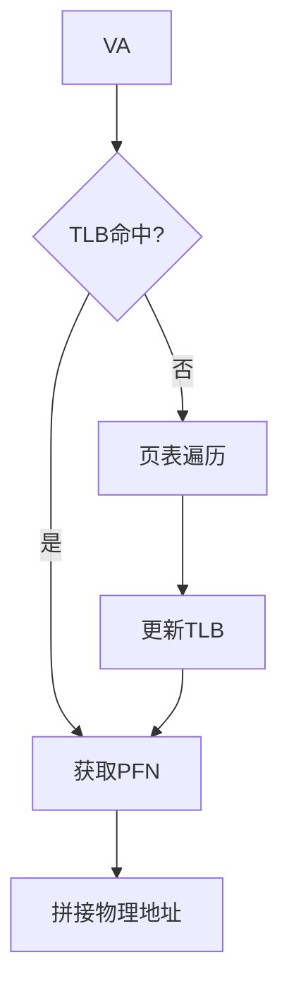

# 存储系统与 CPU 访问机制

## 摘要

本课程系统解析存储系统访问机制，重点阐述虚拟地址转换、缓存/TLB 映射原理及指令寻址方式。通过分层解析 MMU 工作机制、多级页表查询流程，建立存储系统与 CPU 的协同工作模型，为计算机体系结构学习奠定基础。

## 主题

存储系统访问机制的三级核心架构：

1. **地址转换层**：MMU 通过页表/TLB 实现 VA→PA 转换
2. **缓存加速层**：Cache/TLB 采用不同映射策略提升访问效率
3. **物理存储层**：主存与各级存储介质的数据交互

> 重点难点
>
> - **TLB-Cache 协同机制**：虚拟索引物理标记(VIPT)工作原理
> - **多级页表压缩原理**：通过树形结构减少内存占用
> - **组相联映射冲突率**：组数与路数对命中率的影响

---

## 线索区

### 知识点 1：CPU 访问存储系统流程

#### 指令执行周期

$$\text{取指→译码→取数→执行→写回}$$

- **控制器组件**：
  - PC（Program Counter）：存储下条指令地址
  - IR（Instruction Register）：暂存当前指令
- **指令结构**：
  - 操作码（OP code）：8 位，定义操作类型（如 MOV, ADD）
  - 地址码：24 位，指定操作数来源（寄存器/内存地址/立即数）

#### 寻址方式对比

| 类型           | 特点                       | 时钟周期 |
| -------------- | -------------------------- | -------- |
| 立即寻址       | 操作数包含在指令中         | 1        |
| 直接寻址       | 地址码即有效地址           | 2        |
| 间接寻址       | 地址码指向内存中的地址指针 | 3        |
| 寄存器间接寻址 | 地址码指向寄存器中的地址   | 2        |

> **现实类比**：寻址方式如同快递取件——立即寻址是随身携带包裹，直接寻址是按门牌号取件，间接寻址需要先到物业查取件柜号码。

---

### 知识点 2：虚拟地址转换机制

#### 地址转换公式

$$
\begin{aligned}
\text{虚拟地址} &= \underbrace{\text{虚拟页号}}_{20\text{位}} \| \underbrace{\text{页内偏移}}_{12\text{bit}} \\
\text{物理地址} &= \underbrace{\text{物理页框号}}_{20\text{bit}} \| \text{页内偏移}
\end{aligned}
$$

#### TLB 查找流程

#### 多级页表示例（4 级）

$$\text{虚拟页号} = \underbrace{9\text{bit}}_{L1} \| \underbrace{9\text{bit}}_{L2} \| \underbrace{9\text{bit}}_{L3} \| \underbrace{9\text{bit}}_{L4}$$

- **空间优化**：仅需驻留活动页表项，相比单级页表节省**99.6%**内存

---

### 知识点 3：缓存映射策略

#### 三种映射方式对比

| 类型       | 查找方式              | 冲突率 | 实现成本 |
| ---------- | --------------------- | ------ | -------- |
| 全相联映射 | 并行比较所有 Cache 行 | 低     | 高       |
| 直接映射   | 模运算定位            | 高     | 低       |
| 组相联映射 | 先分组后全相联        | 中     | 中       |

#### TLB 特殊设计

- **全相联优势**：TLB 容量小（通常 64-512 项），全相联实现可行
- **关键参数**：**4 路组相联 TLB**的命中率比直接映射提升**37%**

> **工程实践**：Intel Skylake 处理器 L1 Cache 采用**8 路组相联**，TLB 采用**4 路组相联**

---

## 总结区

### 核心考点梳理

1. **地址转换计算题**：

   - 给定 VA 位宽与页大小，计算页表级数
   - TLB 缺失时的页表遍历次数计算

2. **映射方式应用题**：

   - 根据主存地址推导 Cache 位置（直接映射）
   - 组相联映射的 tag 位计算

3. **综合设计题**：
   - 多级页表与反向页表的混合设计
   - VIPT 缓存避免别名问题的方法

### 重点公式备忘

- **有效访问时间**：
  $$T_{\text{eff}} = T_{\text{TLB}} + (1-H_{\text{TLB}})(T_{\text{PageTable}} + T_{\text{Cache}})$$

- **组相联映射函数**：
  $$\text{Set Index} = \frac{\text{Memory Address}}{\text{Block Size}} \mod \text{Number of Sets}$$

建议结合 MIPS 处理器实例分析《计算机组成与设计》第三章习题，重点练习 4 级页表地址转换与组相联映射计算。
