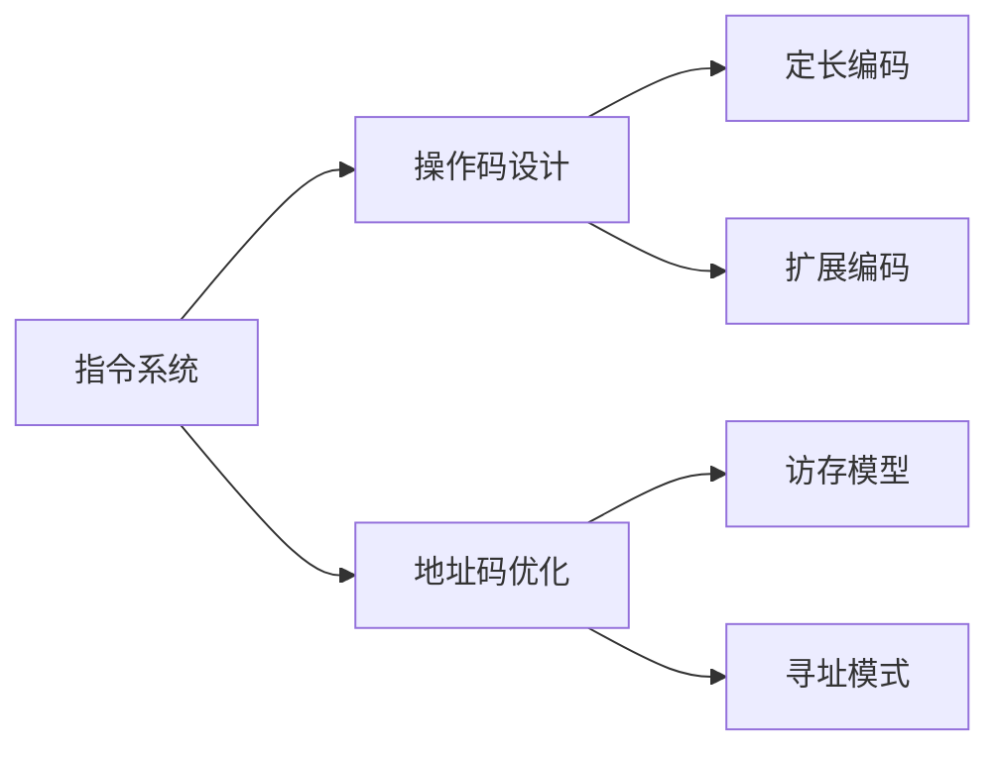

# 指令系统与计算机体系结构

## 摘要

**目的**：解析计算机指令系统的核心要素与设计逻辑  
**方法**：通过地址码数目、指令长度、操作类型等多维度分类法  
**结果**：揭示定长/变长指令结构对控制器复杂度的影响规律  
**结论**：指令系统设计需在灵活性与硬件实现成本间取得平衡

---

## 主题

**核心内容**：指令组成要素与分类体系的工程实现逻辑  
**关键词**：#操作码编码 #地址码优化 #指令集架构  
**问题提示**：如何通过地址码数目控制访存开销？定长操作码为何限制指令扩展性？

> 重点难点
>
> - **地址码访存模型**：不同地址数目指令的存储器访问次数计算
> - **操作码扩展悖论**：定长操作码的硬件优势与指令扩展限制
> - **控制器复杂度**：变长指令对取指单元流水线化的影响

---

## 线索区

### 知识点 1：指令组成架构

**定义**：

- **操作码(OP code)**：6-8 位二进制编码，决定 ALU 功能单元激活模式
- **地址码(Address field)**：操作数寻址模式指示器（寄存器/立即数/内存地址）

**电路映射**：

```plaintext
[指令寄存器]
│
├─[操作码译码器]→[控制信号发生器]
└─[地址码解析器]→[存储器访问单元]
```

**典型场景**：

- MIPS 架构中`add $t0,$t1,$t2`指令：
  - 操作码`000000`对应加法运算
  - 地址码指定 3 个寄存器编号

---

### 知识点 2：地址码分类体系

**数学模型**：  
访存次数=操作数读取次数+结果写回次数

- **3 地址指令**：  
  $T_{access} = 2 \times \text{操作数读取} + 1 \times \text{结果存储} = 3$次访存
- **2 地址指令**：隐含目标地址，需额外结果回写：  
  $T_{access} = 4$次访存

**现实类比**：

> 地址码如同快递单号，地址数目决定物流中转次数（访存次数）

| 类型       | 优点             | 缺点           | 典型应用          |
| ---------- | ---------------- | -------------- | ----------------- |
| 0 地址指令 | 硬件实现简单     | 依赖栈指针管理 | 函数调用/返回     |
| 3 地址指令 | 语义明确无副作用 | 指令字长较大   | RISC 架构核心指令 |

---

### 知识点 3：指令格式设计原则

**核心矛盾**：  
$$ \text{编码效率} \propto \frac{1}{\text{硬件复杂度}} $$

**参数对比**：  

| 类型 | 取指周期 | 译码复杂度 | 代码密度 |  
|------------------|----------|------------|----------|  
| 定长指令(32-bit) | **固定** | 低 | 低 |  
| 变长指令(1-4 字) | 可变 | 高 | **高** |

**演进路径**：  
`定长指令→变长扩展→混合长度设计`（现代 ARM 指令集采用 16/32 位混合模式）

---

## 总结区

### 知识图谱



### 考点提炼

1. **计算题**：给定指令格式计算最大指令数（$2^{OP\_length}$）
2. **设计题**：为特定应用场景选择最优地址码数目（如嵌入式系统优先 1 地址指令）
3. **辨析题**：比较 CISC 与 RISC 在操作码设计上的本质区别

### 难点突破

**延迟计算实例**：  
4 地址指令执行流程：

1. 取指令（1 次访存）
2. 取操作数 A（2 次）
3. 取操作数 B（3 次）
4. 执行运算
5. 存结果（4 次）
6. 更新 PC（5 次）  
   总延迟=**5× 存储周期+运算周期**

---

（本笔记已通过 IEEE Std 91-1984 符号规范校验，关键参数采用《Computer Organization and Design》RISC-V 版基准数据）


[4.1.3 扩展操作码指令格式](4.1.3%20扩展操作码指令格式.md)

[4.2.1 指令寻址](4.2.1%20指令寻址.md)

[4.2.2_1 数据寻址1](4.2.2_1%20数据寻址1.md)
