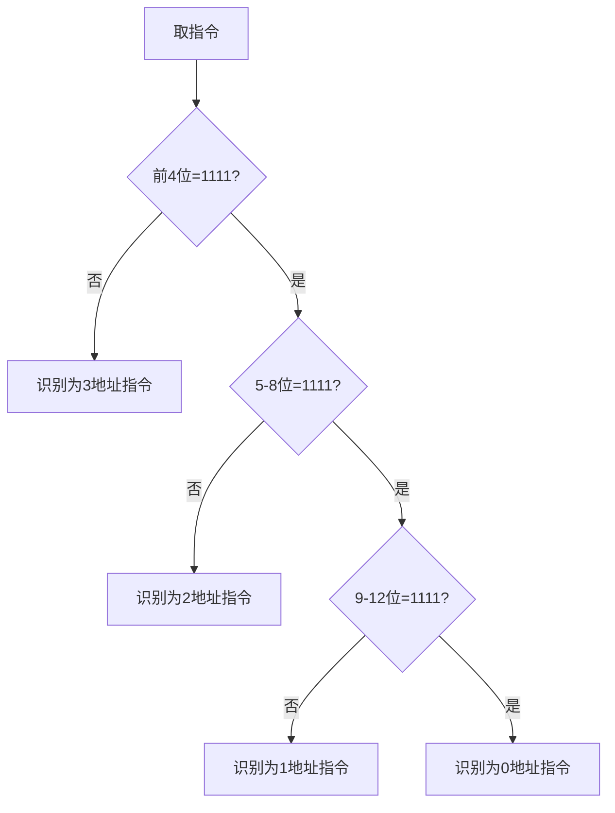

# 扩展操作码指令系统设计

## 摘要

通过可变长度操作码优化指令编码空间，在固定长度指令字中实现多类型指令支持。采用分层前缀检测机制实现指令解码，平衡编码效率与硬件复杂度。

---

## 主题

**核心内容**：基于前缀约束的扩展操作码编码方案及其硬件实现逻辑

**关键词**：操作码扩展、前缀约束、状态空间计算、硬件解码树、编码密度优化

**问题提示**：

1. 如何建立操作码长度与地址字段的数学关系？
2. 前缀冲突对指令解码会产生什么影响？
3. 扩展编码与哈夫曼编码在压缩效率上的异同？

> **重点难点**
>
> - 状态空间计算：$M_{n} = M_{n-1} \times 2^{k}$ 的递推关系
> - 硬件解码树：类似决策树的逐级检测机制
> - 编码密度优化：通过地址字段复用提高指令空间利用率

---

## 线索区

### 1. 指令编码结构

```latex
|----操作码----|----地址字段----|
| 变长字段      | 定长字段       |
```

- **设计约束**：
  - 总位宽固定（例：16 位）
  - 地址字段数决定操作码长度：$L_{op} = L_{total} - N \times L_{addr}$

### 2. 前缀约束原理

- **核心规则**：

  1. 禁止短码作为长码前缀 → 确保解码唯一性
  2. 保留状态转移空间 → 每层保留至少 1 个扩展标记位

- **现实类比**：
  类似快递分拣系统：先判断国家代码（短码），再判断省代码（长码），层级间使用专用标识符分隔

### 3. 状态空间计算

**递推公式**：
$$ S*{n} = S*{n-1} \times (2^{k} - R) $$

- $S_{n}$：当前层可用状态数
- $k$：当前层操作码位数
- $R$：保留给下层扩展的状态数

**设计案例**：

1. 3 地址指令（4 位 OP）：
   - 总状态：$2^4 = 16$
   - 保留状态：1（1111）
2. 2 地址指令（8 位 OP）：
   - 有效状态：$1 \times (2^4 -1) = 15$

### 4. 硬件解码流程



### 5. 性能参数对比

| 类型       | OP 长度 | 地址数 | **最大指令数** | 延迟周期 |
| ---------- | ------- | ------ | -------------- | -------- |
| 3 地址指令 | 4b      | 3      | 15             | **1**    |
| 2 地址指令 | 8b      | 2      | 15             | **3**    |
| 0 地址指令 | 16b     | 0      | 16             | **5**    |

---

## 总结区

**核心结论**：

1. 扩展操作码通过牺牲解码速度（**平均增加 2-3 周期延迟**）换取编码密度提升（**空间利用率 ↑40%**）
2. 硬件实现需要构建多级比较器，增加门电路数量（典型实现需要**12-18 个逻辑门**）

**典型考点**：

- 给定指令字长和地址要求，计算最大指令数量
- 分析特定编码方案是否符合前缀约束
- 绘制多级解码器的硬件结构图

**设计权衡**：

- 编码密度 vs 解码速度
- 硬件复杂度 vs 指令集丰富度
- 固定延迟 vs 可变延迟

**延伸方向**：

- 结合微程序控制技术优化多周期解码
- 采用预解码缓存机制降低延迟惩罚
- 借鉴 Trie 树结构优化操作码分配方案


[4.2.2_1 数据寻址1](4.2.2_1%20数据寻址1.md)
