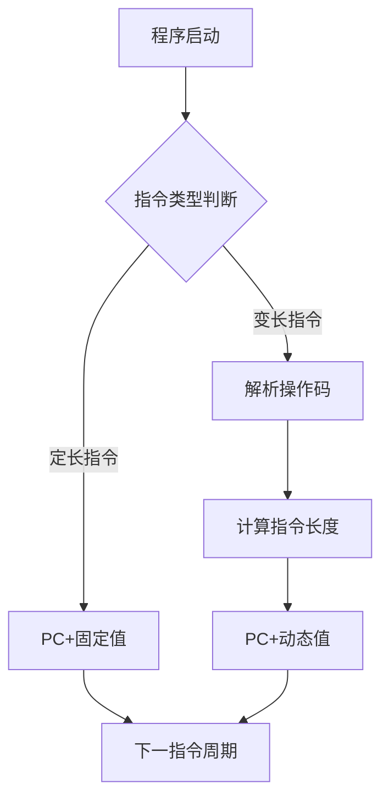

# 指令寻址与程序计数器（PC）的工作机制

## 摘要

本笔记系统解析计算机指令寻址机制，重点阐述程序计数器（PC）在**定长/变长指令字结构**中的调整策略。通过对比顺序寻址与跳跃寻址的技术特征，揭示指令执行流程控制原理，为理解计算机体系结构提供理论基础。

## 主题

指令流控制核心机制：PC 寄存器动态管理下一条指令地址  
**关键词**：指令周期、地址生成、执行流控制  
**核心问题**：

- 主存编址方式如何影响 PC 增量？
- 变长指令场景如何实现可靠地址计算？

> 重点难点
>
> - 变长指令字结构中的操作码解析机制
> - 跳跃寻址与过程调用/中断处理的关联性
> - 不同主存编址方案（字节/字）对 PC 调整的影响

## 线索区

### 1. 指令存储基础结构

**定义**：

- 操作码（OP）：**4-8 位**二进制编码，定义指令功能（如`ADD/MOV`）
- 地址码：操作数地址或立即数，长度取决于寻址方式

**存储特性**：

1. 线性存储：高级语言 → 机器指令 →**连续主存地址**存放
2. 地址对齐：定长指令按**2^n 字节**边界对齐（例：32 位指令按 4 字节对齐）

**公式表达**：

```txt
指令地址 = PC当前值
PC更新值 = PC + n (n=指令字节数/主存编址单位)
```

---

### 2. PC 工作机制

**核心功能**：

- 顺序控制：自动增量（**+1/+2**）实现指令流水
- 跳转控制：直接修改为目标地址（绝对/相对地址）

**调整策略对比**：  

| 指令类型 | 主存编址 | PC 增量 | 示例 |
|---------------|----------|--------|-------------------|
| 定长（16 位） | 字节编制 | +2 | MIPS 架构 |
| 变长（1-5B） | 字节编制 | Δ=OP 解析 | x86 架构 |

**电路实现**：

- 加法器单元：专用**PC 增量器**（比 ALU 更快）
- 多路选择器：处理顺序/跳转路径选择

---

### 3. 寻址方式技术演进

**顺序寻址**：

- 优势：硬件实现简单（**单时钟周期完成**）
- 局限：无法实现分支/循环结构

**跳跃寻址**：

- 实现方式：
  1. 绝对跳转：PC← 目标地址（如`JMP 0x4000`）
  2. 相对跳转：PC←PC+offset（范围**-128~+127**）

**性能参数**：

- 跳转延迟：**1-3 时钟周期**（依赖分支预测效果）

---

### 4. 指令结构设计权衡

**定长指令优势**：

- PC 控制电路简单（固定增量）
- 适合流水线优化（**五级流水无气泡**）

**变长指令挑战**：

1. 预取缓冲设计：需要**指令长度解码器**
2. 地址计算延迟：多周期操作降低 IPC（每周期指令数）

**典型案例**：

- ARM Thumb 模式：**16 位定长**指令（代码密度提升 30%）
- x86 指令集：**1-15 字节变长**（兼容性代价）

---

## 总结区

**知识图谱**：

```txt
指令存储结构 → PC增量机制 → 寻址方式选择 → 指令集架构设计
```

**考点聚焦**：

- 计算不同编址方式下的 PC 增量（例：字节编址+32 位定长指令 → **PC+4**）
- 分析跳转指令的机器码格式（操作码+偏移量编码）
- 对比 RISC/CISC 的 PC 控制差异

**难点突破**：

- 变长指令解析流程：  
  取指单元 → 操作码解码 → 长度计算 → PC 增量生成（**3 级流水阶段**）

**工程启示**：

- 嵌入式系统优选定长指令（实时性保证）
- PC 值保护机制：中断发生时自动保存 PC 到**堆栈指针**


