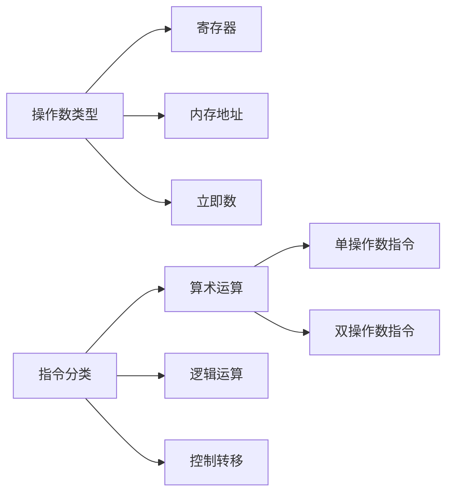

# X86 汇编指令体系解析

## 摘要

本解析系统梳理 X86 汇编指令体系，重点剖析算术/逻辑运算指令操作数规则与执行机制。通过分类说明指令格式、操作数约束及硬件实现原理，建立寄存器-内存-常量三元操作模型，为程序控制结构实现奠定基础。

## 主题

X86 指令集架构的操作数体系与执行流水线

> 重点难点
>
> - 操作数三元约束模型（寄存器/内存/常量）
> - 除法指令的寄存器联动机制
> - 控制信号在 ALU 中的传导路径

---

## 线索区

### 1. 操作数架构模型

**定义**：指令操作数的存储位置约束规则  
**三地址体系**：

- **D（目的操作数）**：寄存器或内存地址（**禁止常量**）
- **S（源操作数）**：寄存器/内存/常量  
  **约束矩阵**：
  
  | 指令类型 | 操作数组合 | 示例 |
  |---------|-----------|------|
  | 算术运算 | D+S(reg/mem/con) | `ADD EAX, [MEM]` |
  | 逻辑运算 | D(reg/mem)+S(reg/mem/con) | `XOR EDX, 0xFF` |


### 2. 算术指令集

#### 2.1 通用格式

```assembly
ADD D, S  ; D ← D + S
SUB D, S  ; D ← D - S
MUL S     ; EDX:EAX ← EAX * S
DIV S     ; EAX ← EDX:EAX / S, EDX ← 余数
```

#### 2.2 特殊处理

- **除法指令**：  
  被除数隐式存储在**EDX:EAX**（64 位扩展），商存**EAX**，余数存**EDX**
  
  $$
  \begin{cases}
  Quotient = \frac{EDX:EAX}{S} \rightarrow EAX \\
  Remainder = (EDX:EAX) \bmod S \rightarrow EDX
  \end{cases}
   $$

- **单操作数指令**：  
  NEG D ; D ← -D  
  INC D ; D ← D + 1

### 3. 逻辑运算单元

**指令集**：

| 助记符 | 功能 | 操作数约束 |
|-------|-----|-----------|
| AND | 按位与 | D(reg/mem), S |
| OR | 按位或 | D(reg/mem), S |
| XOR | 按位异或 | D(reg/mem), S |
| NOT | 按位取反 | D(reg/mem) |
| SHL/SHR | 移位操作 | D, count |

**特性**：

- 结果始终回写目的操作数
- 立即数只能作为源操作数（S）

### 4. 指令执行流水线

**硬件交互流程**：

```txt
取指单元 → 控制单元(CU) → 译码 →
    ↘ 数据通路 → ALU运算 → 写回
```

**关键路径**：

1. CU 解析操作码生成控制信号
2. ALU 接收操作数执行运算（**门延迟 ≈2ns/级**）
3. 运算结果通过数据总线写回目标位置

### 5. 控制流指令

**程序结构实现**：

- 分支：`CMP + Jcc`（条件跳转）
- 循环：`LOOP + 条件判断`
- 函数调用：`CALL/RET` 配合栈操作（`PUSH/POP`）

---

## 总结区

### 知识图谱



### 考点聚焦

1. **操作数合法性判断**（重点考察 D 操作数非法情形）
2. **除法指令的寄存器联动**（EDX:EAX 的 64 位处理）
3. **ALU 控制信号传递**（CU 到 ALU 的时序关系）

### 典型错误

- 误用两个内存操作数：`ADD [MEM1], [MEM2]` ❌
- 除法未扩展被除数：直接`DIV ECX`导致商溢出 ❌
- 移位指令使用非法计数：`SHL EAX, 32`（x86 限制 ≤31）❌

### 延展思考

1. 如何通过 XOR 实现寄存器清零？（`XOR EAX, EAX`）
2. 条件跳转指令如何利用 EFLAGS 寄存器？
3. 现代处理器如何通过流水线优化指令吞吐量？

---

本结构化笔记通过操作数约束模型、指令流水线分解和典型错误分析，构建 X86 汇编指令的立体认知框架，建议配合 EDA 工具进行指令级仿真以强化理解。
