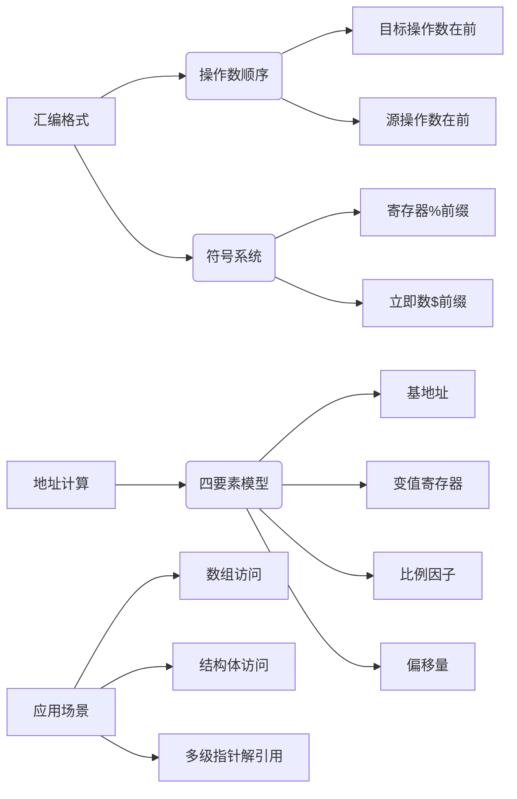

# X86 汇编语言格式与地址计算

## 摘要

**目的**：掌握 X86 汇编语言格式差异及主存地址计算方法  
**方法**：对比分析英特尔/AT&T 格式语法，解析地址计算公式  
**结果**：建立格式转换能力，实现复杂数据结构访问  
**结论**：地址计算是底层编程的核心技能，直接影响程序效率

---

## 主题

**核心内容**：

1. 汇编格式双标准：操作数顺序/符号系统差异
2. 地址计算四要素：`基地址 + 变值×比例因子 + 偏移量`
3. 结构体数组寻址：复合地址计算的实际应用

**关键词**：  
`操作数顺序` `符号系统` `比例因子` `结构体对齐`

> 重点难点
>
> - AT&T 格式中`movl $0x5, (%ebx)`与英特尔格式`mov [ebx], 5`的等价转换
> - 计算`基地址 + 4*index + 16`时的字节对齐问题
> - 结构体 padding 对偏移量计算的影响

---

## 线索区

### 知识点 1：汇编格式双标准体系

**定义对比**：  

| 特征 | 英特尔格式 | AT&T 格式 |
|-----------|-----------------------|-------------------------|
| 操作数顺序 | 目标操作数在前 | 源操作数在前 |
| 寄存器表示 | 直接写寄存器名 | 加%前缀（如`%eax`） |
| 立即数 | 直接数值 | 加$前缀（如`$0x20`） |
| 内存地址 | [基址 + 变址 × 比例 + 偏移] | 基址(%基寄存器,%变寄存器,比例) |

**典型指令对比**：

```nasm
; 英特尔格式
mov eax, [ebx + 4*esi + 20]

; AT&T格式
movl 20(%ebx,%esi,4), %eax
```

### 知识点 2：主存地址计算模型

**数学模型**：

$$
\text{物理地址} = \text{基地址} + (\text{变值} \times \text{比例因子}) + \text{偏移量}
$$

**要素说明**：

- **基地址**：常由段寄存器（如 DS）提供基准
- **变值**：存储在通用寄存器中的索引值（如 ESI）
- **比例因子**：取值为**1/2/4/8**，对应不同数据类型大小
- **偏移量**：固定位移值（如结构体字段偏移）

**应用场景**：

```nasm
; 访问二维数组元素arr[i][j]
mov eax, [ebx + 4*edi + 8*esi]  ; ebx=数组首地址，edi=行号，esi=列号
```

### 知识点 3：结构体数组寻址

**内存布局示例**：

```c
struct Student {       // 总大小32字节
    int id;            // 偏移0
    char name[12];     // 偏移4
    int age;           // 偏移16
    float gpa;         // 偏移20
};                     // 末尾填充8字节保证对齐
```

**寻址计算**：

- 访问第 3 个学生的年龄：  
  `基地址 + 2*32 + 16`
- 对应汇编实现：

  ```nasm
  ; 英特尔格式
  mov eax, [students + 2*32 + 16]

  ; AT&T格式
  movl 16(students,%eax,32), %ebx
  ```

---

## 总结区

**核心考点**：

1. 格式转换题：给定英特尔格式指令写出 AT&T 等效形式
2. 地址计算题：计算结构体数组中特定字段的偏移量
3. 优化分析题：对比不同比例因子对访问效率的影响

**易错点提醒**：

- AT&T 格式中比例因子位置容易与变值寄存器混淆
- 忽略数据对齐要求会导致计算结果偏差
- 结构体 padding 可能改变字段的实际偏移量

**关联知识**：

- 计算机体系结构中的内存层次结构
- 编译原理中的数据对齐优化策略
- 操作系统中的虚拟地址转换机制




[4.4 CISC和RISC](4.4%20CISC和RISC.md)
