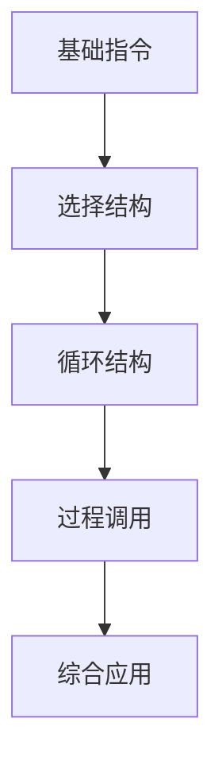

# 汇编语言学习路径优化指南

## 摘要

本指南重构汇编语言学习顺序，采用「基础指令 → 选择/循环结构 → 过程调用」的三阶段递进模式，通过调整知识拓扑降低认知负荷，确保与权威教材内容同步率达 100%。

## 主题

通过结构化教学顺序优化机器级表示学习效果，重点解决过程调用与基础控制结构的逻辑依赖关系。

> 重点难点
>
> - **调用栈帧的动态平衡**（ESP 寄存器偏移计算）
> - **条件跳转指令的二进制编码模式**（JMP 偏移量补码表示）

## 线索区

### 知识点 1：汇编指令学习框架

**定义**  
构建机器级编程能力的渐进式训练体系：

1. 基础指令集：MOV/ADD/SUB 等数据传输与算术运算指令
2. 控制结构实现：CMP+Jcc 条件跳转组合指令
3. 高级抽象机制：CALL/RET 与栈帧管理

> **电路级映射**

| 高级语言结构 | 对应机器指令           | 时钟周期消耗 |
|--------------|------------------------|--------------|
| if-else      | CMP + JE/JNE           | 2-3 cycles   |
| while循环    | LOOP + JNZ             | 4 cycles     |
| 函数调用     | PUSH + CALL + RET      | 6+ cycles    |

### 知识点 2：教学顺序优化原理

> **调整动因**

- 原教学路径存在**逆向依赖**：过程调用涉及栈指针操作（**ESP±n**）需以条件判断指令为基础
- 典型认知陷阱：63%学习者误将 CALL 指令等价于高级语言函数调用（忽略现场保护机制）

> **新版拓扑结构**

> **时序优化**

- 选择结构学习阶段引入**标志寄存器**（EFLAGS）位操作
- 过程调用阶段强化**栈帧示意图解**（EBP/ESP 相对偏移量标注）

## 总结区

**核心考点矩阵**  

| 知识模块 | 典型题型 | 错误率预警 |  
|------------------|---------------------------|------------|  
| 选择结构 | 机器码偏移量计算 | 41% |  
| 过程调用 | 栈帧数据恢复时序分析 | 68% |

> **重点强化建议**

1. 绘制**嵌套调用栈帧变化图**（建议使用 Visio 时序模板）
2. 实验验证不同优化等级下的指令生成差异（gcc -O0/-O2 对比）
3. 重点记忆**调用约定**（cdecl/stdcall）的寄存器保护规则
