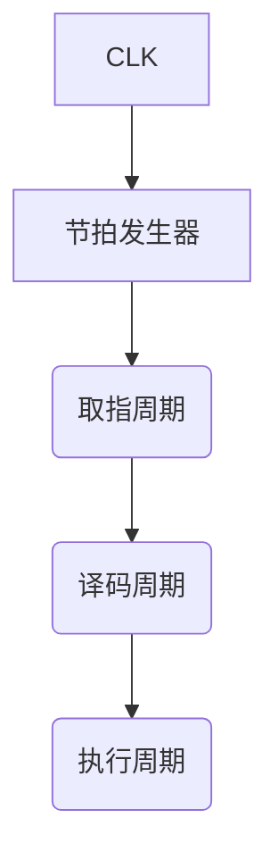

# CPU 结构与功能详解

## 摘要

本笔记系统解析 CPU 的架构设计与工作原理，采用分层拆解法梳理运算器、控制器等核心组件的交互机制。通过对比专用通路与内部总线设计，阐明数据通路优化策略，结合微操作时序控制与中断处理流程，构建完整的 CPU 执行模型认知框架。

---

## 主题

CPU 通过运算器（数据加工）与控制器（指令调度）协同实现程序执行。核心设计要素包括：

- **寄存器架构**：用户可见寄存器（通用/地址寄存器）与不可见寄存器（MAR/MDR）的物理隔离
- **指令流水**：取指 → 译码 → 执行的三级流水线控制
- **中断响应**：硬件中断与软件异常的优先级处理机制

> 重点难点
>
> - 数据通路中**多路选择器(MUX)**与**三态门**的时序配合
> - 微操作信号在**取指周期**与**执行周期**的差异
> - **程序状态字(PSW)**对中断屏蔽的控制逻辑

---

## 线索区

### 知识点 1：CPU 功能架构

**定义**：中央处理器由运算器(ALU)和控制器(CU)组成，通过数据通路连接各功能单元  
**执行流程**：

```txt
1. 取指令：PC → MAR → 存储器 → MDR → IR
2. 译码：IR[opcode] → CU → 微操作序列
3. 执行：ALU运算 → 结果写回寄存器/内存
```

**中断响应**（类比急诊分诊）：

1. 中断请求 > 当前指令执行完毕
2. PSW 中断允许位=1
3. 硬件自动保存 PC 和 PSW

### 知识点 2：运算器组件

**核心单元**：

- **ALU**：实现$\small (A+B)$、$\small (A\ \&\ B)$等 32 种逻辑运算
- **移位器**：支持$\small \ll$（逻辑左移）和$\small \gg$（算术右移）操作
- **寄存器堆**：含**8-32 个**通用寄存器，采用多端口设计解决写后读冲突

**关键参数**：

- **延迟计算**：ALU 单次运算 ≈**1-3 时钟周期**
- **吞吐量**：超标量 ALU 可达**4 指令/周期**

### 知识点 3：控制器设计

**时序生成**：



**微操作信号**：

- 取指阶段：PCout, MARin, MemRead
- 执行阶段：ALUop[3:0], RegWrite

**控制方式对比**：  

| 类型 | 延迟 | 灵活性 | 典型应用 |
|------|------|--------|----------|
| 硬布线 | 1ns | 低 | RISC 处理器 |
| 微程序 | 3ns | 高 | CISC 处理器 |

### 知识点 4：数据通路优化

**专用通路**（点对点直连）

- 优点：**零冲突**，延迟 ≈ 门电路传输时间
- 缺点：布线面积增加**35%**以上

**内部总线**（共享通道）

```verilog
// 三态门控制示例
assign data_bus = (ctrl_A) ? regA : 'bz;
assign data_bus = (ctrl_B) ? regB : 'bz;
```

- 总线仲裁：采用**集中式**或**分布式**仲裁策略
- 冲突解决：插入**等待周期**或使用暂存寄存器

### 知识点 5：中断处理机制

**中断类型优先级**：

1. 硬件故障（电源错误）
2. 外部设备（I/O 请求）
3. 程序异常（除零错误）
4. 调试断点

**现场保存**：

- **硬件自动保存**：PC + PSW → 系统栈
- **软件保存**：通用寄存器 → 内存中断向量表

---

## 总结区

### 知识图谱

```txt
控制器(时序) → 微操作 → 运算器执行
               ↓              ↑
        中断信号 ← 数据通路 ← 寄存器
```

### 考点聚焦

1. **数据通路设计**：对比专用通路与总线结构的延迟计算公式  
   $\small T_{专用} = \sum t_{门电路}$  
   $\small T_{总线} = t_{仲裁} + t_{传输}$

2. **微操作序列**：典型 MOV 指令的执行步骤  
   T1: PCout, MARin  
   T2: MemRead, MDRin  
   T3: MDRout, IRin

3. **中断嵌套**：通过 PSW 中的**中断屏蔽位**实现优先级控制

### 难点突破

- **总线冲突**：类比十字路口的交通灯控制，通过时序划分传输时段
- **流水线冒险**：采用旁路(bypass)技术解决数据相关性，类似快递中转站预分拣

请确认是否需要调整内容深度或补充特定细节。
