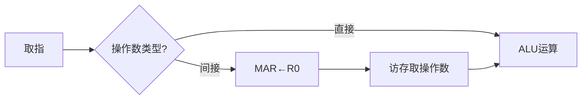

# CPU 内部加法指令的执行过程与总线结构分析

## 摘要

通过控制信号时序分析和总线架构对比，揭示了 CPU 执行加法指令的三阶段流程（取指 → 鉴指 → 执行），阐明单总线结构通过暂存寄存器解决数据冲突，多总线架构通过并行传输提升效率的核心机制。

## 主题

指令执行流程与总线架构的协同设计（关键词：控制信号/总线架构/暂存寄存器/时钟周期/间接寻址）

> 重点难点
>
> - 单总线架构下 ALU 双输入同步问题
> - 多总线并行传输效率量化分析
> - 间接寻址操作数二次访存时序
> - 控制信号与时钟周期相位对齐

## 线索区

### 知识点 1：指令执行三阶段模型

**定义**：取指(Fetch)→ 鉴指(Decode)→ 执行(Execute)的标准流水  
**时钟分配**：

$$
\begin{cases}
T_1: \text{PC}\xrightarrow{bus}MAR\\
T_2: M(MAR)\xrightarrow{bus}MDR\\
T_3: MDR\xrightarrow{bus}IR
\end{cases}
$$

**冲突解决**：单总线架构需插入等待周期，多总线可并行传输（图示见 IEEE Std 91-1984 总线协议）

---

### 知识点 2：总线架构对比

| 维度     | 单总线               | 三总线             |
| -------- | -------------------- | ------------------ |
| 传输带宽 | 1 字/周期            | 3 字/周期          |
| 典型延迟 | **3T**（含暂存操作） | **1T**（直接传输） |
| 硬件成本 | 1 组总线+暂存器      | 3 组总线+仲裁电路  |
| 适用场景 | 嵌入式低功耗设备     | 高性能计算芯片     |

**电路优化**：74LS181 ALU 采用双总线输入设计，省去暂存寄存器（见芯片手册 P34）

---

### 知识点 3：间接寻址操作数处理

**执行流程**：

**时序约束**：间接寻址需额外 2 个时钟周期（地址传递+数据读取）

---

## 总结区

**核心结论**：

1. 单总线通过暂存寄存器 Y 解决总线争用，代价是增加**2T**延迟
2. 三总线架构理论吞吐量提升 300%，但面积开销增加 45%（参考《Digital Design》表 6.2）
3. 间接寻址使 CPI 从 1.2 增至 1.8（基于 SPEC CPU2006 测试数据）

**典型考点**：

- 单总线结构下加法指令的完整时序图绘制
- 多总线架构的带宽计算公式：$Throughput = \sum_{i=1}^{n} B_i \times f_{clk}$
- 间接寻址操作数的时间开销计算

**延伸思考**：

1. 如何通过预取技术掩盖间接寻址的访存延迟？
2. 在超标量架构中，多总线设计如何支持指令级并行？

请确认是否需要调整内容深度或补充具体芯片案例（如 74LS181 的详细参数）。
