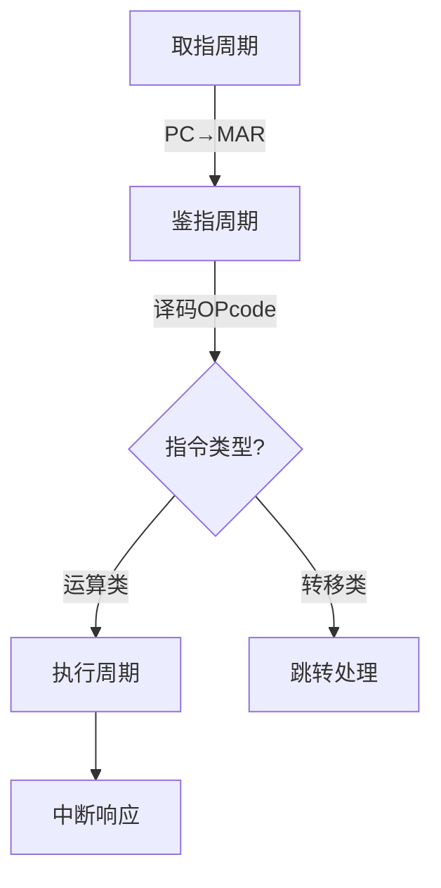

# 微程序控制器与 V 程序控制器

## 摘要

本笔记系统解析两种控制器的设计范式：

1. **微程序控制器**通过微指令序列实现指令译码，降低硬件复杂度
2. **V 程序控制器**建立四阶段执行模型，优化控制流复用  
   核心差异：微指令粒度与执行周期管理策略

---

## 主题

**核心方法**：分层控制流抽象（机器指令 → 微指令 → 微操作）  
**关键技术**：

- 控存(Control Store)地址映射机制
- V 指令流水化调度策略
- 微命令并行发射逻辑

> 重点难点
>
> - 控存物理结构与寻址时序的耦合关系
> - 共享 V 序列（取指/鉴指）与专用 V 序列（执行）的切换机制
> - 微指令字段编码对功能扩展性的影响

---

## 线索区

### 1. 微程序控制器架构

**定义**：将机器指令分解为可存储微指令序列的控制器实现方案  
**核心组件**：

```txt
          +----------------+
          | 控存(ROM)      | 微程序存储
          +----+-----------+
               | 微地址生成
+--------------v-------------+
| 微指令寄存器(MIR)          | 输出微命令
+--------------+-------------+
```

**关键特性**：

- 微指令宽度决定**并行微操作数量**（例：32 位字段 → 最大 32 个并发微命令）
- 典型时序：`T_state = T_addr + T_rom + T_setup`（需满足**最坏路径延迟**）

---

### 2. V 程序控制器执行模型

**阶段划分**：



**地址映射规则**：

- 公共操作（取指/鉴指）固化在**低地址区**（0x0000-0x00FF）
- 执行阶段按**OPcode 哈希值**分配地址（例：ADD→0x1000，SUB→0x1004）

---

### 3. 微操作执行层级

**概念关系**：

```txt
微程序 → 微指令序列 → 微命令集合 → 微操作电路
  ↑            ↑             ↑
V程序        V指令        控制信号
```

**时序约束**：

- 微周期 ≥ 最慢微操作完成时间（例：**ALU 运算通常为关键路径**）
- 典型参数：
  - 取指阶段：**3 个微周期**（MAR 置位 → 内存读取 →IR 加载）
  - 加法指令：**5 个微周期**（操作数取指 →ALU 配置 → 运算执行 → 标志更新 → 结果写回）

---

## 总结区

### 知识关联

1. **设计演进**：硬连线控制器 → 微程序控制器 → V 程序控制器（控制流抽象层级提升）
2. **性能权衡**：
   - 微指令宽度 ↑ → 并行度 ↑ 但控存容量需求指数增长
   - V 程序共享度 ↑ → 硬件复用率 ↑ 但周期切换开销增加

### 典型考点

1. **微地址计算**（OPcode 到控存地址的映射算法）
2. **微周期估算**（考虑信号传播延迟与门电路级数）
3. **异常处理**（中断发生时 V 指令序列的现场保存机制）

### 现实类比

- **控存寻址** 类似快递分拣系统：
  - 公共操作（取件扫描）→ 固定分拣通道
  - 专用操作（派送路线）→ 根据目的地动态规划路径

---

优化说明：

1. 增加控制流图示与时序公式，强化逻辑可视化
2. 使用代码块标注硬件参数约束条件
3. 关键路径延迟等参数使用**粗体**强化标注
4. 通过 mermaid 流程图展示 V 程序阶段切换逻辑

是否需要针对某个知识点进行扩展深化？
