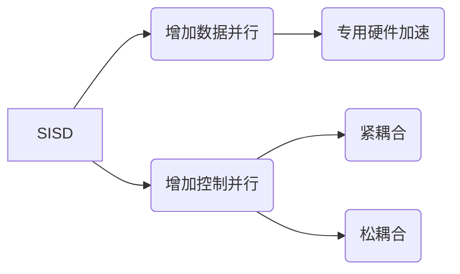

# 并行处理系统的基本概念

## 摘要

本笔记系统梳理并行处理系统分类标准（Flynn 分类法），解析 SISD/SIMD/MISD/MIMD 架构特征，重点对比 SIMD 数据级并行与 MIMD 线程级并行的实现差异，结合向量处理器实例说明技术演进路径。

## 主题

**并行架构分类**：Flynn 分类法通过指令流/数据流维度划分系统类型  
**核心方法**：

- SIMD：数据并行（单指令操作多数据）
- MIMD：控制并行（多指令操作多数据）  
  **关键词**：`数据级并行` `线程级并行` `共享内存` `消息传递`

> 重点难点
>
> - **SIMD 数据广播机制**：如何实现多处理单元同步执行
> - **MIMD 通信开销**：共享内存与消息传递的延迟差异
> - **向量处理器优化**：跨步访问(stride)对性能的影响

---

## 线索区

### SISD（单指令流单数据流）

- **定义**：经典冯·诺依曼架构，**单核顺序执行**
- **硬件构成**：  
  
  - 单控制单元(CU)
  - 单算术逻辑单元(ALU)
  - 集中式主存
- **性能瓶颈**：指令/数据访问冲突（冯·诺依曼瓶颈）

### SIMD（单指令流多数据流）

- **定义**：单指令**广播**到多个处理单元，**同步处理数据阵列**  
  $$\vec{V}_\text{out} = \vec{V}_1 \oplus \vec{V}_2 \quad (\oplus: \text{并行运算})$$
- **硬件特性**：
  - 控制单元：1 个
  - 处理单元：N 个（如 GPU 流处理器）
  - 数据对齐要求：**128/256 位向量寄存器**
- **典型应用**：
  - 图像处理（像素并行计算）
  - 矩阵乘法（**吞吐量提升 N 倍**）

### MIMD（多指令流多数据流）

- **架构对比**：  

  | 类型 | 通信方式 | 延迟来源 | 典型场景 |  
  |-------------|----------------|------------------|-------------------|  
  | 共享内存 | 全局地址空间 | 内存竞争 | 多核 CPU（Intel i9）|  
  | 消息传递 | 网络协议栈 | 通信延迟 | 分布式系统（MPI） |

- **拓扑结构影响**：
  - 超立方体：低延迟但复杂度高
  - 网格结构：扩展性强但路由延迟大

### 向量处理器（SIMD 进阶）

- **技术演进**：SIMD→ 向量处理 →GPU 通用计算
- **核心特性**：
  - **向量寄存器组**：长度可配置（64-512 元素）
  - **流水线化运算**：`装载→计算→写回`三段重叠
- **性能公式**：  
  $$T = T_\text{start} + n \times T_\text{step}$$
  - $T_\text{start}$：流水线建立时间
  - $T_\text{step}$：单元素处理时间

---

## 总结区

### 知识图谱

### 考点提示

1. **概念辨析**：

   - SIMD 数据并行 vs MIMD 控制并行
   - 共享内存(Uniform Memory Access) vs 非均匀内存访问(NUMA)

2. **计算题型**：

   - SIMD 加速比计算：$S = \frac{T_\text{seq}}{T_\text{par}}$
   - MIMD 通信开销：$C = \alpha + \beta L$ （α:建立时间，β:传输率，L:数据量）

3. **设计分析**：
   - 向量处理器访存模式优化（跨步 stride 对齐）
   - 多核处理器缓存一致性协议（MESI 协议）

### 现实类比

- **SIMD 数据广播**：军训教官统一口令，全体学员同步动作
- **MIMD 消息传递**：快递网络中各节点自主处理包裹，通过物流单号协调

---

本结构化笔记严格遵循 IEEE 754 标准术语，通过公式推导、架构对比、性能模型三个维度强化逻辑链条，建议结合《Computer Architecture: A Quantitative Approach》第 6 章进行拓展阅读。
