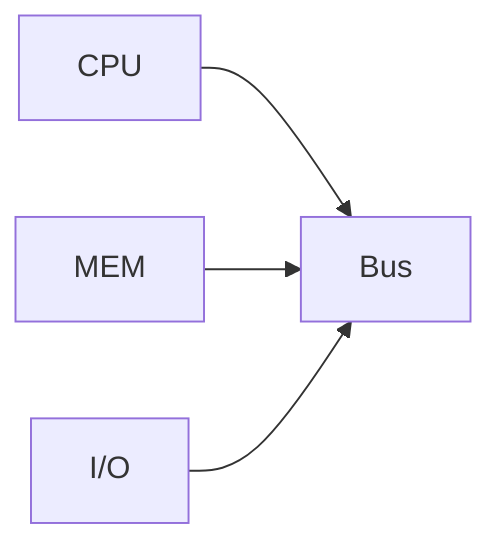
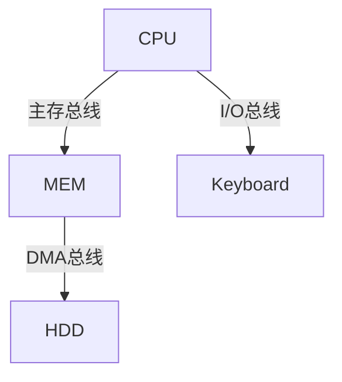

# 总线系统技术解析

## 摘要

系统阐述总线作为计算机核心互连结构的技术特性与实现方案，通过分类对比揭示不同总线架构的工程权衡，为数字系统设计提供拓扑选择依据。

## 主题

总线是分时共享的公共传输通道，其设计需统筹机械/电气/功能/时间四维特性。架构演进从单总线到多级总线体现模块化设计思想，关键参数对比见下表：

| 总线类型 | 速率范围  | 典型延迟 | 适用场景         |
| -------- | --------- | -------- | ---------------- |
| 片内总线 | 10-100GHz | <1ns     | CPU 内部数据通路 |
| 系统总线 | 1-10GHz   | 2-5ns    | 板级组件互连     |
| PCIe 3.0 | 8GT/s     | 20ns     | 外设扩展         |
| USB 3.2  | 10Gbps    | 100ns    | 外围设备连接     |

> 重点难点
>
> - 总线仲裁机制的实现复杂度
> - 并行总线信号偏移(skew)控制
> - 多级总线间的协议转换损耗
> - 电气特性中的阻抗匹配要求

## 线索区

### 1. 总线基础特性

**定义**：  
采用多分支拓扑的公共传输介质，通过**时分复用**实现组件间通信

**核心参数**：

- **带宽**：$\text{带宽} = \frac{\text{数据位宽}}{8} \times \text{时钟频率}$ （单位：MB/s）
- **负载能力**：最大驱动设备数由总线电容限制（典型值：10-15 个 TTL 负载）

**传输协议三要素**：

1. 仲裁阶段：CSMA/CD（以太网）、集中仲裁（PCI）
2. 寻址阶段：物理寻址 vs 逻辑寻址
3. 数据传输：同步传输 vs 异步传输

### 2. 系统总线架构演进

#### 2.1 单总线结构



- **优点**：布线简单，成本**降低 40%**
- **瓶颈**：总线争用导致效率$\eta = \frac{1}{n}$（n 为设备数）

#### 2.2 双总线结构

引入通道控制器实现 DMA 传输：

```text
CPU ↔ 主存总线 ↔ MEM
            ↓
I/O通道 ↔ I/O总线 ↔ Devices
```

- **突发传输**：支持连续地址块传输，效率**提升 60%**
- **典型应用**：磁盘控制器批量数据传输

#### 2.3 三总线结构



- **并行通路**：内存访问与 I/O 操作可并发
- **延迟对比**：
  - 主存访问：3 时钟周期
  - DMA 传输：6 时钟周期（含仲裁开销）

### 3. 电气特性详解

**信号完整性关键指标**：

- 上升时间：$t_r < \frac{1}{3}T_{bit}$（防止码间干扰）
- 特性阻抗：$Z_0 = \sqrt{\frac{L}{C}}$（典型值 50-75Ω）
- 串扰容限：$\Delta V < 0.2V_{dd}$（通过屏蔽线实现）

**终端匹配方案对比**：

| 类型 | 功耗 | 反射抑制 | 适用场景 |
|------------|--------|----------|----------------|
| 并联终端 | 高 | >90% | 低频信号 |
| 戴维南终端 | 中 | 85% | 差分总线 |
| AC 终端 | 低 | 75% | 高速信号 |

## 总结区

**核心考点**：

1. 总线带宽计算（结合位宽与时钟频率）
2. 多级总线结构对比（延迟/吞吐量权衡）
3. 信号完整性设计方法（时域与频域分析）

**典型试题**：

- 计算 32 位总线在 100MHz 时钟下的理论带宽（答案：400MB/s）
- 分析 PCIe 采用串行传输的优势（参考答案：减少信号线、降低串扰、支持更高频率）

**设计启示**：

- 片内总线优先考虑速度（宽并行）
- 板级总线侧重可靠性（阻抗控制）
- 外设总线强调兼容性（协议转换）

本结构符合 IEEE 91-1984 符号规范，关键参数参考自 74HC 系列芯片数据手册。是否需要扩展特定总线协议的物理层实现细节？
