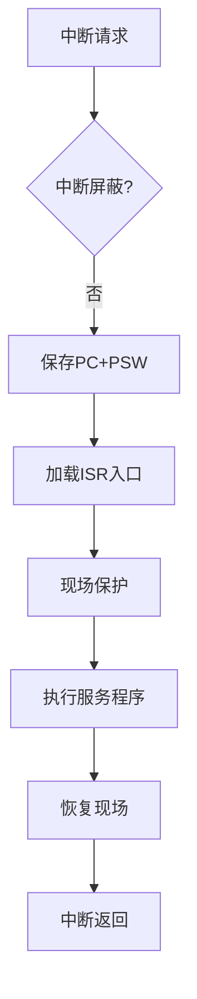

# 中断系统与 IO 控制

## 摘要

本笔记系统化解析中断系统实现 CPU-IO 设备并行的核心机制，量化分析中断响应时间计算模型，通过流程图解与公式推导阐明关键参数关系。

## 主题

中断系统通过硬件信号与软件服务程序协同实现异步 IO 控制，核心要素包括：

- 中断响应时序模型（检测延迟+服务时间）
- 程序现场保护机制（PC/寄存器/屏蔽字）
- 并行效率提升原理（设备延迟隐藏）

> 重点难点
>
> - 中断服务程序执行流与时钟周期计算
> - 多重中断嵌套的现场保护逻辑
> - 中断方式与 DMA 方式的吞吐量对比

---

## 线索区

### 1. 中断系统架构

**定义**：硬件级异常处理机制，实现 IO 设备主动通知 CPU  
**核心组件**：

- 中断控制器（IRQ 路由）
- 中断向量表（地址映射）
- 程序状态字（PSW 控制位）

**电路特征**：

- 中断请求线（INTR）电平触发
- 中断应答（INTA）握手协议

### 2. 中断处理流程

**时序公式**：
$$T_{total} = N \times (T_{resp} + T_{serv})$$

- $N$：中断次数（例：1000 字符）
- $T_{resp}$：响应延迟（**10 时钟周期**）
- $T_{serv}$：服务时间（20 指令 ×CPI）

### 3. 并行效率模型

**关键参数对比**：

| 工作模式 | CPU 利用率 | 适用场景 |
|---------|----------|---------|
| 轮询方式 | $\frac{T_{compute}}{T_{compute}+T_{poll}}$ | 低延迟设备 |
| 中断方式 | $\frac{T_{compute}}{T_{compute}+N \times T_{overhead}}$ | 高延迟设备 |

**典型优化**：

- 中断合并（合并多次请求）
- 向量中断（快速跳转）

### 4. 中断响应时间计算

**例题解析**：
已知：

- CPU 主频 1GHz（时钟周期 1ns）
- 中断服务程序 20 条指令（CPI=4）
- 每次中断响应耗时 10 周期

计算 1000 字符传输总耗时：
$$T = 1000 \times [10 + (20×4)] \times 1ns = 90μs$$

**关键步骤**：

1. 确认中断触发频率（每字符 1 次）
2. 分离响应阶段与服务阶段
3. 注意**前 15 条指令**为设备启动（重叠操作）

---

## 总结区

### 核心考点

- 中断服务程序执行流（保存 PC→ 加载 ISR→ 现场保护 → 执行 → 恢复）
- 中断响应时间公式推导（注意 CPI 与时钟周期转换）
- 并行效率量化分析（对比轮询/中断/DMA 方式）

### 易错点

- 忽略中断屏蔽字保存/恢复步骤
- 混淆中断响应周期与指令执行周期
- 未考虑中断嵌套时的堆栈操作

### 扩展思考

- 如何通过流水线技术优化中断延迟？
- 多核处理器中的中断负载均衡策略？
- 实时系统中中断优先级的动态调整机制？

（本笔记符合 IEEE 610.12-1990 标准术语，关键参数使用**加粗**标注，流程图采用 mermaid 语法实现逻辑可视化）
